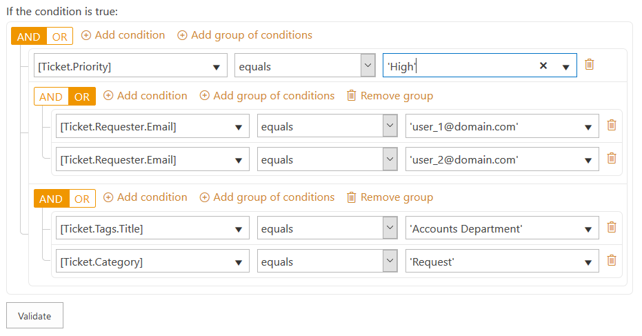
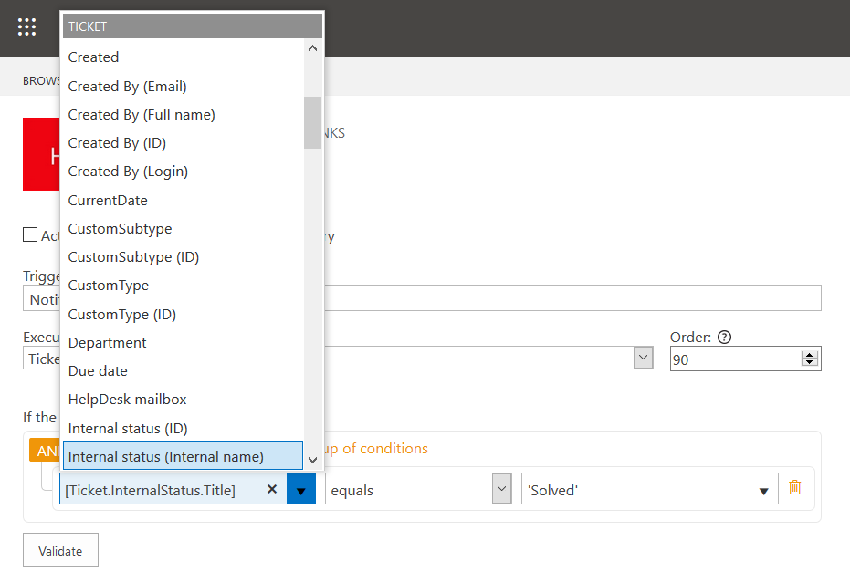

Syntax of Trigger Conditions in HelpDesk for SharePoint
#######################################################

.. contents:: Contents
   :local:
   :depth: 2

Condition Structure
~~~~~~~~~~~~~~~~~~~

|complexSet|

Let us take a closer look at a condition block of a trigger configuration menu on the screenshot above.

The condition is a group of elements. Each element can be whether a separate boolean expression (that returns ``true`` or ``false``) or a group of ones. The same is true for each group that is an element of the root one—it can consist of the separate expressions or groups of ones and so on. So, the condition has a **tree structure** that can branch out growing very complex.

A group unites several expressions inside. To determine what boolean value the group should return, the elements are united with a `logical operator`_ (``AND``/``OR``).

To the right of logical operators, there are links to **create** the elements. To **delete** the one, just click a pictogram of recycle bin for a separate expression or a whole group.

At the end of the day, the boolean **expression** is a basic element. It has three fields—two for operands and one for an operator of expression.

The **operands** receive data of expression by entering some values_ or referring_ to them (to properties of tickets or comments). Functions_ allow to process those data inside of the operand.

The **operator** can be selected from a predefined set only which contains not only `comparison operators`_ but also some of additional `boolean functions`_.

Data
~~~~

Primitive Data Types
++++++++++++++++++++

.. list-table::
   :header-rows: 1

   *
      -
         Name
      -
         Description
      -
         Example
   *
      -
         Integer
      -
         It is represented using numbers and evaluated as **Int32**.
      -
         ``123``
   *
      -
         Floating-point number
      -
         Use the dot to define the decimal part. They are evaluated as **Decimal**.
      -
         ``12.3``
   *
      -
         String
      -
         Any character between single quotes is evaluated as **String**. You can escape special characters: ``\'``, ``\n``, ``\r``, ``\t``.
      -
         ``'String #1'``
   *
      -
         Date and time
      -
         Must be enclosed between sharps. The are evaluated as **DateTime**. NCalc uses the current Culture to evaluate them (the example is for ``en-US`` locale).
      -
         ``#08/31/2019#``
   *
      -
         Boolean
      -
         It is a logical data type that can have only the values ``true`` or ``false``. Any condition expression should be resolved into a value of the type.
      -
         ``true``

Reference
+++++++++

The operands of condition expressions can contain a reference to existing properties which is enclosed between square brackets ``[]``. Its structure could be described as ``[Object.Property]``. If a property is not just a value but a reference to another object (lookup column), then it is also considered as an object that has own properties and the structure of the reference become a bit more complex: ``[Object.Property.SubProperty]``.

References to commonly used properties can be selected from the dropdown list of an operand:

|references|

The objects that are available depend on the event a trigger is configured on.

.. list-table::
   :header-rows: 1

   *  -
         Object
      -
         Description
      -
         Available on Event
      -
         Reference Syntax
   *
      -
         Ticket
      -
         Returns the current version of a ticket item and allow to get access to its properties defined in a "Tickets" list.
      -
         Ticket has been created
         Ticket has been changed
         Comment has been created
      -
         ``[Ticket.Property]``
   *
      -
         Last ticket version
      -
         Returns the previous version of a ticket item and allow to get access to its properties defined in the "Tickets" list.
      -
         Ticket has been changed
      -
         ``[LastTicketVersion.Property]``
   *
      -
         Comment
      -
         Returns a comment item and allow to get access to its properties defined in a "Comments" list.
      -
         Comment has been created
      -
         ``[Comment.Property]``

Using the described syntax, you can get access to other properties of tickets and comments that are not included in the dropdown list. Refering to such columns requires using of their `internal names`_: ``[Ticket.CustomColumn]``.

Operators
~~~~~~~~~

Comparison Operators
++++++++++++++++++++

.. list-table::
   :header-rows: 1

   *
      -
         Name
      -
         Description
      -
         Usage
      -
         Result
   *
      -
         Equal (``=``, ``==``)
      -
         Compares two operands and return ``true`` if they are equal.
      -
         ``2 = (1 + 1)``
      -
         ``true``
   *
      -
         Not equal (``!=``, ``<>``)
      -
         Compares two operands and return  ``true`` if they are not equal.
      -
         ``5 != 5``
      -
         ``false``
   *
      -
         Greater than (``>``)
      -
         Compares two operands and return ``true`` if the the first is greater than the second.
      -
         ``7 > 6``
      -
         ``true``
   *
      -
         Greater than or equal (``>=``)
      -
         Compares two operands and return ``true` if the first is greater than the second or equal to the last.
      -
         ``6 >= 6``
      -
         ``true``
   *
      -
         Less than (``<``)
      -
         The operator compares two operands and return ``true`` if the first is less than the second.
      -
         ``2 < 1``
      -
         ``false``
   *
      -
         Less than or equal (``<=``)
      -
         Compares two operands and return ``true`` if the first is less than the second or equal to the last.
      -
         ``4 <= 8``
      -
         ``true``

Arithmetical Operators
++++++++++++++++++++++

.. list-table::
   :header-rows: 1

   *
      -
         Name
      -
         Description
      -
         Usage
      -
         Result
   *
      -
         Addition or concatenation (``+``)
      -
         Adds values to each other and returns a sum of them.
      -
         ``2 + 2``
      -
         ``4``
   *
      -
         Subtraction (``-``)
      -
         Subtracts the second value from the firs one.
      -
         ``5 - 3``
      -
         ``2``
   *
      -
         Multiplication (``*``)
      -
         Multiplies one value by another.
      -
         ``3 * 4``
      -
         ``12``
   *
      -
         Division (``/``)
      -
         Divides the first value by the second one.
      -
         ``8 / 4``
      -
         ``2``
   *
      -
         Remainder (``%``)
      -
         Divides the first value by the second one and returns a remainder of the division.
      -
         ``5 % 2``
      -
         ``1``

Logical Operators
+++++++++++++++++

.. list-table::
   :header-rows: 1

   *
      -
         Name
      -
         Description
      -
         Usage
      -
         Result
   
   *
      -
         Logical AND (``and``, ``&&``)
      -
         The group of expressions returns ``true`` if each element does. The ``and`` operator has higher priority than ``or``.
      -
         ``(5 > 4) && (3 > 2)``
      -
         ``true``
   *
      -
         Logical OR (``or``, ``||``)
      -
         The group of expressions returns ``true`` if any element does.
      -
         ``(5 < 4) || (3 > 2)``
      -
         ``true``

   *
      -
         Logical NOT (``not``, ``!``)
      -
         The operator changes the result of boolean expression to opposite.
      -
         ``!(5 < 4)``
      -
         ``true``

Functions
~~~~~~~~~

Boolean Functions
+++++++++++++++++

.. list-table::
   :header-rows: 1

   *
      -
         Name
      -
         Description
      -
         Usage
      -
         Result
   *
      -
         ``in()``
      -
         An argument of the function is a set of elements separated by comma. The function returns ``true`` if the first element is found among the rest ones.
      -
         ``in(1 + 1, 1, 2, 3)``
      -
         ``true``
   *
      -
         ``if()``
      -
         The function receives three arguments: condition expression, values to return depending on the the condition (whether it is true or false).
      -
         ``if(3 % 2 = 1, 'trueValue', 'falseValue')``
      -
         ``trueValue``
   *
      -
         ``contains()``
      -
         Returns ``true`` if the first string contains the second.
      -
         ``contains('1234', '23')``
      -
         ``true``
   *
      -
         ``match()``
      -
         The function returns ``true`` if the firtst argument is an occurance of the regular expression which is the second argument. This pattern can contain inline options to modify behaviour of the regular expression. Such options have to be placed in the beginning of the expression inside brackets with question mark: ``(?YOUR_OPTIONS)``. For example options ``(?mi)`` will allow to process multi line text with case insensitivity.
         
         List of available options:

         ::

          x - allow whitespace and comments 
          s - single line mode
          m - multi line mode 
          i - case insensitivity 
          n - only allow explicit capture
         
         You can find additional information about inline options in this `MSDN article <http://msdn.microsoft.com/en-us/library/yd1hzczs%28v=vs.110%29.aspx>`_.
      -
         ``match('ADAM', '(?i)(adam)?( smith)*')``
      -
         ``true``

Arithmetical Functions
++++++++++++++++++++++

.. list-table::
   :header-rows: 1

   *
      -
         Name
      -
         Description
      -
         Usage
      -
         Result
   *  -
         ``Abs()``
      -
         Returns the absolute value of a specified number.
      -
         ``Abs(-1)``
      -
         ``1``
   *
      -
         ``Ceiling()``
      -
         Returns the smallest integer greater than or equal to the specified number.
      -
         ``Ceiling(1.5)``
      -
         ``2``
   *
      -
         ``Floor()``
      -
         Returns the largest integer less than or equal to the specified number.
      -
         ``Floor(1.5)``
      -
         ``1``
   *
      -
         ``Max()``
      -
         Returns the larger of two specified numbers.
      -
         ``Max(1, 2)``
      -
         ``2``
   *
      -
         ``Min()``
      -
         Returns the smaller of two numbers.
      -
         ``Min(1, 2)``
      -
         ``1``
   *
      -
         ``Round()``
      -
         Rounds a value to the nearest integer or specified a number of decimal places.
      -
         ``Round(3.222, 2)``
      -
         ``3.22``

DateTime Functions
+++++++++++++++++++

.. list-table::
   :header-rows: 1

   *
      -
         Name
      -
         Description
      -
         Usage
      -
         Result
   *
      -
         ``Today()``
      -
         Returns the current system date.
      -
         ``Today()``
      -
         ``#01/02/2017#``
   *
      -
         ``Now()``
      -
         Returns the current system date and time.
      -
         ``Now()``
      -
         ``#01/02/2017 13:47#``
   *
      -
         ``Date()``
      -
         Returns the date part of a particluar datetime value.
      -
         ``Date([Ticket.Created])``
      -
         ``#01/02/2017#``
   *
      -
         ``AddMinutes()``
      -
         Adds the specified number of minutes to the specified date parameter.
      -
         ``AddMinutes(#01/02/2017 13:45#, 2)``
      -
         ``#01/02/2017 13:47#``
   *
      -
         ``AddHours()``
      -
         Adds the specified number of hours to the specified date parameter.
      -
         ``AddHours(#01/02/2017 13:45#, 2)``
      -
         ``#01/02/2017 15:45#``
   *
      -
         ``AddDays()``
      -
         Adds the specified number of days to the specified date parameter.
      -
         ``AddDays(#01/04/2017 12:00#, 2)``
      -
         ``#03/04/2017 12:00#``
   *
      -
         ``AddMonths()``
      -
         Adds the specified number of months to the specified date parameter.
      -
         ``AddMonths(#01/04/2017 12:00#, 2)``
      -
         ``#01/06/2017 12:00#``
   *
      -
         ``AddYears()``
      -
         Adds the specified number of years to the specified date parameter.
      -
         ``AddYears(#01/02/2017 12:00#, 2)``
      -
         ``#01/02/2019 12:00#``

.. _logical operator: #logical-operators
.. _comparison operators: #comparison-operators
.. _boolean functions: #boolean-functions
.. _internal names: ../How%20To/Find%20the%20internal%20name%20of%20SharePoint%20column.html
.. _Functions: #functions
.. _values: #primitive-data-types
.. _referring: #reference

