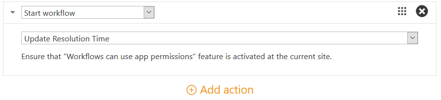

General Information on Triggers in HelpDesk for SharePoint
##########################################################

.. contents:: Contents
  :local:
  :depth: 2

.. note:: If you are using Plumsail HelpDesk with version older than 1.3.0, please follow  `this link <deprecated/Triggers.html>`_ to learn about triggers.

Triggers allow you to set up automatic execution of arbitrary sets of actions based on events and conditions. A bunch of triggers designed for sending notifications is available out-of-the-box. You can create your own ones and define actions for them in accordance with your needs.

Triggers List
~~~~~~~~~~~~~

:Location:

Navigate to the settings using navbar.

Then click the  **Triggers**  tab. Here you can find the list of the pre-defined notification triggers. All of them are active but you can uncheck this option in trigger's configuration menu.

|hd-triggers|

:Manage the List:

As on any SharePoint list, you can create new items (a **new item** link) and get access to a quick edit mode (an  **edit**  link) to change some of triggers properties without opening each one separately. For example, you can deactivate some of the triggers that you don't need. When you have done with editing, just click a  **Stop**  link.

|triggersList_quickEdit|

Configuration Menu
~~~~~~~~~~~~~~~~~~

To get to the configuration menu, create a new trigger or open an existing one. Let's look over a built-in trigger called "Notification: Requester – Ticket resolved". It sends a notification to a requester when the ticket status is changed to "Solved".

|HD-trigger|

In the configuration menu, you can find the following elements:

.. glossary::

  Checkboxes
    In this example, the trigger is active and all its runs will be logged into history tab of the tickets which are affected by it.
  
  Trigger Name
    The name you choose for a trigger. You can implement some pattern in naming of them. In this case, the one can be described as: "Type of Action: Object of Action - Case".
  
  `Execute when`_
    The event that raises the actions.
  
  Order
    This field helps to control triggers execution order which is ascending.
  
  `If the condition is true`_
    The condition block that determines whether the actions have to be executed. You can add conditions or groups of them using "And"/"Or" logical operators. After configuring the condition block, it can be checked by clicking a "Validate" button that allows to avoid syntax mistakes.
  
  `Actions to perform`_
    The list of actions that have to be executed on the specified event if the result of condition checking meets "true". You can set several actions of different types there.
  
  Save
    Clicking the button saves all changes you made and leave you on the same page of current trigger configuration menu.
  
  Close
    Clicking the button redirects you to the triggers list without saving any changes.
  
  `Show logs`_
    Clicking the button displays a field with logs which contain the information about runs of the trigger.

Events
~~~~~~

|events|

Events determine not only when to run triggers but also what properties (field values) are available for usage in the condition block and what actions are accessible to perform.

.. glossary::

  Ticket has been created
    This event gives you access to the current version of ticket.
  
  Ticket has been changed
    On this event, you can access the current and previous versions of ticket.

  Comment has been created
    Here you can refer to properties of the created comment and of the current version of ticket. Also, you can use action "`Change comment type to private`_" only on this event.
    
Conditions
~~~~~~~~~~

Conditions determine whether the actions have to be executed.
They support references to fields of the current item (ticket or comment) by their `internal names`_.
For example, ``[Ticket.Title]`` returns the value of the **Title** field that a current version of ticket has.
So you can access field values of the ticket or comment using syntax: ``[Item.InternalFieldName]``.
There is a number of operators and functions available in conditions.
You can make sure that your condition is valid by clicking "Validate" button.
If it is not, you will notice an alert message.

Let's take a look on the condition from the screenshot above:

|conditions|

The condition literally says: **InternalStatus** is changed and **InternalStatus** is equal to "Solved". **InternalStatus** is an internal name of a column on the "Tickets" list.

  .. note::
    | You may notice that we have used **InternalStatus** column instead of **Status** column in this example. There is actually a separate list of ticket statuses with display names and internal names. We recommend to use **InternalStatus** in conditions, as it is internal ticket status name, which should not be changed in future. To get more information about it read `this article`_.   

For more details see `condition syntax`_.

Actions
~~~~~~~

To add a new action click the "Add new action" link. 

|AddNewAction|

There are three types of actions:

#. `Send Email`_
#. `Start Workflow`_
#. `Set Field`_
#. `Change Comment Type to Private`_

The list of actions may contain multiple actions which will be executed sequentially one by one starting from the top. To reorder actions, drag the action header and drop it to desired place.

|DnDAction|

In the block of actions, you can enter arbitrary values without quotes or use context tokens. The tokens allow you to get values that already exist, and they have the same syntax as the properties in the condition block, but instead of brackets, double braces are used. So the token syntax looks like ``{{Item.InternalFieldName}}``.
 
Find the complete description of the context `tokens and snippets`_.

Send Email
++++++++++

This action sends an email to multiple recipients. You can use tokens and snippets in the message title and body to automatically populate information on the current item. The "Send email" action has the following properties:

:To: 
	Required field. Defines recipients of the message. In this field you can pick a contact from the contacts list or use tokens "All agents", "Requester", "Cc", "Assignee", and "Comment author" (only for the "Comment has been created" event).
:Except: 
	Excludes the specified recipients from the "To" field. In this field you can pick a contact from the contacts list or use tokens "All agents", "Requester", "Cc", "Assignee" and "Comment author" (only for the "Comment has been created" event).
:Subject: 
	The title of message. In this field you can use context tokens.
:Email body: 
	The body of the message. In this field you can use context tokens and snippets.
:Attachment URLs: 
	Semicolon separated list of attachments that have to be included in the message. In this field you can use context tokens, for example, ``{{Comment.AttachmentUrls}}``.

In the example on the screenshot below, there are two actions of one type – "Send email". Each action on the list has a short description of what it does. Let's look at the first action. Clicking the action expands its settings.

The action sends a message to **Requester** (the token suggested for selection while entering it in the **To** field). The **Subject** contains tokens ``{{Ticket.Title}}`` and ``{{Ticket.ID}}`` that are replaced by the accordant properties of current ticket. The **Email body** contains snippets ``{{snippet:Styles}}`` (sets the style of email message to the default HelpDesk style via CSS) and ``{{snippet:TicketIdWidgetLink}}`` (renders a link to a ticket in widget_).

|ExpandedAction|

Start Workflow
++++++++++++++

|workflows|

This action starts a specified workflow. The "Start workflow" action has the following property:

:Workflow to start:
	Required field. The name of the workflow that has to be executed. Both SharePoint Workflows 2010 and 2013 are supported. You can pick a list or site level workflow.

Set Field
+++++++++

|setField|

This action sets the value of the public field of ticket. The "Set field" action has the following properties:

:Field name: Required field. The name of the field that has to be changed.

:Field value: The new value of the field. In this field you can enter a value without quotes or use context tokens.

Change Comment Type to Private
++++++++++++++++++++++++++++++

|commentType|

The action doesn't require any input and can be performed only on the "Comment has been created" event. So if condition meets true the type of the created comment will be changed to private.

Logs
~~~~

You can unfold logs about each trigger run by ckicking the "Show logs" button. They contain results of condition checking and action performing. Logs are useful to control triggers and can be exported as a text file. It will contain not only the infromation about trigger runs but also its configuration. So if you are going to contact support on any issues related to triggers, it has sense to attach the file with logs. Here is an example of unfolded logs in the trigger configuration menu.

|LogHistory|

.. _Send Email: #send-email
.. _Start Workflow: #start-workflow
.. _Set Field: #set-field
.. _Event: #events
.. _Condition: #condition
.. _Actions: #actions
.. _condition syntax: Condition%20syntax.html
.. _Advanced Configuratoin of Actions: Advanced%20Configuration%20of%20Actions.html
.. _tokens and snippets: Tokens%20and%20snippets.html
.. _this article: Statuses%20customization.html#how-statuses-list-connected-to-tickets-list
.. _this link: deprecated/Triggers.html
.. _Show logs: #logs
.. _Execute when: #events
.. _If the condition is true: #conditions
.. _Actions to perform: #actions
.. _widget: Widget.html
.. _Change Comment Type to Private: #change-comment-type-to-private
.. _internal names: ../How%20To/Find%20the%20internal%20name%20of%20SharePoint%20column.html

.. |hd-triggers| image:: ../../_static/img/HD-All-triggers.png
   :alt: HelpDesk Triggers
   :width: 700
.. |HD-trigger| image:: ../../_static/img/HD-trigger.png
   :alt: Trigger - Notify Requester
   :width: 700
.. |ExpandedAction| image:: ../../_static/img/show-action.png
   :alt: Expanded action - Send Email
.. |LogHistory| image:: ../../_static/img/log-history.png
   :alt: Log history
.. |AddNewAction| image:: ../../_static/img/new-action.gif
   :alt: Add new action
.. |DnDAction| image:: ../../_static/img/move-actions.gif
   :alt: Drag and Drop action
.. |triggersList_quickEdit| image:: ../../_static/img/triggersList_quickEdit.png
   :alt: Quick edit mode
   :width: 700
.. |events| image:: ../../_static/img/triggers_general_events.png
   :alt: Quick edit mode
   :width: 700
.. |conditions| image:: ../../_static/img/triggers_general_conditions.png
   :alt: Quick edit mode
   :width: 700

.. |setField| image:: ../../_static/img/triggers_general_setField.png
   :alt: Quick edit mode
   :width: 700
.. |commentType| image:: ../../_static/img/triggers_general_commentType.png
   :alt: Quick edit mode
   :width: 700