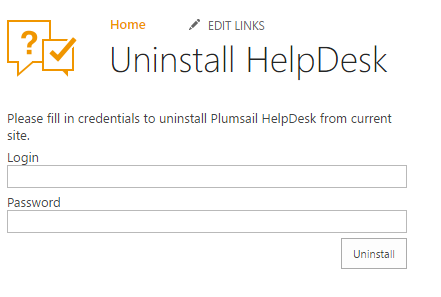

Uninstall HelpDesk
##################

To uninstall HelpDesk you should have **Manage Web** permissions. 
Navigate to **Site Setting** --> **Uninstall Plumsail HelpDesk**.

|RemoveManager|

Enter your login and password then HelpDesk system will check your permissions and start the uninstallation 
process.

.. warning:: 
	All data associated with HelpDesk will be deleted, including contacts, tickets, and triggers. You will 
    not able to restore this data.

