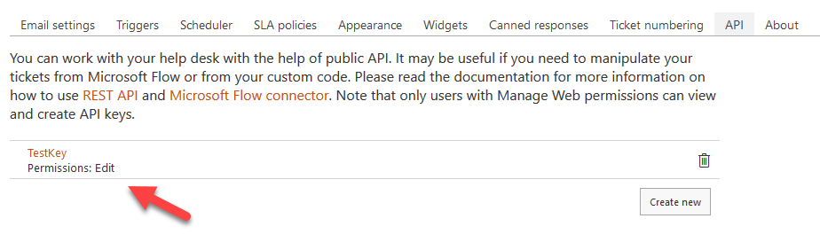

How to add quick actions to the context menu of tickets in SharePoint HelpDesk
~~~~~~~~~~~~~~~~~~~~~~~~~~~~~~~~~~~~~~~~~~~~~~~~~~~~~~~~~~~~~~~~~~~~~~~~~~~~~~

`Plumsail Helpdesk for Office 365`_ has `Microsoft Flow Connector`_ which helps you to manipulate data in your HelpDesk with the help of Microsoft Flow.
To start using it you need to `Create an API key`_ and  `Review available actions`_ .
In this article we'll work with Plumsail Helpdesk connector to add quick actions to the context menu of tickets, specifically to resolve a ticket without opening it.
Of course, you can use this approach with other scenarios. 

Creating API key

Let's create an API key in the Helpdesk settings

We need to copy the API key and then use it in Microsoft Flow. 

Open Micsoft Flow website and go to Connections

Search for Plumsail Helpdesk connector, select it and paste our API key

Ok, now we've connected MS Flow Helpdesk connector to our Helpdesk instance and ready to move on.

Creating flow

On this step we've already created MS Flow connection using our Helpdesk API key. 
Now we move further and create a flow which is going to resolve the tickets.
We start the flow with Microsoft SharePoint action "For a selected item". 
We need the action to pick the selected Ticket ID and pass it to the Helpdesk action `Update a ticket`_.
I specify the Helpdesk site address and the list name "Tickets".

Then I search for Helpdesk connector

Select `Update a ticket`_ action, specify the Ticket ID from the previous step and put ticket status "Solved".

.. image:: ../_static/img/resolve-ticket-flow.png
   :alt: Microsoft Flow

Then we can start the flow for selected ticket. Check it out

Another example

The same manner you can manage the tickets statuses depending on the situation and your goals.
For example, you can design a flow which changes ticket's category, priority or due date and add the action to the ticket's context menu.
To achieve it we can add dropdown input for the initial action "For a selected item".

Then we select the flow in the ticket context menu

And we see the dropdown, select the status and run the flow

Conslusion

Microsoft Flow and `Plumsail Helpdesk connector`_ is a power tandem which allows managing Plumsail Helpdesk very effectively.

.. _Plumsail Helpdesk for Office 365: https://plumsail.com/docs/help-desk-o365/v1.x/

.. _Update a ticket: https://plumsail.com/docs/help-desk-o365/v1.x/API/flow-actions.html#update-a-ticket

.. _Microsoft Flow Connector: https://emea.flow.microsoft.com/en-us/connectors/shared_plumsailhelpdesk/plumsail-helpdesk/

.. _Plumsail Helpdesk connector: https://plumsail.com/docs/help-desk-o365/v1.x/API/ms-flow.html

.. _Create an API key: https://plumsail.com/docs/help-desk-o365/v1.x/API/get-api-key.html

.. _Review available actions: https://plumsail.com/docs/help-desk-o365/v1.x/API/flow-actions.html