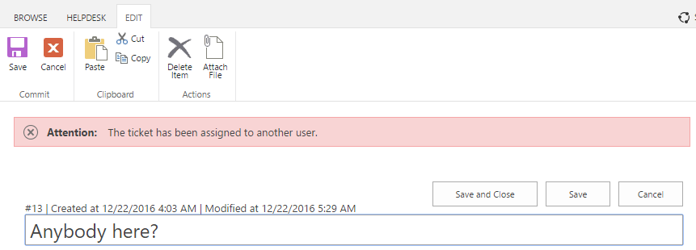

Detect agent collision
######################

When a ticket has been assigned to somebody, an agent gets a notification displayed at the top of the ticket. This helps prevent agents from trying to make updates to the same ticket at the same time and avoid the collision.

Autorefresh is taking care about if someone already added a comment or ticket has been assigned to an agent. It allows you to keep up with ticket’s updates.

|agentCollision|

