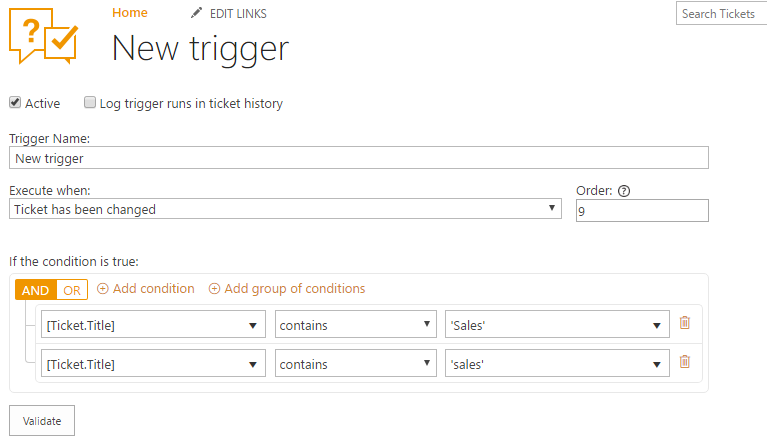
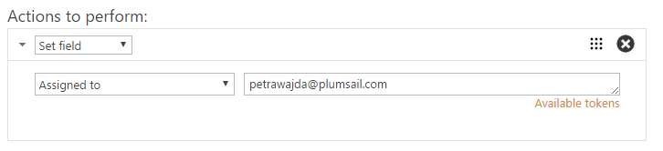

Assign ticket to specific person
################################

Auto assigning to an agent can be a useful tool for faster response on the most important cases in your ticketing system. Here you can learn how to automate the routing of tickets.

For example, you may want to assign all tickets with word ‘sales’ in the title to a specific agent. To fulfill this action, you need to create a trigger. 

From the home page, head to settings and choose Triggers. You need to create a new trigger, so choose a new item and that’s it. The ‘Event’ field specifies an action that you want your trigger to perform, as you probably want notifications to be sent only in case a ticket has been created, choose the corresponding option in the dropdown menu. 
‘Conditions’ field defines the conditions which should be met in order for the action to be performed. You can write down our conditions in the following manner:

|NewTrigger|

It says that ticket title should contain word ‘sales’ or ‘Sales’. More about syntax, you can find `here`_.

To automatically assign tickets to an agent, in actions select ‘Set field’ and pick required field. 
Don’t forget about the field value, you can add the user’s name, e-mail, or a name of a
SharePoint group. 

|Action| 

.. || image:: ../_static/img/
   :alt: 
.. || image:: ../_static/img/
   :alt:  
.. || image:: ../_static/img/
   :alt: 
.. || image:: ../_static/img/
   :alt: 
.. || image:: ../_static/img/
   :alt: 
.. || image:: ../_static/img/
   :alt: 

.. _here: ../Configuration%20Guide/Condition%20syntax.html#functions