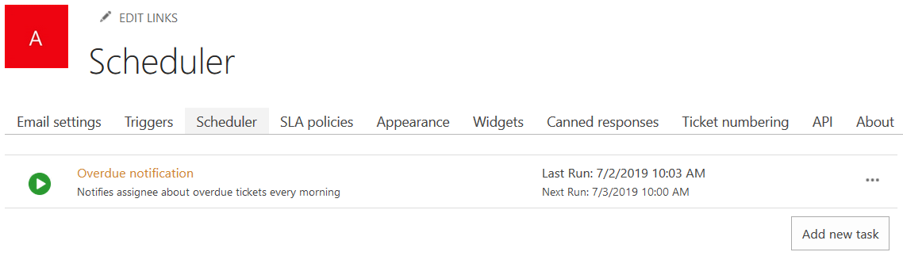
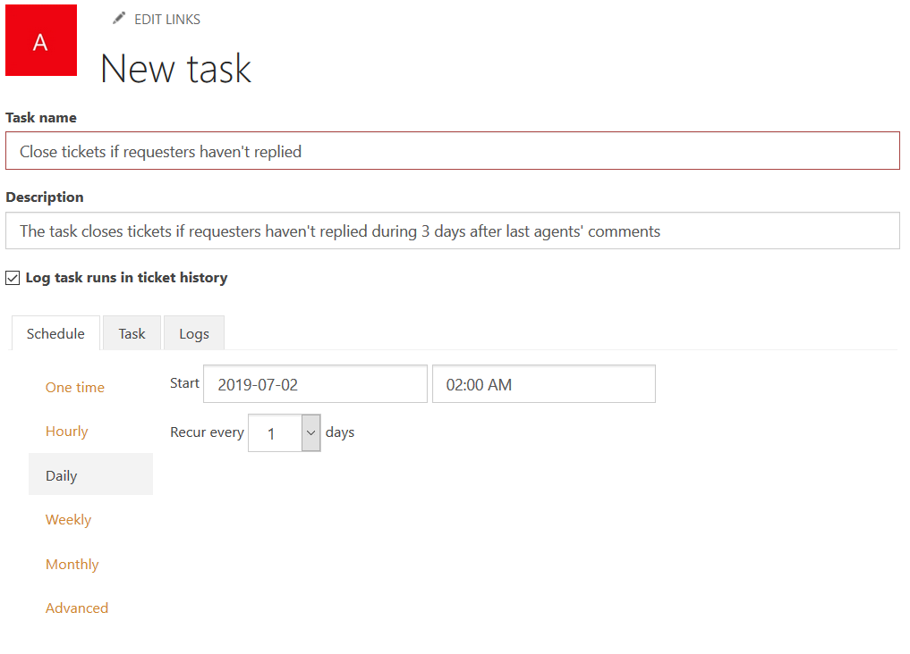
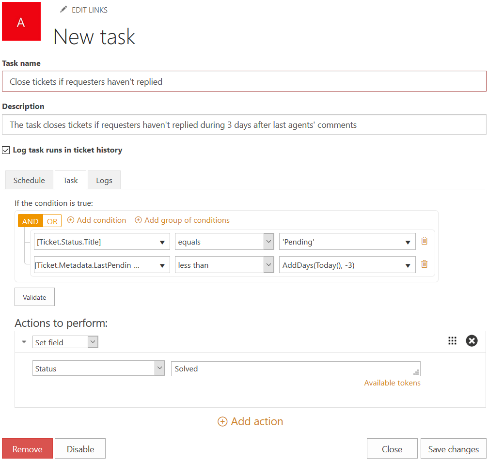
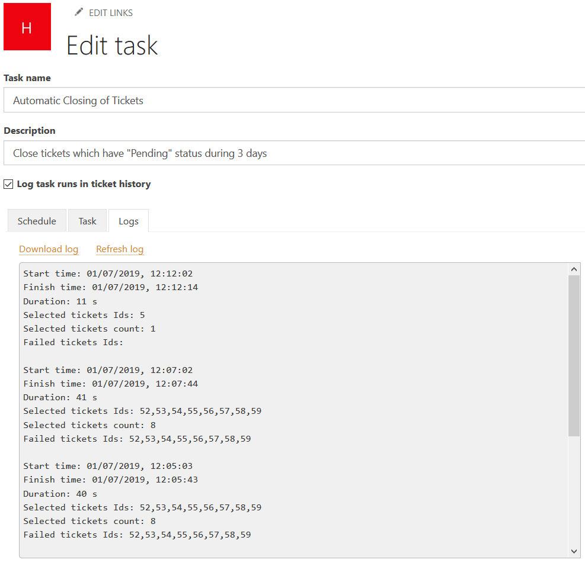
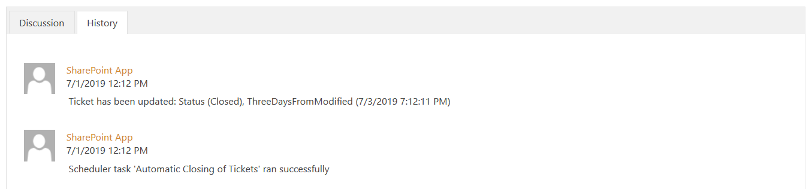
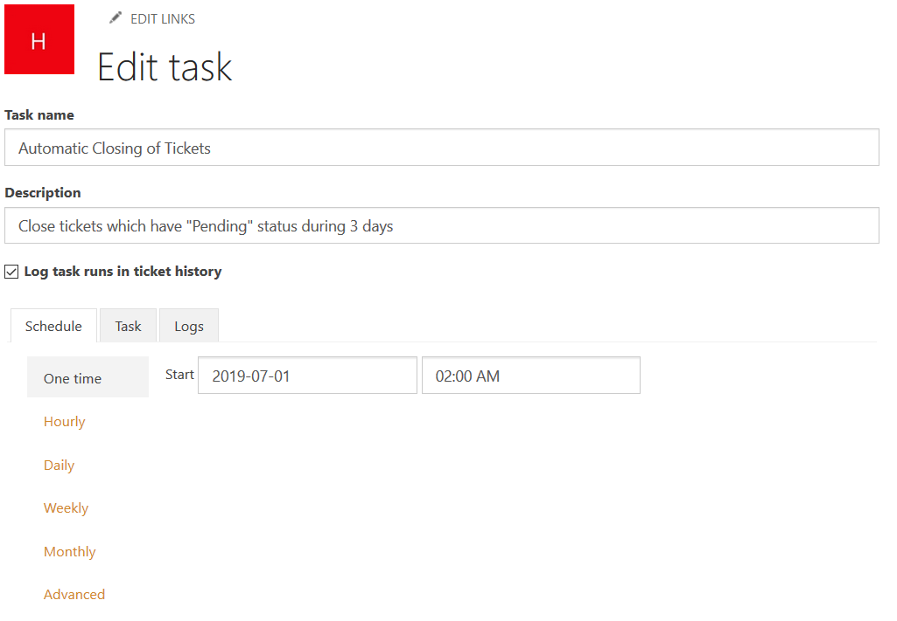

Close tickets if customer hasn't replied in SharePoint help desk system
#######################################################################

In any ticketing system, a support specialist may encounter the situation when a customer leaves his last message without reply. In this case, the number of active tickets will grow and they will hinder specialists in their work distracting attention and requiring them to close tickets manually after a while. To save time and to allow support team focusing on current tasks, the ticketing system should have a feature that allows periodically check statuses of tickets and automatically close them under certain conditions.

`Plumsail HelpDesk`_ is a solution designed to deploy the ticketing system on the basis of SharePoint site whether it is Online (Office 365) or On-Premises (Server) version. Particularly, it includes `HelpDesk Scheduler`_—a tool that allows you to set up different actions on unsolved tickets that were changed during the last 30 days. These actions are executed on a schedule defined in a task. In this article, you will see how to create the task that will automatically close all tickets without a reply from a customer if 3 days passed after support specialist (agent) replied.

Create a task in HelpDesk system
~~~~~~~~~~~~~~~~~~~~~~~~~~~~~~~~

Open a "Scheduler" tab in HelpDesk settings and hit on a button "Add new task".

|addNew|

Now you are on a page for task editing. Give an informative name and add a brief description to it so other users (or even you later) can understand what and what for it is.

|newPage|

Checking "Log task runs in ticket history" allows you to see records about its execution when you overlook the history of a ticket affected by it.

|history|

Define a schedule for automatic closing of tickets
~~~~~~~~~~~~~~~~~~~~~~~~~~~~~~~~~~~~~~~~~~~~~~~~~~

The next step is to determine a schedule when the task to be executed. You can use standard scheduling options or an advanced `cron syntax`_ so that the schedule can meet your specific needs. In this case, I schedule the task execution every night when the HelpDesk system is not loaded by the processing of agents actions and a ticket flow is less intensive.

|schedule|

Set conditions and action to close tickets
~~~~~~~~~~~~~~~~~~~~~~~~~~~~~~~~~~~~~~~~~~

The actions to be executed are configured on the next tab. It contains two blocks—conditions and actions.  Take a look at the screenshot below.

|task|

The condition block works in the same way as in triggers_. When agent replies to customer, he changes the ticket status to "Pending" so we need to find all tickets which statuses were changed to it more than 3 days ago. To do that, check whether ``[Ticket.Status.Title]`` (can be selected in a dropdown list) is equal to ``'Pending'`` and a ticket property ``[Ticket.Metadata.LastPendingDate]`` less than a current date decreased by 3 days. To compose the last condition, use advanced `condition syntax`_. ``Today()`` function returns the current date and ``AddDays()`` one allows to add an arbitrary number of days to the chosen date. So to decrease the current date by 3 days, just add a negative value to the current date using this expression: ``AddDays(Today(), -3)``.

Finally, choose a "Set field" action to perform in the next block, select a "Status" property and set its value to "Solved". Save the task you have created.

Track the execution of Scheduler task in logs
~~~~~~~~~~~~~~~~~~~~~~~~~~~~~~~~~~~~~~~~~~~~~

You can check the task executions on a "Logs" tab. If you need, you can export the logs.

|logs|

Summary
~~~~~~~~

That's it. Now you know how to configure the task. HelpDesk Scheduler will periodically check status of your tickets and close them if they didn’t get a reply from a customer in 3 days. You can try to do it by yourself. Just follow instructions and install_ HelpDesk on your own SharePoint site to get a ticketing system with easy and simple automation.

.. _condition syntax: ../Configuration%20Guide/Condition%20Syntax.html
.. _cron syntax: https://plumsail.com/sharepoint-workflow-scheduler/docs/advanced-schedule-cron-syntax/
.. _HelpDesk Scheduler: ../Configuration%20Guide/Scheduling.html
.. _Plumsail HelpDesk: https://plumsail.com/sharepoint-helpdesk/
.. _triggers: ../Configuration%20Guide/Triggers.html
.. _install: ../Getting%20Started/Installation.html

