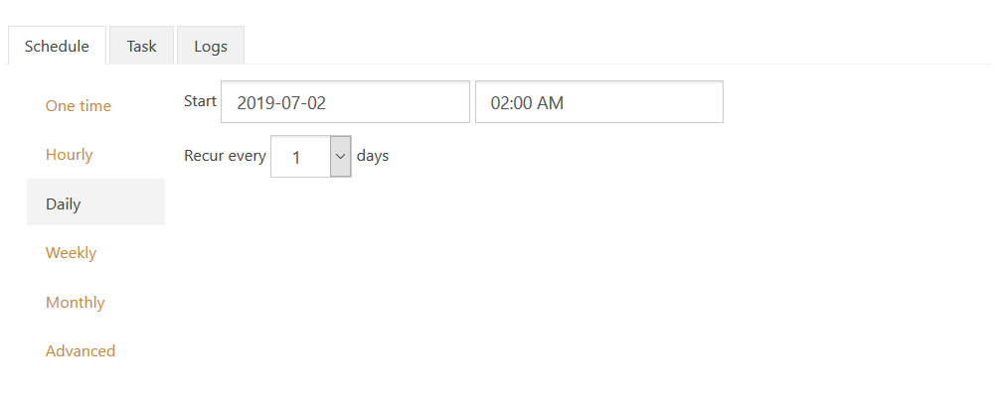
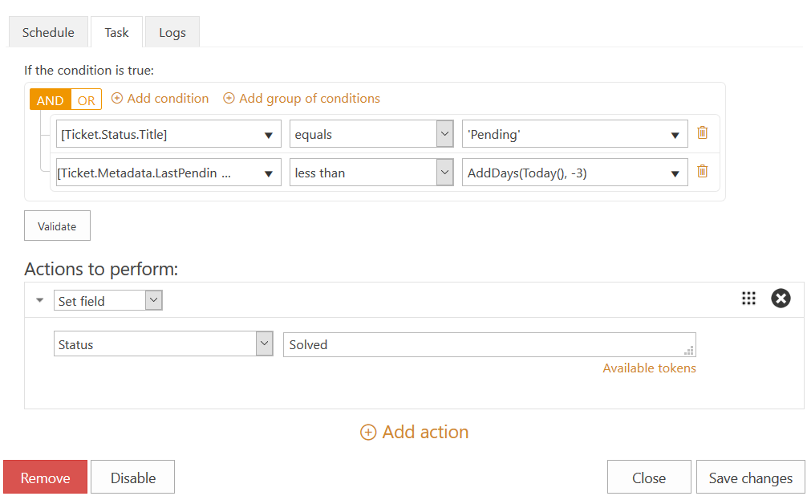
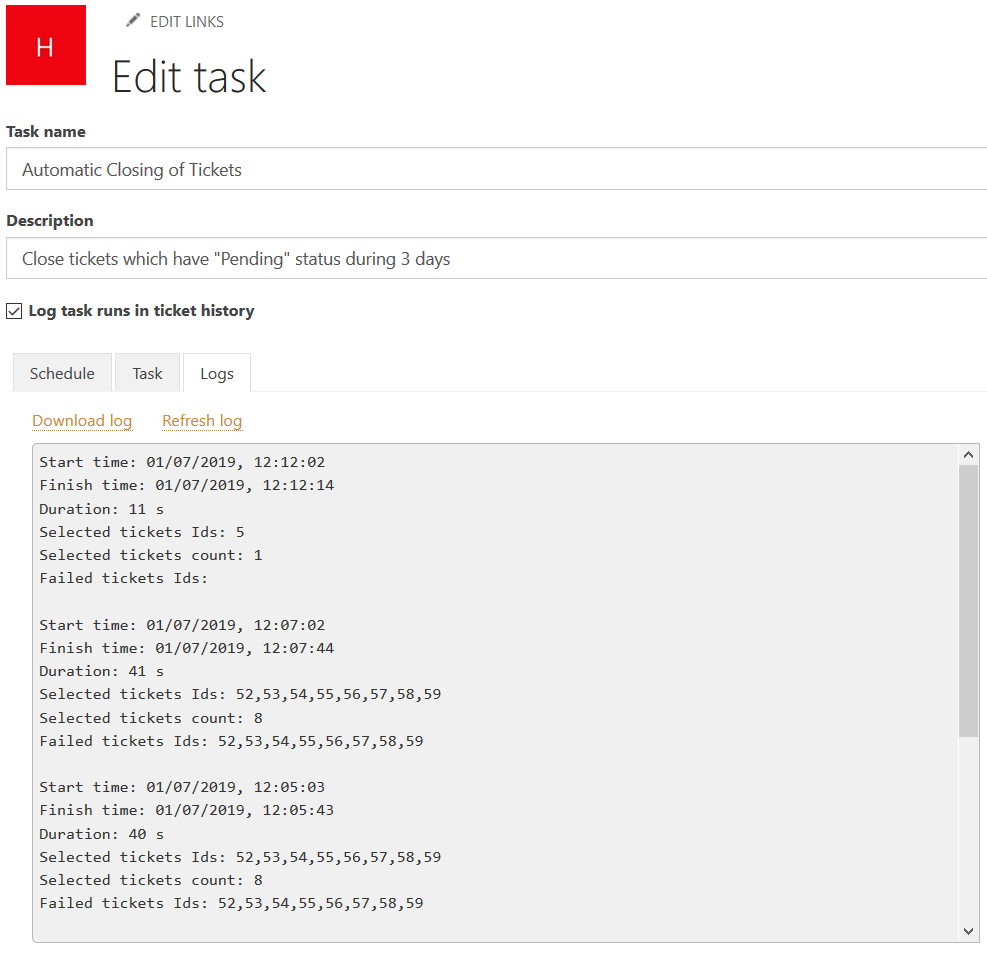

Close tickets if requesters haven't replied
###########################################

:Introduction: A requester may leave the agent's last message without a reply. In this case, the number of active tickets will grow and they will hinder agents in their work distracting their attention and requiring them to close tickets manually after a while. To save time and to allow agents focusing on current tickets, it is possible to create a task in HelpDesk scheduler that will automatically close the tickets that haven't had new comments from requesters during a predefined period.

:Create a task: Open a "Schedule" tab in HelpDesk settings and hit on a button "Add new task". Now you are on a page for task editing. Give an informative name and add a brief description to it so other users (or even you later) can understand what and what for it is. Checking "Log task runs in ticket history" allows you to see records about its execution when you overlook the history of a ticket affected by it.

|addNew|

:Define a schedule: The next step is to determine a schedule when the task to be executed. You can use standard scheduling options or an advanced `cron syntax`_ so that the schedule can meet your specific needs. In this case, I schedule the task execution every night when the HelpDesk system is not loaded by the processing of agents actions and a ticket flow is less intensive.

|schedule|

:Set conditions and an action: Then configure the task execution in the next tab. It contains two blocks—conditions and actions. The condition block works in the same way as in triggers. We need to find all tickets which statuses were changed to "Pending" more than 3 days ago. To do that, check whether ``[Ticket.Status.Title]`` (can be selected in a dropdown list) is equal to ``'Pending'`` and a ticket property ``[Ticket.Metadata.LastPendingDate]`` less than a current date decreased by 3 days. To compose the last condition, use advanced `condition syntax`_. ``Today()`` function returns the current date and ``AddDays()`` one allows to add an arbitrary number of days to the chosen date. So to decrease the current date by 3 days, just add a negative value to the current date using this expression: ``AddDays(Today(), -3)``. Finally, choose a "Set field" action to perform in the next block, select a "Status" property and set its value to "Solved". Save the task you have created.

|task|

:Conclusion: That's it. You can check the task executions in a "Logs" tab. If you need, you can export the logs.

|logs|

.. _condition syntax: https://plumsail.com/docs/help-desk-o365/v1.x/Configuration%20Guide/Condition%20Syntax.html
.. _cron syntax: https://plumsail.com/sharepoint-workflow-scheduler/docs/advanced-schedule-cron-syntax/

.. |addNew| image:: ../_static/img/automations_closingTickets_addNew.png
   :alt: Add New Task
   :width: 800

