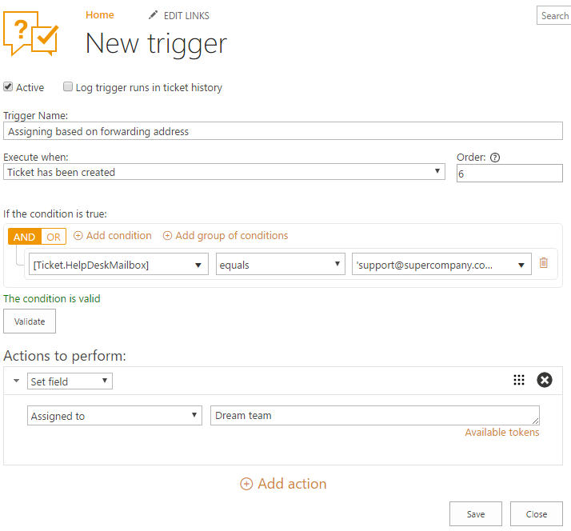

Assign ticket based on forwarding address
###############################################

In HelpDesk ticket system you are able to `create multiple help desk instances`_ and configure forwarding for every mailbox you have. In case you'd like to keep all tickets from several mailboxes in one place, you can configure assigning based on forwarding address.

Let’s say you have support@contoso.com mailbox for support and another mailbox for general questions — company@contoso.com. You need to configure forwarding messages from each of them to help desk. It’s quite easy and you can find instructions on how to do that for the most popular e-mail platforms `here`_.

After you finish with configuring of forwarding, move to triggers.

Here you need to create a trigger to assign all tickets which were sent to support e-mail to Support group.

From the home page, head to settings and choose Triggers. You need to create a new trigger, so choose a new item. The ‘When event occurs’ field specifies an event when the trigger must be performed. Since you want notifications to be sent only in case a ticket has been created, choose the corresponding option in the dropdown menu.  

The ‘Conditions’ field defines the conditions under which the actions are performed. You can write down our condition like this:

|Condition|

**[HelpDeskMailbox]** is an internal name of the hidden field which contains information on the source mailbox - from which an original message has been forwarded. Condition says that e-mail address is support@supercompany.com and only if this condition is fulfilled, the trigger goes to the actions.

As you want to assign tickets to the group of agents automatically, you should use ‘Set field’ and pick the ‘Assigned to’ field. Don’t forget about field value, here you can use a user’s name, e-mail, or a name of a SharePoint group.

.. || image:: ../_static/img/
   :alt: 
.. || image:: ../_static/img/
   :alt: 
.. || image:: ../_static/img/
   :alt:   

.. _create multiple help desk instances: https://plumsail.com/blog/2016/09/quick-tip-how-to-create-multiple-help-desks-for-different-departments-and-configure-them-with-different-inboxes/
.. _here: https://plumsail.com/docs/help-desk-o365/v1.x/Configuration%20Guide/Email%20settings.html#forwarding-of-e-mail-messages-from-your-support-mailbox