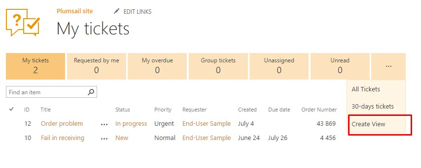
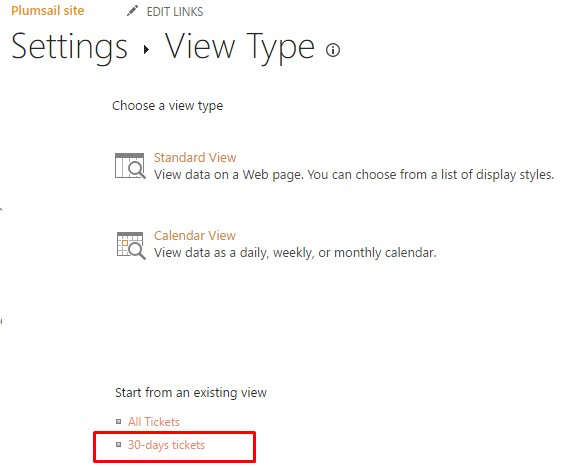
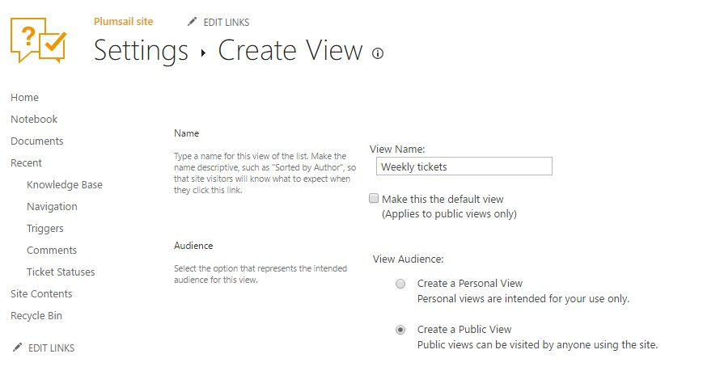
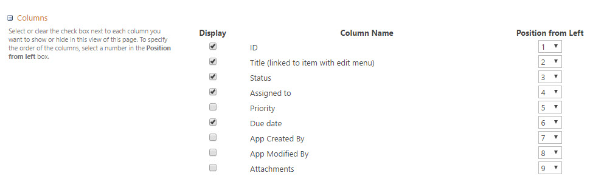
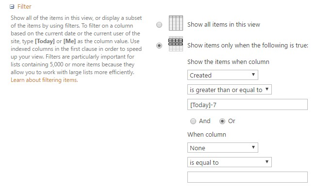
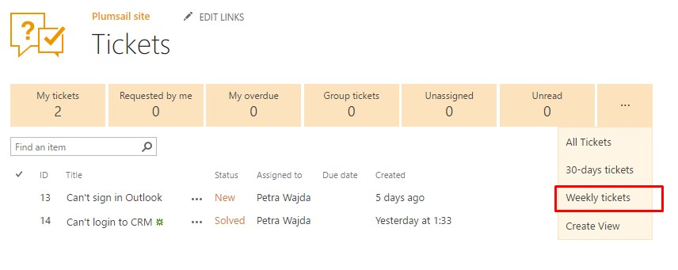

Create a new view
#################

    .. raw:: html
     
     <iframe width="560" height="315" src="https://www.youtube.com/embed/8kLySL2H57k" frameborder="0" allowfullscreen></iframe>
  

Views give an opportunity to organize work with SharePoint list and sort data in your service desk in an easy-to-find way. For instance, let's create a view based on existing custom one.

On the home page, you can find auto-generated views for the most common cases and all new views will appear under ‘more options’ button.

|newView|

First, navigate to Create View. Here you can choose view type but you already have an existing view. We will use it to create a new one. Thus, you will need to modify just a few properties for a new view.

|ViewType|

Now you can change view’s name and, also, you can make view public or private.

|createView|

In columns section, you select columns that need to be displayed. Combine this section with other filters to make your work with views more productive.

|Columns|

Applying filters is very helpful if you’d like to get a subset of the items. For example, you need to see all tickets that are less than 7 days. Just type [Today]-7 and choose operator ‘is greater than or equal to'.

|ViewFilter|

Now you have a new public view which shows tickets created less than a week ago.

|FinallyView|

You can modify this view by clicking the button in the ribbon.

|ModifyView|

.. |ModifyView| image:: ../_static/img/modify-view.jpg
   :alt: Modify view