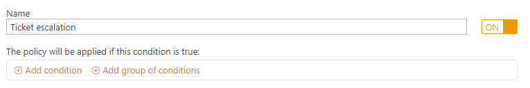
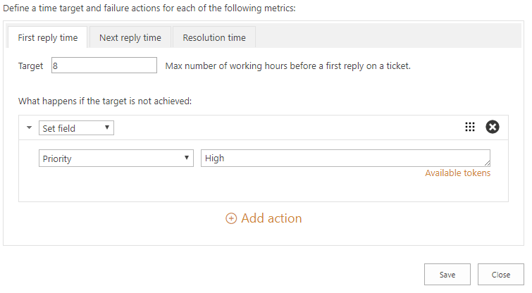

Create cascading SLAs 
#####################

You can create multiple SLA policies and configure cascading execution of different SLAs depending on conditions. 
For example, you may want to implement scenario like this: if first reply or next reply SLA is failed, Priority is changed to higher and another SLA with shorter response time will be applied. 

To create a new SLA, navigate to Settings and click on SLA policies tab. Click on the ‘Add new policy’ button and you will need to provide a name for a new SLA policy. Also, you can specify conditions but there is no need for it in this agreement, so move to defining a target and action. 

|TicketEscalation|

If the requester didn’t get an answer to the ticket within 8 office hours, the ticket’s priority will be escalated. 
For configuring escalation, click ‘Add action’, choose ‘Set field’ in drop-down menu and select Priority field. Don’t forget to provide a value of priority field, it may be ‘High’ or ‘Urgent’.

|TargetAction|

Then you need to create a one more SLA policy but with condition which says that ticket’s priority should be High.

|UrgentAssigning|

For high priority tickets, we define the target time for 2 working hours. If the target is not achieved, Admin gets notification about it.

|Action|

And remember that order of your SLAs is important. The first SLA with matching condition will be always applied. Put the most strict SLA rules on the top.

