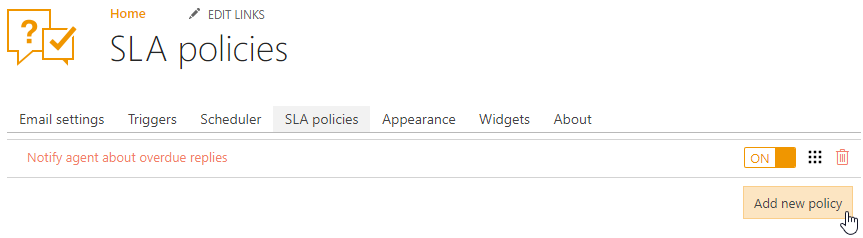
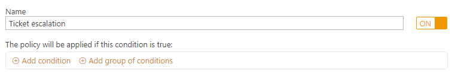
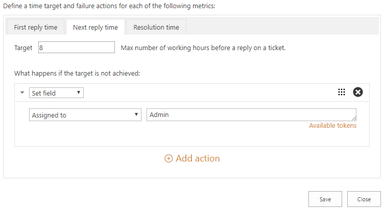

Escalate ticket if an agent didn't reply in time
################################################

If the first response time has been passed, it is better to configure escalation for tickets for immediate reaction. Here is how you can do it. 
 
Navigate to Settings and click on SLA policies tab. You need to create a new SLA policy, so click ‘Add new policy’ button’. 

|NewPolicy|

Then provide a name for a new SLA policy. Also, you can specify conditions but there is no need for it in this case, so move to defining a target and action.

|TicketEscalation|

If the requester didn’t get an answer to the ticket within 8 office hours, the ticket’s priority will be escalated. For configuring escalation, click ‘Add action’, choose ‘Set field’ in drop-down menu and select Priority field. Don’t forget to provide a value of priority field, it may be ‘High’ or ‘Urgent’.

|TargetAction|

You can go further and configure assigning of high priority tickets to executive manager. For that, configure target in the next reply metric and then specify action again — click ‘Add action’, choose ‘Set field’ in the drop-down menu and select ‘Assigned to’ field. In this case, all escalated and answered tickets will be assigned to Admin.

|NextReply|

This tip is also applying to `cascading SLAs`_ also.

.. |TargetAction| image:: ../_static/img/high-escalation.png
   :alt: Target and Action

.. _cascading SLAs: https://plumsail.com/docs/help-desk-o365/v1.x/How%20To/Create%20cascading%20SLAs.html
