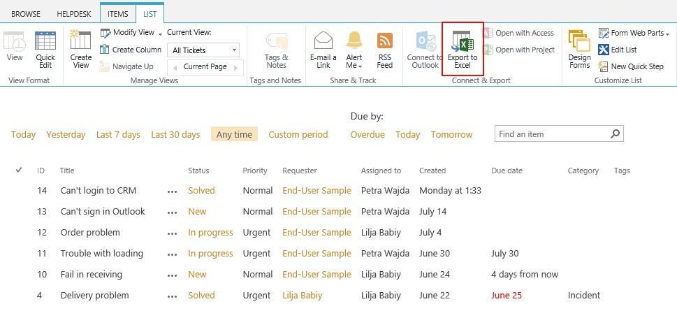

Export tickets to Excel
#######################

  .. raw:: html
  
     <iframe width="560" height="315" src="https://www.youtube.com/embed/cKFbkgbVJ38" frameborder="0" allowfullscreen></iframe>

Exporting tickets from your ticketing system to Excel is as easy as can be. First of all, you need to choose tickets view to export. You can select any view to export.

Then head to ribbon menu and click on ‘Export to Excel’. Note that you need to have Microsoft SharePoint Foundation-compatible application for that.

|Export|

During exporting all ticket's parameters will be exported as well, so you can build any analytics in Excel.

