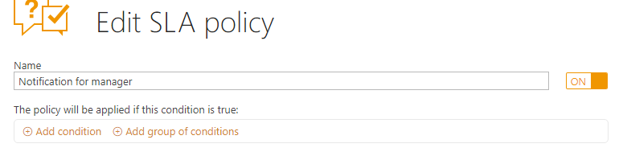
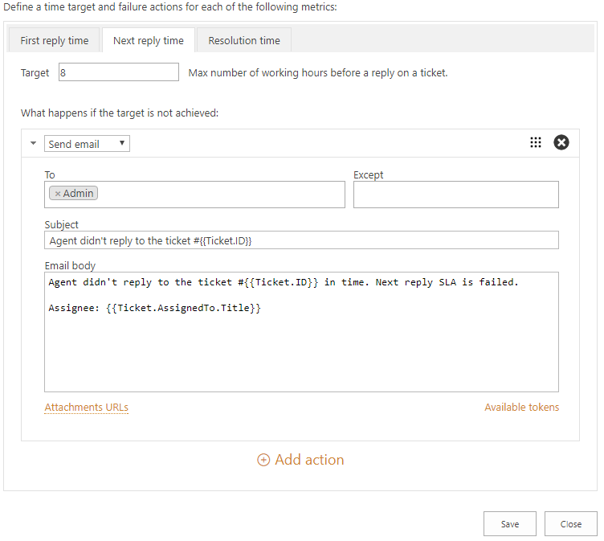

Notify agent or manager when SLA is failed
##########################################

You can configure any notifications about failing of SLA metrics in your ticketing system. That means that not only Assignee can get emails about tickets without answer but team leader or executive manager too. Here is how you can do that. 
 
First of all, navigate to Settings and click on SLA policies tab. Let’s create a new SLA policy, for that click ‘Add new policy’ button’. Note that you can edit predefined SLA policy as well — just add one more email address.

|NewPolicy|

Then you need to provide a name for a new SLA policy. Also, you can specify conditions but there is no need for it in this case.

|Name|

Then define a time target and failure actions for each metric. In this case, target time for a first reply and for a next reply — 8 business hours. And resolution time is 24 hours.

|NextReply|

If the target time is not achieved, action ‘Send email’ will be performed. 
In ‘To’ field specify who will receive a notification about unanswered ticket. In this case, it will be Admin. Subject and Email body were complemented with `tokens`_ to provide more context for the recipient of the message. 

.. |NewPolicy| image:: ../_static/img/add-new-policy.png
   :alt: Add new policy

 

.. _tokens: https://plumsail.com/docs/help-desk-o365/v1.x/Configuration%20Guide/Tokens%20and%20snippets.html