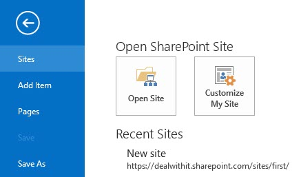
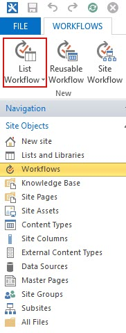
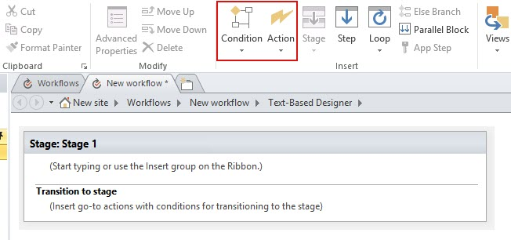
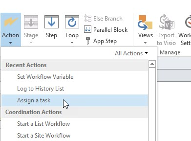
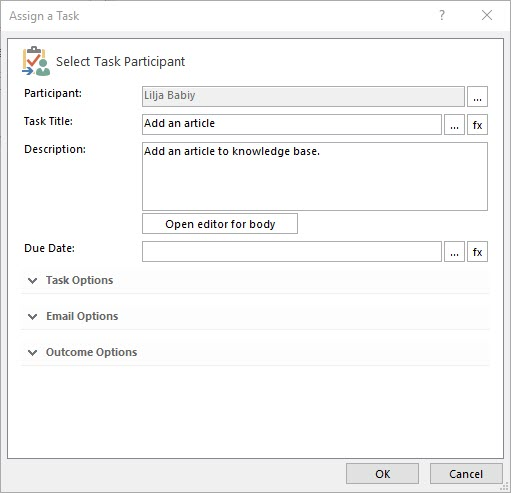
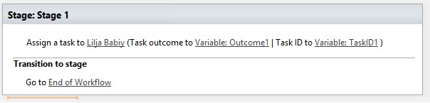
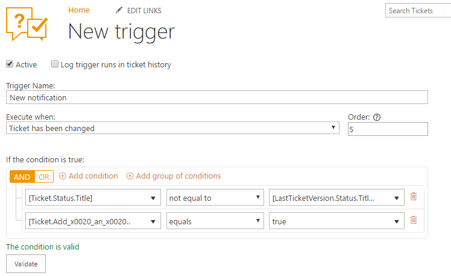
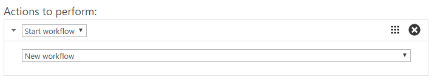
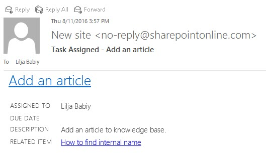

Start a workflow with a trigger
###############################

Workflows are usually used to avoid routine work. For example, workflows can check any updates in one data source and, according to them, update another data source. 
Let’s say that you’d like to assign a task to an agent after a ticket has been solved and some fields were filled. Here is how you can do that.

First of all, we need to have a `SharePoint Designer`_. After that, you will add a new site to it. Choose a site which you’d want to connect to and open it.

|SharePointDesigner|

Choose ‘Workflows’ and define required workflow’s list. It has a context of the list for which it was created, due to that it has access to all field values.

|SharepointDesignerWorkflows|

In dialog box type a name for your workflow, its description and don’t forget about platform type. In SharePoint Online you can only use a Workflow 2013, so choose this platform type.

After that, head to the ribbon menu and you are ready to start configuring a workflow. You can add conditions, actions, stages, steps and loops, but in our case, only one action is needed. 
Switch down to workflow editor and choose the first step. Action will be put right here.

|Action|

Actions are the most common unit in SharePoint Designer, a bunch of ready-made actions is already placed in the drop-down menu. But you can extend workflow’s functionality with `Workflow Actions Pack`_. For example, it will add more than `60 activities to the workflows`_. You need to use one of these ready-made actions and choose a ‘Assign a task’.

|AssignATask|

Action will appear in the first step and you need to choose a participant. Then fill in fields with a title, description and any other settings you may need. After that click OK.

|Description|

After the first step is over and you don’t need to put any other actions and conditions, you can move to the second step. Here just choose an action which will end a workflow. Don’t forget to save and publish your new workflow.

|completeWorkflow|

Now you can switch to HelpDesk and configure a trigger. Go to settings and choose triggers. You will create a new trigger which is fired when a ticket has been changed, its status is solved and in custom field ‘Add an article’ has been chosen ‘yes’ as an answer.

To perform this, use syntax like this:

|newTriggerForWorkflow|

After you have set value for a condition, settle down an action. It’s the easiest part, just choose ‘Start workflow’ and pick the workflow which was created before.

|newAction|

Now agent who is responsible for articles will get email notifications like this. Also, you can configure your workflow schedule with `SharePoint Workflow Scheduler`_ which already built into Plumsail HelpDesk.

|NotificationLetter|

.. _SharePoint Designer: https://www.microsoft.com/en-us/download/details.aspx?id=35491
.. _Workflow Actions Pack: https://plumsail.com/workflow-actions-pack/
.. _60 activities to the workflows: https://plumsail.com/docs/workflow-actions-pack/index.html
.. _SharePoint Workflow Scheduler: https://plumsail.com/workflow-scheduler/