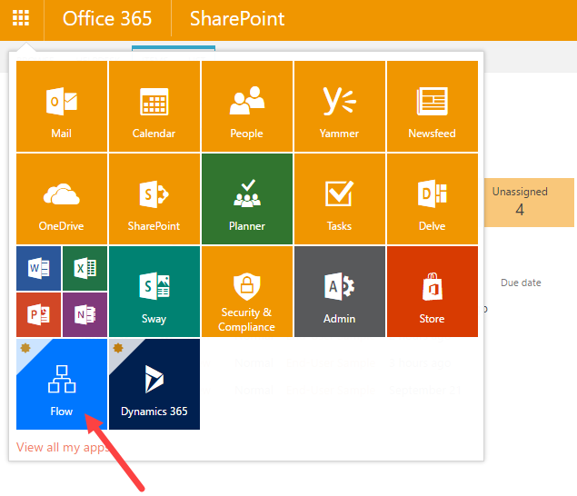
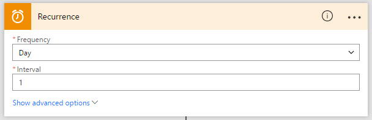
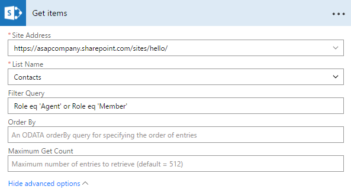
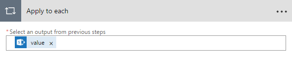
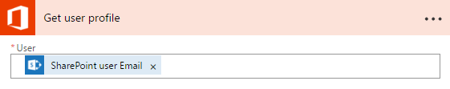
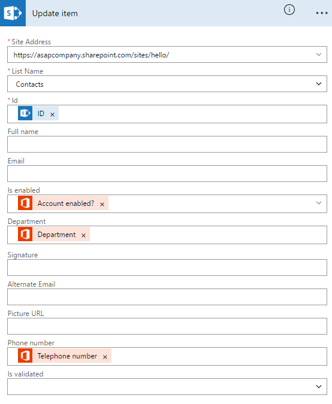

Sync SharePoint user profiles fields to HelpDesk contacts 
#########################################################

`Microsoft Flow`_ is a service for creation automated workflows between different apps and services. Since now you can connect SharePoint to a lot of external services, so you can do with Plumsail HelpDesk for Office 365.

With the help of Microsoft Flow you can sync SharePoint user profiles to HelpDesk contacts. Here you can find how to do that.

First of all, click Flow tile in the app launcher.

|SuiteBar|

After you have been redirected to Flow site, navigate to My flows tab and choose ‘Create from blank’ to create your own workflow. If you want to check updates about user’s status only once in a day, use Recurrence. It will trigger an event to run at regular time intervals.

|Recurrence|

Next, you choose ‘Add an action’. In our case, it’s an action for SharePoint. It will get items from our SharePoint site from Contacts list. Once you have selected SharePoint, you will need to log in. In advanced options you can filter query by role which equals to Member or Agent.

|GetItems|

After that, you need to configure ‘Apply to each’ loop which makes possible to control the list that you repeat over.

|Loop|

Then you add a ‘Get user profile’ action for Office 365.

|GetUser|

Then add a new action which will update fields in Contacts list in SharePoint if there were some changes in user profiles in Office 365. Note that 'Is enabled' field was created manually. You can find information how to create a new column `here`_.

|Update|

Don't forget to save the new new flow.

.. _Microsoft Flow: https://flow.microsoft.com/en-us/
.. _here: https://plumsail.com/blog/2016/07/quick-tip-how-to-add-a-new-column-to-tickets-list-and-form-in-sharepoint-help-desk/