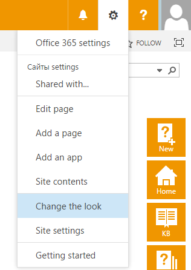
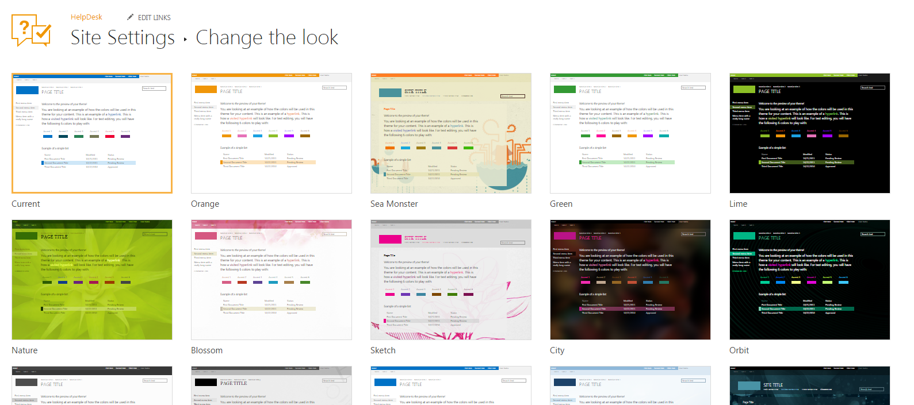

Color theme
###########

By default, HelpDesk uses its own color theme, but you can always revert it
to default or choose another one. HelpDesk uses SharePoint look to
change colors. Look is a color theme applied to your SharePoint site.

To do this click on "SharePoint Settings" button and select "Change the
look" item:

|ctl-online|

You will see the list of available "Looks". To apply the desired look just click
on it and follow setup steps.

|looks|

