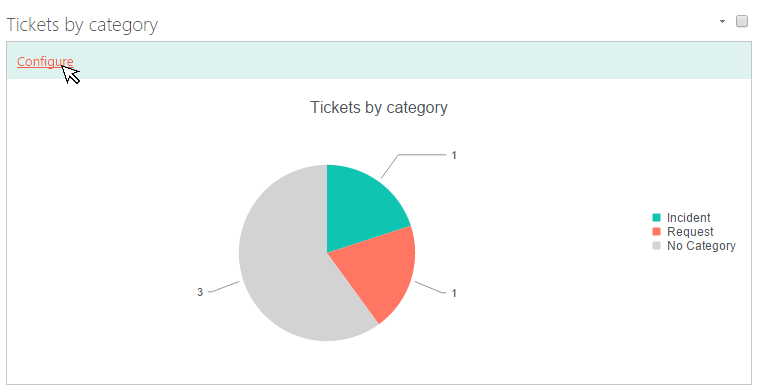

Reports customization
#####################

You can use our additional solution `Dashboard Designer`_ to customize
charts. You can find more information in the \ `documentation`_.

In order to customize charts with Dashboard Designer navigate to the
page containing charts and enter edit mode.

|Start edit mode|

Clicking the link "Configure" will load Dashboard designer where you can
customize your chart.

|Edit chart|

 

 

.. _Dashboard Designer: http://www.spchart.com/
.. _documentation: http://www.spchart.com/documentation

.. |Start edit mode| image:: ../_static/img/ribbon_charts_c.png

