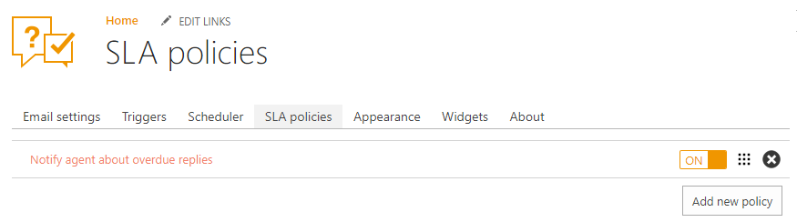
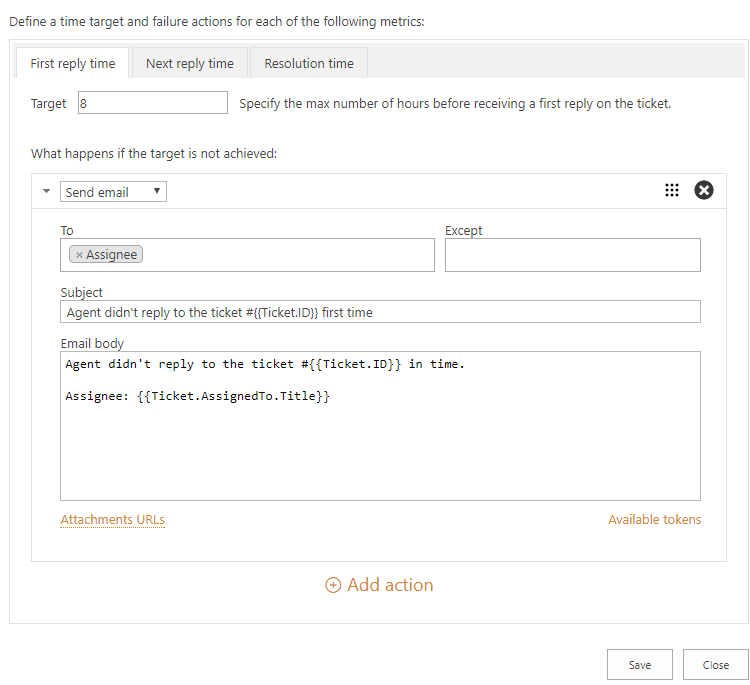
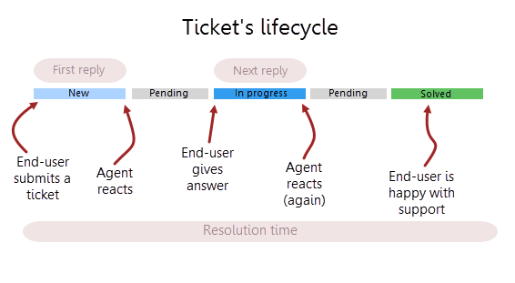
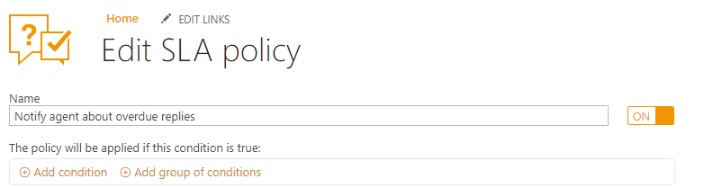
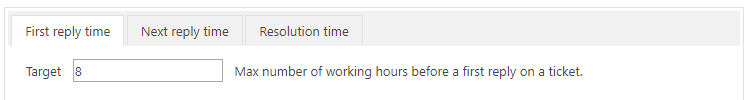
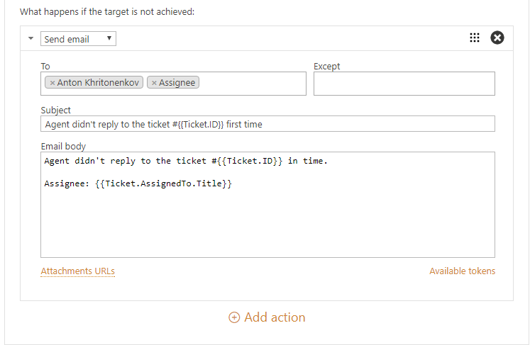

SLA policy
==========

SLA stands for Service Level Agreement, it lets you set up an average response and resolution time. SLA helps to provide more predictable and clear service, so your customers know when to expect a response for their request. 

You can create your own SLA policies and define actions for them according to your needs.

First of all, navigate to the settings using the icon in the navbar:

|SettingsIcon|

Then click on the SLA policies tab. Here you have one predefined SLA policy. By default, it’s inactive but you can activate it by switching the toggle button. Also, you can delete it.

|SLA|

How SLA policies are applied to tickets
---------------------------------------

List of SLA policies is sortable. You can change the order by dragging and dropping policies.

When a ticket is created, updated or a new comment is added, HelpDesk starts all the triggers. Once triggers are completed, it goes through the list of your SLA policies from top to bottom. Each SLA policy has a condition. HelpDesk checks those conditions. The first policy with the satisfied condition is applied to the ticket. Only this policy is applied to the ticket.

Once some SLA policy is applied to the ticket, HelpDesk starts tracking metrics of this SLA policy for the ticket.

.. note:: Order of your SLAs is important. Only the first SLA with the matching condition will be applied. Put the most strict SLA rules on the top.

We recommend you to create policies without overlapping conditions. Thus, you will ensure that specific policy is applied to a ticket with specific fields. For example, you can create different SLA policies for tickets with different priorities.

When a ticket is updated, a new SLA policy may be applied to a ticket. For example, if you change ticket priority it updates your ticket. HelpDesk goes through the list of SLA policies again and may apply different policy this time.

Metrics that you can measure
----------------------------

You can define the following metrics.

- **First reply time** - It is the time between ticket creation and the first response by an Assignee.    
- **Next reply time** - It is the time between the latest customer comment and the next response by Assignee.
- **Resolution time** - It is the time taken by the ticket to move from status “New” to “Solved”.

First reply time and Next reply time are using Requester comment as a starting point of SLA and these metrics are calculated only for Assignee. When resolution time is calculated, pending time is taken from it. In other words, SLA is always paused when the ticket has a pending status.

|TicketLifecycle|

Each metric has a list of actions that are performed if the metric is failed. For example, you can send an email notification about metric fail to a manager.

Creating a new SLA policy
-------------------------

Each SLA policy has the following structure:

- **Name** - SLA policy title. Use it to distinguish your policies.
- **Condition** - Set of rules which should be satisfied with the policy be applied.
- **Metrics with target hours** - Each metric has a target. It is a time in working hours for each metric. If an assignee spends more hours for the first reply, next reply, ticket resolution, corresponding metrics is considered failed.
- **Failure actions** - It is what happens if the target is not achieved.

|SLApolicy|

Condition
~~~~~~~~~

When you open SLA policies for the first time you see the default SLA policy. It doesn't have any conditions but you can configure it. `Condition syntax`_ in SLA is the same as in triggers_

|editSLA|

.. note:: You should not use ticket status in conditions. SLA policies already use it internally when calculating metrics.

Metrics with target hours
~~~~~~~~~~~~~~~~~~~~~~~~~

A target is a time within which a metric should be executed. In the policy below Agent should answer to a ticket for the first time within 8 business hours.

|Target|

Only working hours are calculated for each metric. HelpDesk takes business hours from regional settings of your help desk SharePoint site. You can change them by navigating to "Site settings -> Site Administration -> Regional settings":

|WorkingHours|

Site settings can be found in the top right corner of your site. Click Site Settings and navigate to Reginal settings.

Failure actions
~~~~~~~~~~~~~~~

If the target time is not achieved, action will be performed. Actions for SLA policies is the same to the trigger’s `actions`_.
The list of actions may contain multiple actions that will be executed sequentially one by one starting from the top. On the screenshot below, it is chosen to send an email to assignee about an unanswered ticket. You can use `tokens`_ and HTML markup to include information about the ticket into your message.

|Failure|

.. |SettingsIcon| image:: ../_static/img/settingsicon.png
   :alt: Settings Navigation Icon

.. |WorkingHours| image:: ../_static/img/working-hours.png
   :alt: Working hours

.. _actions: General%20information.html#actions
.. _tokens: Tokens%20and%20snippets.html
.. _Condition syntax: Condition%20syntax.html
.. _triggers: General%20information.html#conditions