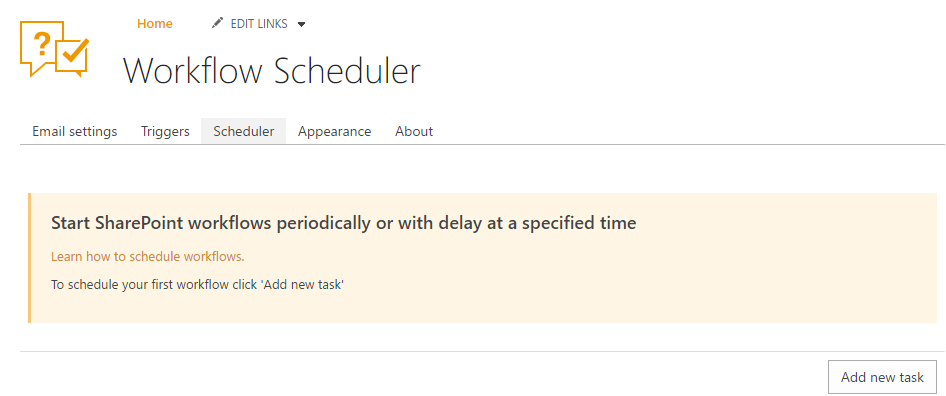

Scheduling
##########

You can use embedded `Workflow Scheduler`_ to run workflows
periodically. Find more information in `the Workflow Scheduler
documentation`_.

Navigate to settings using the icon in the navbar:

|SettingsIcon|

Then switch to "Scheduler" tab:

|HelpDeskScheduler|

.. _Workflow Scheduler: https://plumsail.com/workflow-scheduler/
.. _the Workflow Scheduler documentation: https://plumsail.com/workflow-scheduler/docs/

