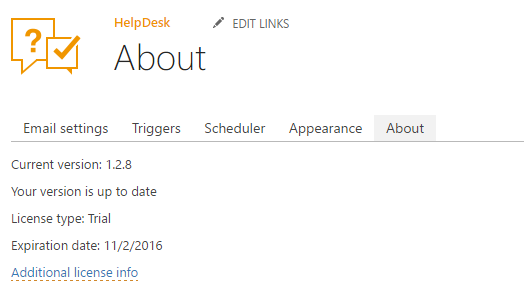

Upgrade manager
###############

.. note::
You need to restart SharePoint Timer Service after the upgrade is finished.

Upgrade manager allows you to install updates on your HelpDesk. Also, it provides information about HelpDesk version and license. Information about all HelpDesk versions you can find on `Version history`_ page.

If you'd like to update HelpDesk, you need to `download`_ the latest version of installer and run it on one of the servers in your SharePoint 2013/2016 farm as Farm Administrator. Follow the wizard steps and choose "Upgrade".

After that, navigate to settings using the icon in the navbar:

|SettingsIcon|

Then click on "About" tab. You will see the interface of upgrade manager. If you don't see "About" tab that means you are using HelpDesk version 1.0.0. You should manually navigate to URL ``<Site with HelpDesk>/_layouts/15/Plumsail/Helpdesk/About.aspx``.

.. note:: You need to update each HelpDesk instance in your farm otherwise, sites without update wouldn't be working.

|UpgradeManager|

On the picture above you can see that HelpDesk has version 1.2.8 and at the moment this version is up to date. Also you can see that license type is "Production" and the expiration date is 11/2/2016.

If version of your HelpDesk is not up to date and your account have "Manage Web" permissions then you will see the list of updates with full description of each update.

|UpdateAvailable|

To finish update you should click "Update" button.

:Manual steps when upgrading from version 1.0: 
You need to perform some actions manually to complete upgrade if you are updating from version 1.0:

1. Download CSS file :download:`plumsail.helpdesk.theme.css </_static/download/plumsail.helpdesk.theme.css>`.
2. **Upload** and **publish** "plumsail.helpdesk.theme.css" to following location ``<Site Collection with HelpDesk Site>/Style Library/<your language folder>/Themable/Plumsail/HelpDesk``.

	.. note::
		| If HelpDesk is installed on the site ``https://helpdesk.sharepoint.com/sites/IT/HelpDesk/`` with **English** as default language 
		| then you should **upload** and publish the file to ``https://helpdesk.sharepoint.com/sites/IT/Style Library/en-us/Themable/Plumsail/HelpDesk``.

3. Go to site settings and click "Change the look".
4. Reapply your current look.

.. |SettingsIcon| image:: ../_static/img/settingsicon.png
   :alt: Settings Navigation Icon

.. |UpdateAvailable| image:: ../_static/img/upgrade-manager-1.png
   :alt: Update Available

.. _Version history: ../General/Versionhistory.html
.. _download: https://plumsail.com/sharepoint-helpdesk/download/