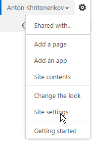
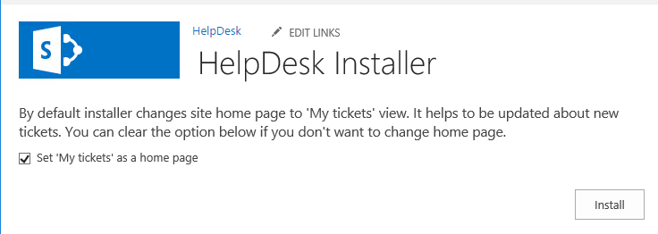
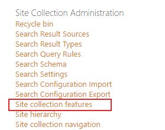

HelpDesk installation for SharePoint 2019
#########################################

`Download`_ and run it on one of the servers in your SharePoint 2019 farm as Farm Administrator. Follow the wizard steps.

Go to SharePoint site where you want to create HelpDesk. Select ‘Site Settings’:

|HelpDeskAuthentication|

Then navigate to site features:

|HelpDeskAuthentication1|

Activate Plumsail HelpDesk feature.

|HelpDeskFeature| 

Once you clicked on the feature you are redirected to installation wizard. It will check prerequisites and show you such screen:

|HDInstaller|

Then click next and wait for installation. Once HelpDesk has been installed, you can go on to `configuration`_.

WSP installation for SharePoint 2019
~~~~~~~~~~~~~~~~~~~~~~~~~~~~~~~~~~~~

`Download WSP package`_  and place it to one of the servers in your Sharepoint 2019 farm. Run Sharepoint 2019 Management Shell as administrator.

|WspInstallation1|

|WspInstallation2|

Type Add-SPSolution <path to wsp-package>.

|cmd|

Open Central Administration as administrator, then "System Settings" and move to "Manage farm solutions". Select plumsail.helpdesk.wsp and press "Deploy Solution" link.

|SolutionProp|

Go to your application. Select Site Settings item in the root of the site collection. Choose Site collection features in Site Collection Administration section.

|SiteFeatures|

Activate Plumsail HelpDesk feature.

|PFeature|

After that, you can continue with `configuration`_.

.. _Download: https://plumsail.com/sharepoint-helpdesk/download/
.. _this article: https://technet.microsoft.com/en-us/library/jj219638.aspx
.. _Download WSP package: https://plumsail.com/sharepoint-helpdesk/download/
.. _configuration: https://plumsail.com/docs/help-desk-onpremises/v1.x/Getting%20Started/Quick%20HelpDesk%20configuration.html

.. |HelpDeskAuthentication1| image:: ../_static/img/ManageSiteFeatures.png
   :alt: Site Features
.. |HelpDeskFeature| image:: ../_static/img/HD_Feature_2013.png
   :alt: Activate Plumsail HelpDesk

.. |PFeature| image:: ../_static/img/HD_Feature_2013.png
   :alt: Activate Plumsail Helpdesk