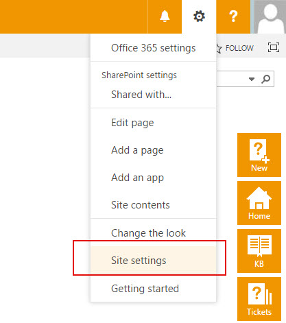
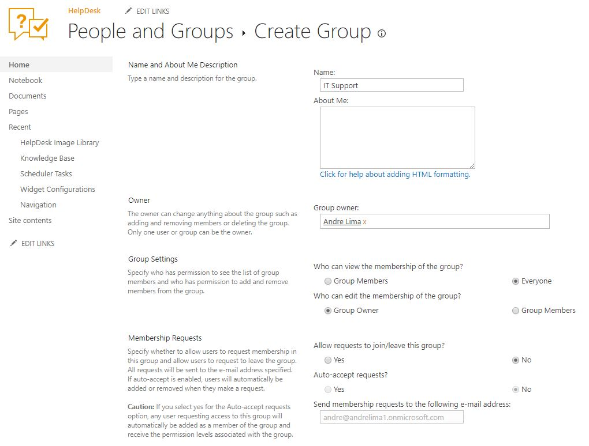

Assign ticket to multiple agents
################################

SharePoint group is a pool of SharePoint users with the same permission level.
If you would like to assign a ticket to a group, you need to create one.
For that, navigate to site settings.

|siteSettings|

And then to site permissions.

|sitePermissions|

Under site permissions, you can find predefined groups with different permission levels.
SharePoint creates them automatically with a site.
You need to create a new group, so click on **Create Group**.

|createGroup|

You can organize users into any number of groups.

.. note::
   HelpDesk will send notifications to the group members only if you allow **everyone** to view its membership.

|GroupSettings|

You can choose any permission level depending on what level of access you need.

|groupPermission|

To add new users to your group, select **Add users** in the dropdown menu.

|AddUsers|

In **Share** dialog enter names or e-mail addresses of users that you want to add to the group.
You can even add external users to SharePoint Online groups if they have Microsoft Accounts.
If you would like to add a personal touch, provide some text that will accompany the invitation.

|groupDialog|

Now you can **assign tickets** to the SharePoint group.

|groupExample|

.. |sitePermissions| image:: ../_static/img/sitePermissions.jpg
   :alt: Site permissions
.. |createGroup| image:: ../_static/img/createGroup.jpg
   :alt: Create a group

.. |groupPermission| image:: ../_static/img/group-permission.jpg
   :alt: Group permission level
.. |AddUsers| image:: ../_static/img/addUsers.jpg
   :alt:  Add new users
.. |groupDialog| image:: ../_static/img/group-dialog.jpg
   :alt:  Share pop up window
.. |groupExample| image:: ../_static/img/group-example.jpg
   :alt:  Example of assignment