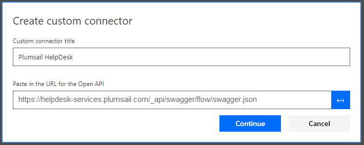

Create custom connector
=======================

Open Microsoft Flow account then navigate to *'Custom Connectors'* and click *'Create custom connector → Import an OpenAPI from URL'*:

|i1| |nbsp| |nbsp| |nbsp| |nbsp| |i2|

.. |nbsp| unicode:: 0xA0 
   :trim:

Fill in name *'Plumsail HelpDesk'* and swagger definition URL:

  https://helpdesk-services.plumsail.com/_api/swagger/flow/swagger.json

Once you clicked *'Continue'* you will see *'General'* step of connector configuration:

You may want to differentiate this connector from others. In this case, you can assign a custom icon and custom color for it. We suggest this icon:

And this color:

::

  #ee8400

Then click *'Create connector'*:

.. image:: ../_static/img/create-connector-link.png
   :alt: Create Connector link

