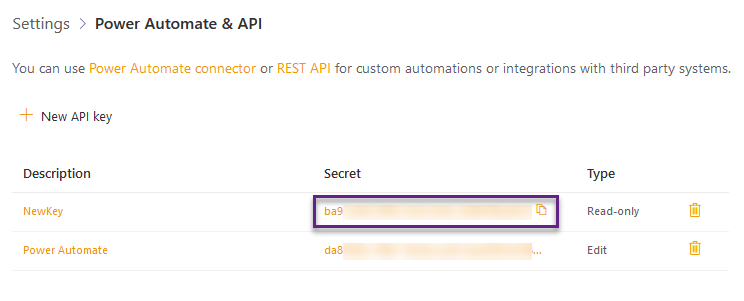

Get API key
===========

.. note::
	Only users with Manage Web permissions and above on your HelpDesk site can view and create API keys.

	If you don't see the menu item Settings -> API page, please check your HelpDesk version, it should be 1.4.5 or above to use API.

To generate new API key for Power Automate (Microsoft Flow) connector or REST API you need to navigate to the *"Settings -> API"* page on your HelpDesk site and click "Create new" button. Then select type of API key according to your needs. Read-only keys can be used only to retrive information, Edit keys allow to create, update and delete items.

-------------------------------------------------------------------------

.. image:: ../_static/img/create-api-key-form.png
   :alt: API key type

Once you created and API key, you can see your key right in the "API key" row on a key form:

|

Now you can copy and use it in:

- `Power Automate (Microsoft Flow) <ms-flow.html>`_
- `REST API calls <rest-api.html>`_