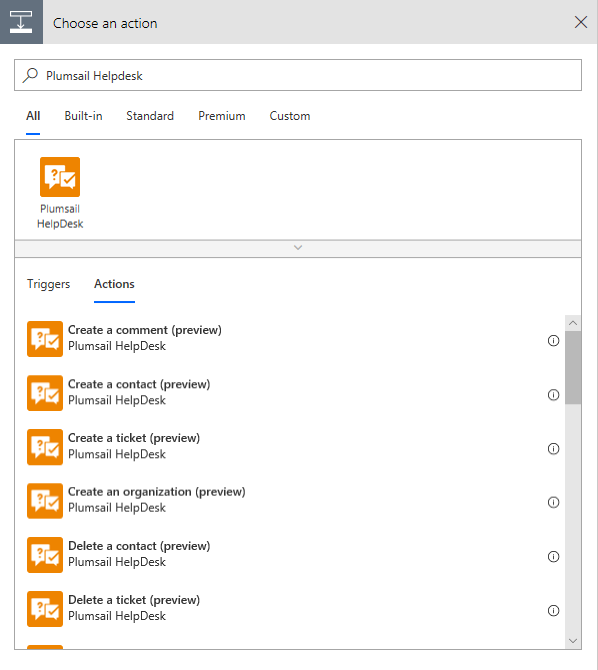

Microsoft Flow connector
=======================================

This connector helps you to manipulate data in your HelpDesk with the help of Microsoft Flow.

To start using it you need to complete following prerequisites:

1. `Create an API key <get-api-key.html>`_
2. `Create custom connector <create-custom-connector.html>`_
3. `Review available actions <flow-actions.html>`_

Then, once you created an API key and custom connector, you are ready to create your first Flow.

Just search for "Plumsail HelpDesk" in you Flow and add an appropriate action:

When you add an action for the first time you will be asked for *'Connection Name'* and for *'Access Key'*. You can type any name for the connection. For example, *'Plumsail HelpDesk'*. 

Then paste the API key you created in the first step to *'Access Key'* input. 

.. image:: ../_static/img/create-flow-connection.png
   :alt: Create Connection Form

Here is the list of actions available in the connector:

.. toctree::      
      :name: flow-actions
      :maxdepth: 2
            
      flow-actions