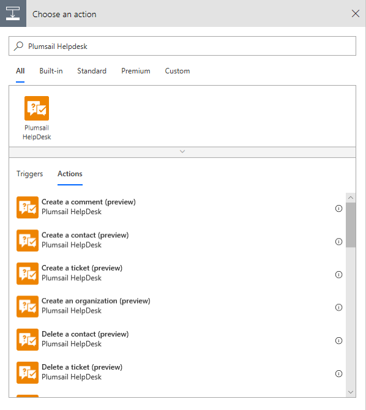
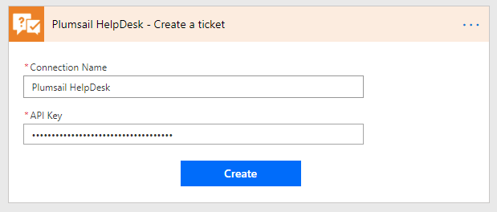

Microsoft Flow connector
=======================================

This connector helps you to manipulate data in your HelpDesk with the help of Microsoft Flow.

To start using it you need to complete following prerequisites:

1. :ref:`create-flow-api-key`
2. :ref:`create-custom-connector`
3. :ref:`review-flow-actions`

.. _create-flow-api-key:

Create an API key
-----------------

HelpDesk Microsoft Flow connector uses API keys for authentification. To generate API key just follow the steps described in `this topic <get-api-key.html>`_.

.. _create-custom-connector:

Create custom connector
-----------------------

Plumsail HelpDesk connector is not available in Microsoft Flow yet. It will become available soon. If you want to use it right now, you can `add Plumsail HelpDesk connector as a custom connector <create-custom-connector.html>`_.

.. _review-flow-actions:

Review available actions
------------------------

Once you created an API key and custom connector, you are ready to create your first Flow.

Just search for "Plumsail HelpDesk" in you Flow and add an appropriate action:

When you add an action for the first time you will be asked for *'Connection Name'* and for *'Access Key'*. You can type any name for the connection. For example, *'Plumsail HelpDesk'*. 

Then paste the API key you created in the first step to *'Access Key'* input. 

Here is the list of actions available in the connector:

.. toctree::      
      :name: flow-actions
      :maxdepth: 2
            
      flow-actions