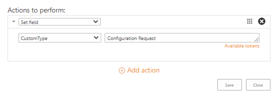
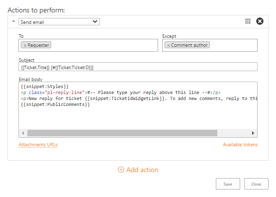
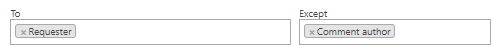
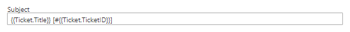
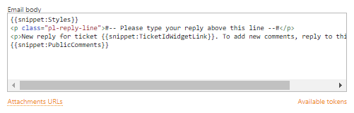
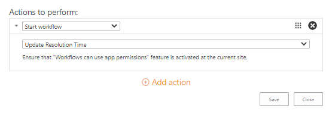
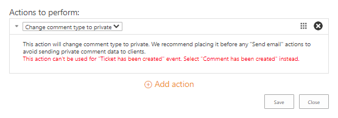

Actions reference
=================

There are four types of actions that can be executed with triggers (the first three are also available for Scheduler_ tasks or SLA_ policies).

.. contents::
    :local:
    :depth: 2

Set field
---------

|set-1|

The action for setting values into the *Tickets* list. The *Set field* action has the following properties:

* *Field name* is a drop-down menu with the names of fields that can be changed.
* *Field value* contains the new value of the selected field. Here, you can enter a value without quotes or use context tokens.

The tokens are enclosed between double braces and allow using the dynamical data from the list (in the context of a current ticket).
For example, the following token will be replaced with the value of the *Modified* column so the custom column will be filled with it:

|set-2|

For more information on the tokens usage, read the `accordant section`_.

Send email
----------

|send-1|
 
This action sends an email to multiple recipients.
You can use tokens and snippets in the message title and body to fill the template with the required information.
The action has the following properties:

* *To* is a required field. It defines recipients of the message. In this field, you can pick a contact from the *Contacts* list or use predefined tokens *All agents*, *Requester*, *Cc*, *Assignee*, and *Comment author* (the latter is available only for the *Comment has been created* event).
* *Except* excludes the specified recipients from the *To* field. Here, you can pick a contact from the *Contacts* list too or use the same predefined tokens.
* *Subject* of a message. In this field, you can use context tokens.
* *Email body* of a message. Configure here your message template using context tokens and snippets.
* *Attachment URLs* is a semicolon-separated list of attachments’ URLs that should be included in the message. We advise you to put here ``{{Comment.AttachmentUrls}}``.

On the screenshot above, there is a sample of a notification template for a requester.
The fields *To* and *Except* contain the predefined tokens which can be selected from a drop-down menu.
Thus, the action will send a message to the requester if he is not the author of a newly created comment.

|send-2|

The *Subject* field is populated with context tokens that will be replaced by title and ID of a ticket.
For more information on the tokens usage, read the `accordant section`_.

|send-3|

The email body contains snippets and a text marked up with HTML.
The snippets are enclosed between the double braces as well as tokens.
They are used for inserting predefined blocks of information into the message body.
Check the article `Building advanced email templates`_ to know more about this action.

|send-4|
 
Start workflow
--------------

|start|
 
The action starts a custom SharePoint workflow.
It can be a site or list-level workflow which is created on the *Tickets* list.

Change comment type to private
------------------------------

|change|
 
The action doesn’t require any input and can be performed only on the *Comment has been created* event.
So if the condition meets ``true`` the type of the created comment will be changed to private.

.. _tokens:

How to use tokens to access ticket and comment field values
-----------------------------------------------------------

You can use tokens in the fields of trigger actions.
When the action is executed, the token will be replaced by the value to which it refers.
You can use tokens in various scenarios.
For example, in the Send email action or in the Set field action.

One of the options is retrieving properties of tickets and comments.
For the former, it is possible to get properties of the current or previous version.
One of the following keywords should be used to get a required property:

* ``{{Ticket}}`` (can be used on any event)
* ``{{LastTicketVersion}}`` (can be used on a *Ticket has been changed* event)
* ``{{Comment}}`` (can be used on a *Comment has been added* event)

To get column value for a ticket or a comment  it is necessary to use a column internal name from the accordant list:

.. code-block:: latex

    {{Ticket.TicketID}}
    {{Ticket.Title}}
    {{Comment.Body}}
    {{Comment.Type}}

Where *TicketID* and *Title* are internal names of columns from the *Tickets* list.
*Body* and *Type* are internal names of columns from the *Comments* list.

Sometimes you may need to access data from a lookup column.
Reference to a lookup column will look like this:

.. code-block:: latex

    {{Ticket.Requester.Title}}
    {{Ticket.Requester.Organization.Title}}

In the example above, tokens return a full name of the requester and a name of the requester's organization via lookup columns (*Requester* and *Organization*).
The *Requester* is a lookup column in the *Tickets* list.
This lookup refers to the *Contacts* list.

.. |set-2| image:: ../_static/img/configuration-guide-triggers-set-2.png
   :alt: Set field (custom date)

.. _SLA: ./SLA%20policy.html
.. _Scheduler: ./Scheduling.html
.. _accordant section: ./Actions%20reference.html#tokens
.. _Building advanced email templates: ./Building%20advanced%20email%20templates.html