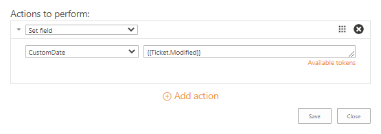

Actions reference
=================

There are four types of actions that can be executed with triggers (the first three are also available for Scheduler_ tasks or SLA_ policies).

.. contents::
    :local:
    :depth: 2

.. _field:

Set field
---------

|set-1|

The action for setting values in the “Tickets” list. It has the following **properties**:

* ``Field name`` (a drop-down menu with the names of fields that can be changed)
* ``Field value`` (a text field for the new value of the selected field, you can enter the value without quotes or use context tokens)

The tokens are enclosed between double braces and allow using the dynamical data from the list (in the context of a current ticket).
For example, the token ``{{Ticket.Modified}}`` will be replaced with the value of the “Modified” column so the custom column will be filled with it:

|set-2|

For more information on the tokens usage, read the `accordant section`_.

.. _email:

Send email
----------

|send-1|
 
This action sends an email to multiple recipients.
You can use tokens and snippets in the message title and body to fill the template with the required information.
The action has the following **properties**:

* ``To`` (a required field defining recipients of the message, you can pick a contact from the “Contacts” list or recipient token)
* ``Except`` (an optional field excluding recipients, you can pick a contact from the “Contacts” list or recipient token)
* ``Subject`` (in this field, you can use context tokens)
* ``Email body`` (configure here your message template using context tokens and snippets)
* ``Attachment URLs`` (a semicolon-separated list of attachments’ URLs, we advise you to put here ``{{Comment.AttachmentUrls}}``)

You can use the following **recipient tokens** instead of specifying certain contacts:

* ``All agents`` (all contacts from the “Contacts” list with the ``Agent`` role)
* ``Requester`` (a contact from the “Requester” field of the ticket)
* ``Cc`` (contacts from the “Cc” field of the ticket)
* ``Assignee`` (a user from the “Assigned to” field of the ticket)
* ``Comment author`` (available only for the ``Comment has been created`` event)

On the screenshot above, there is a sample of a notification template for a requester.
The fields **To** and **Except** contain the predefined tokens which can be selected from a drop-down menu.
Thus, the action will send a message to the requester if he is not the author of a newly created comment.

|send-2|

The **Subject** field is populated with context tokens that will be replaced by title and ID of a ticket.
For more information on the tokens usage, read the `accordant section`_.

|send-3|

The **Email body** contains snippets and a text marked up with HTML.
The snippets are enclosed between the double braces as well as tokens.
They are used for inserting predefined blocks of information into the message body.
Check the article `Building advanced email templates`_ to know more about this action.

|send-4|
 
.. _workflow:

Start workflow
--------------

|start|
 
The action starts a custom SharePoint workflow.
It can be a site or list-level workflow which is created on the “Tickets” list.

.. _type:

Change comment type to private
------------------------------

|type-1|
 
The action doesn’t require any input and can be performed only on the ``Comment has been created`` event.
It allows adding private notes via email.
For example, the agent replies to the ticket and adds a hashtag ``#private`` to his message.
A trigger will check whether the message body contains such a string.
So, if the condition meets ``true``, HelpDesk changes the type of comment to private.
Here is a configuration of such a trigger:

|type-2|

.. note::
   The trigger with this action should be at the top of the list.
   It will exclude the possibility that another one will notify the requester about such a message.

.. _tokens:

How to use tokens to access ticket and comment field values
-----------------------------------------------------------

You can use a **сontext token** in the trigger actions such as `Send email <#email>`_ or `Set field <#field>`_.
When the one is executed, the token will be replaced by the ticket or comment property to which it refers.

Define the source of data
~~~~~~~~~~~~~~~~~~~~~~~~~

One of the options is retrieving properties of either a ticket or a comment.
For the former, it is possible to get properties of a current or previous version.
One of the following **keywords** should be used to get a required property:

* ``{{Ticket}}`` (can be used on any event)
* ``{{LastTicketVersion}}`` (can be used on the ``Ticket has been changed`` event)
* ``{{Comment}}`` (can be used on the ``Comment has been added`` event)

Get simple values
~~~~~~~~~~~~~~~~~

To get a **column value** for a ticket or comment, it is necessary to use column’s `internal name`_:

.. code-block:: latex

    {{Ticket.TicketID}}
    {{Ticket.Title}}
    {{Comment.Body}}
    {{Comment.Type}}

In the example above, ``TicketID`` and ``Title`` are internal names of the columns in the “Tickets” list.
``Body`` and ``Type`` are the ones in the “Comments” list.
You can retrieve thus any simple value such as text, choice or date and time.
In the case of multiple values, they will be separated by semicolons.

Get lookup values
~~~~~~~~~~~~~~~~~

Sometimes you may need to access data from a **lookup column**. Its token will look like this:

.. code-block:: latex

    {{Ticket.Requester.Title}}
    {{Ticket.Requester.Organization.Title}}

In the example above, the tokens return a full name of the requester and a name of the requester’s organization via lookup columns.
The “Requester” is a lookup column in the “Tickets” list that refers to the “Title” column in the “Contacts” one.
The “Organization” is another lookup column in the latter list that refers to the “Title” column in the “Organizations” one.

Get person or group values
~~~~~~~~~~~~~~~~~~~~~~~~~~

Getting data from the field which has a **Person or Group** type is almost the same as in the case with lookup fields.
The only exception, that there is a fixed list of properties that you can refer to:

* ``ID``
* ``LoginName``
* ``Title``
* ``Email``

For example, tokens for a person or group specified in the “Assigned to” field will look as follows:

.. code-block:: latex

    {{Ticket.AssignedTo.ID}}
    {{Ticket.AssignedTo.LoginName}}
    {{Ticket.AssignedTo.Title}}
    {{Ticket.AssignedTo.Email}}

.. |set-1| image:: ../_static/img/configuration-guide-triggers-set-1.png
   :alt: Set field (custom string)

.. |send-3| image:: ../_static/img/configuration-guide-triggers-send-3.png
   :alt: Send email (subject)
.. |send-4| image:: ../_static/img/configuration-guide-triggers-send-4.png
   :alt: Send email (message body)
.. |start| image:: ../_static/img/configuration-guide-triggers-start.png
   :alt: Start workflow
.. |type-1| image:: ../_static/img/configuration-guide-triggers-type-1.png
   :alt: Change comment type to private

.. _SLA: ./SLA%20policy.html
.. _Scheduler: ./Scheduling.html
.. _accordant section: ./Actions%20reference.html#tokens
.. _Building advanced email templates: ./Building%20advanced%20email%20templates.html
.. _internal name: ../How%20To/Find%20the%20internal%20name%20of%20SharePoint%20column.html