Add widget to SharePoint site
#############################

.. note::
   Since version 2.1.1 widget web part is included in the default HelpDesk installation package. 
   It means you don't need to install it separately as in previous versions and it's available right after HelpDesk installation.

.. contents:: Table of contents
   :local:
   :depth: 1

Creating widget configuration
-----------------------------

Open HelpDesk site and navigate to the **Settings** tab using the left navbar.
Click on the **Widgets** tab.

|WidgetTab|

Here you can create a new widget configuration for your page by choosing "New item" and edit any existing configurations by clicking "Edit".
Note that editing of widget configuration is employing to every existing widget with this configuration.

|NewWidget|

Provide a **Title** for the widget and choose "For SharePoint" as its **Type**.

|SPWidget|

Check the configuration of the default views.
You can set how many **Tickets per page** the widget will have for a certain view.
The **Display fields** property specifies what information about tickets will be exposed on the widget list.
Just start typing the name of a field and pick it up from the dropdown list.
Creation of custom views is also available and described in `this article`_.

|EditView|

.. note::
   Display fields customization is available from version 1.4.7 and custom views—from version 2.1.9.
.. note::
   Display fields are cached for 30 minutes for optimisation purposes. You will need to clear browser cache to apply your changes immediately.

After saving, a configuration ID for SharePoint will be generated—copy it for inserting into the web part on a page.

|GenSPConfigID|

.. _auto-sign-in:

Enable automatic sign-in for a widget
-------------------------------------

Open the SharePoint site where you want to place the widget.

Install Plumsail HelpDesk Widget add-in from `SharePoint App store <https://store.office.com/en-us/app.aspx?assetid=WA104380769&sourcecorrid=764978a8-0233-4b42-b2e4-7724d130dcf5&searchapppos=0&ui=en-US&rs=en-US&ad=US&appredirect=false&canaryguid=c737b959d79b439bb20bebb5befabc00&reviewedAssetRating=5&AuthType=1&fromAR=1>`_. Installing of the add-in is required to enable automatic sign-in under the current SharePoint user in a widget.

Then you need to place widget to a specific SharePoint page. Steps to do that are described below.

Adding widget to modern SharePoint page
---------------------------------------

Navigate to a page where you'd like to place a widget.

Pick **Plumsail HelpDesk Widget WebPart** web part from the menu to add it to your page:

|PickWPOnModernPage|

Once you added the web part you need to configure it. Just copy 'Configuration ID for SharePoint' from widget configuration form and paste it to corresponding web part property.

|ConfigureModernWP|

Publish the page. Your HelpDesk widget is ready to use.

|WidgetOnModernPage|

Known issues
------------

You may encounter the following error trying to `add Plumsail HelpDesk Widget <Add%20widget%20to%20SharePoint%20site.html#auto-sign-in>`_ to a SharePoint site:

|Widget_Issue|

In this case, click **Find out why** and **Request Approval**.

|Widget_ApprovalRequest|

Enter a reason and request approval.

|Widget_SendRequest|

.. note::
   You should have global (tenant) admin permissions to perform further actions in App Catalog.

Then, open `App Catalog <Installation%20of%20HelpDesk%20SharePoint%20Framework%20package.html#create-app-catalog>`_ and go to **App Requests**.
Click **Plumsail HelpDesk Widget** on the requests list.

|Widget_AppCatalog|

Check the permissions granting to the app and click **Approve**.

|Widget_Approval|

Then go back to the site where you want to install the widget add-in and click it again.
Confirm that you **Trust It**.

|Widget_Installation|

When the installation is finished, the widget's icon color will be changed from pale to bright one in **Site contents**.

|Widget_PaleIcon|

|Widget_BrightIcon|

.. |WidgetTab| image:: ../_static/img/tab.png
   :alt: Widget Tab
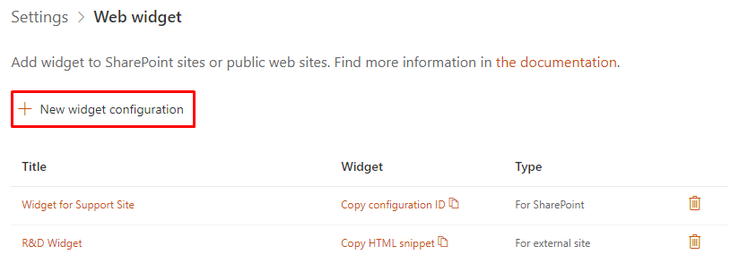
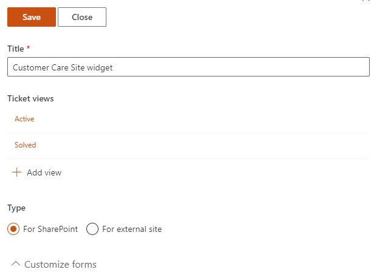
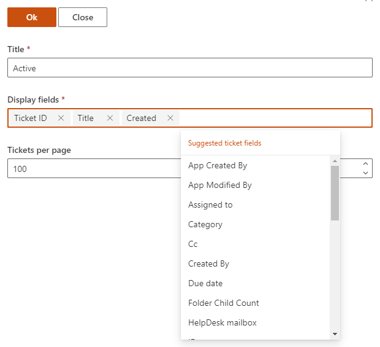
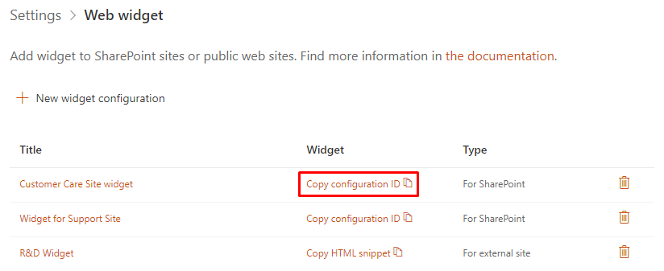
.. |PickWPOnModernPage| image:: ../_static/img/widget-pick-wp-on-modern-page.png
   :alt: Pick the HelpDesk web part
.. |ConfigureModernWP| image:: ../_static/img/widget-configure-modern-wp.png
   :alt: Copy ID to the web part
.. |WidgetOnModernPage| image:: ../_static/img/widget-on-modern-page.png
   :alt: The widget on the page
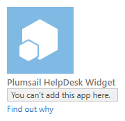
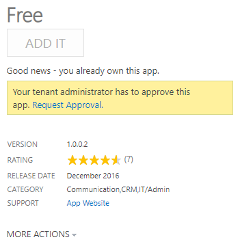
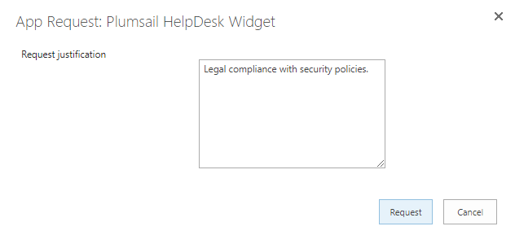
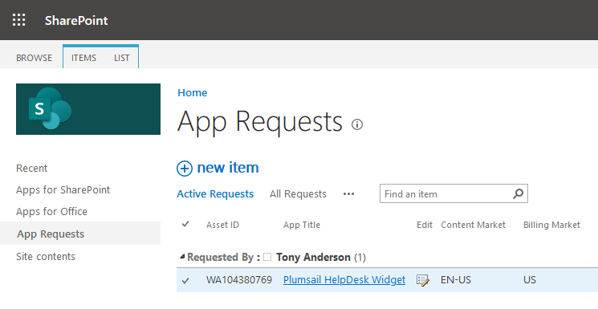
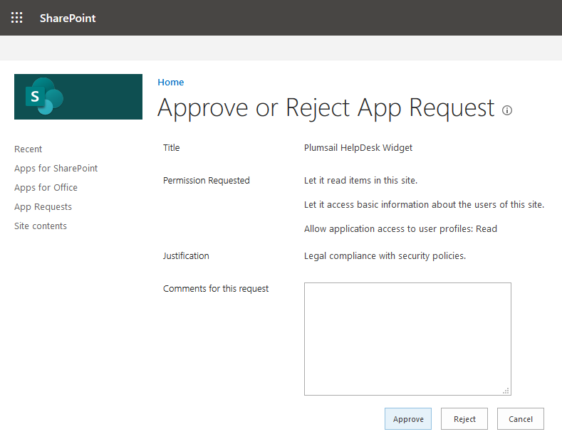
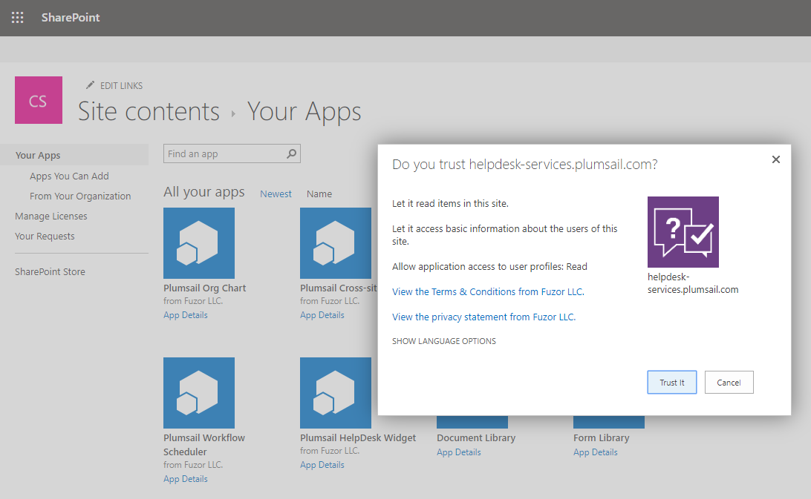
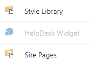
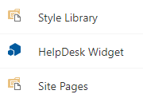

.. _this article: ./Custom%20widget%20views.html