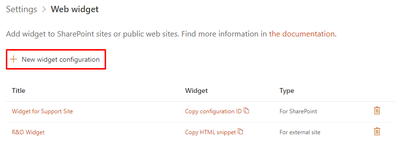
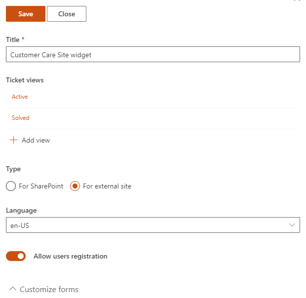
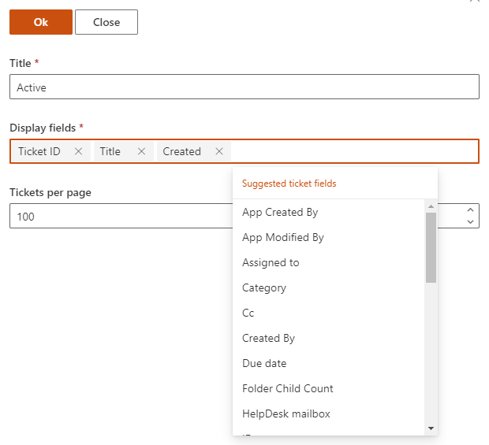
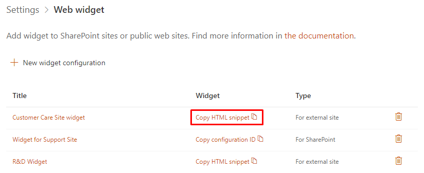

Add widget to external site
###########################

The first step is to configure your future widget. To do it, open HelpDesk site and navigate to 
the **Settings** page using the left navbar.
Then click on the **Widgets** tab.

|WidgetTab|

Here you can create a new widget configuration for your page by choosing 'New item' and edit any existing configurations by clicking 'Edit'. Note that editing of widget configuration is employing to every existing widget with this configuration.

|NewWidget|

Provide a **Title** for the widget and choose "For external site" as its **Type**. If you are creating a widget for an external site, you can choose widget language and whether to allow user registration. Registered users have the ability to review their tickets.

|ExtWidget|

Check the configuration of the default views.
You can set how many **Tickets per page** the widget will have for a certain view.
The **Display fields** property specifies what information about tickets will be exposed on the widget list.
Just start typing the name of a field and pick it up from the dropdown list.
Creation of custom views is also available and described in `this article`_.

|EditView|

.. note::
   Display fields customization is available from version 1.4.7 and custom views—from version 2.1.9.
.. note::
   Display fields are cached for 30 minutes for optimisation purposes. You will need to clear browser cache to apply your changes immediately.

After saving, HTML code for external sites will be generated—copy it.

|GetGeneratedHTML|

Open editing form of your HTML page and add the copied code where you'd like to place a widget.

.. |WidgetTab| image:: ../_static/img/tab.png
   :alt: Widget Tab

.. _this article: ./Custom%20widget%20views.html