Adding widget to SharePoint site
######

Installing Widget WebPart
-------------------------

Since `Helpdesk Modern UI release <https://plumsail.com/docs/help-desk-o365/v1.x/General/Versionhistory.html#version-2-1-1>`_ we included webpart of web widget into Modern UI package
and it's installed with Helpdesk by the installation wizard.

After Helpdesk installation please follow the next steps to configure Helpdesk web widget.

Creating widget configuration
-----------------------------

The next step is to configure your future widget. 

Open HelpDesk site and navigate to e-mail settings using navbar.

|EmailSettings|

Then click “Widgets” tab.

|WidgetTab|

Here you can create a new widget configuration for your page by choosing 'New item' and edit any existing configurations by clicking 'Edit'. Note that editing of widget configuration is employing to every existing widget with this configuration.

|NewWidget|

Provide a title for a widget configuration and choose how many tickets will be displayed on the page.

You can customize fields displayed in widget ticket list. To do this you will need to provide a list of comma-separated field names in Display fields section. Note, that you need to use `internal names`_ of the fields. 

If you are creating a widget for external site, you can choose widget language and whether to allow user registration. Registered users have ability to review their tickets.

.. note::
   Display fields customization is available from version 1.4.7.
.. note::
   Display fields are cached for 30 minutes for optimisation purposes. You will need to clear browser cache to apply your changes immediatly.

|WidgetMenu|

After saving, HTML code for external sites and configuration ID for SharePoint will be generated and you need to copy SharePoint Configuration ID.

|GenSPConfigID|

Enable automatic sign-in for a widget
-----------------------

Open SharePoint site where you want to place the widget.

Install Plumsail HelpDesk Widget add-in from `SharePoint App store <https://store.office.com/en-us/app.aspx?assetid=WA104380769&sourcecorrid=764978a8-0233-4b42-b2e4-7724d130dcf5&searchapppos=0&ui=en-US&rs=en-US&ad=US&appredirect=false&canaryguid=c737b959d79b439bb20bebb5befabc00&reviewedAssetRating=5&AuthType=1&fromAR=1>`_. Installing of the add-in is required to enable automatic sign-in under current SharePoint user in widget.

Then you need to place widget to specific SharePoint page. Steps to do that are described below.

Adding widget to modern SharePoint page
--------------------------------------

Navigate to a page where you'd like to place a widget.

Pick ‘Plumsail HelpDesk Widget WebPart’ web part from the menu to add it to your page:

|PickWPOnModernPage|

Once you added the web part you need to configure it. Just copy 'Configuration ID for SharePoint' from widget configuration form and paste it to corresponding web part property.

|ConfigureModernWP|

Publish the page. Your HelpDesk widget is ready to use.

|WidgetOnModernPage|

Adding widget to classic SharePoint page
--------------------------------------

Navigate to a page where you'd like to place a widget and open the page in the edit mode.

Click ‘Insert → Web Part’. 

Pick ‘Plumsail’ category in the list of web part categories.

Pick ‘Plumsail HelpDesk Widget WebPart’ web part and click ‘Add’:

|PickWPOnClassicPage|

Once you added the web part you need to configure it. Just copy 'Configuration ID for SharePoint' from widget configuration form and paste it to corresponding web part property.

Save the page. Your HelpDesk widget is ready to use.

|WidgetOnClassicPage|

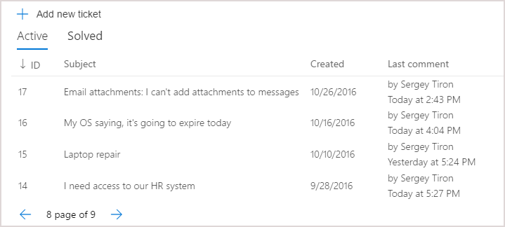
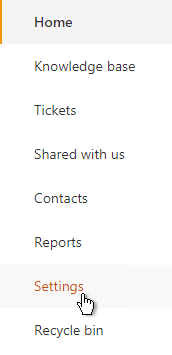
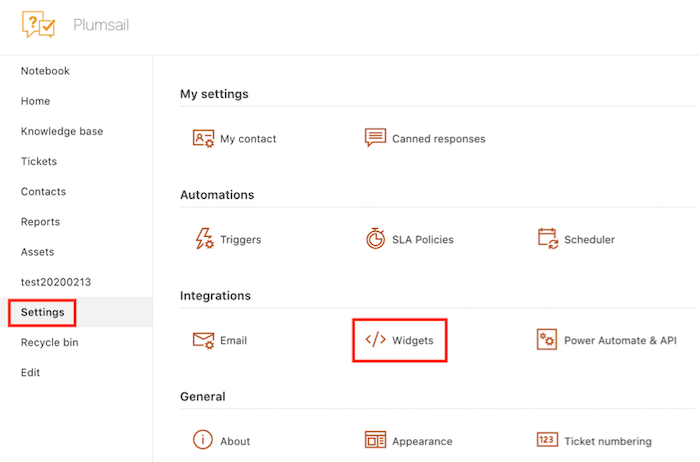
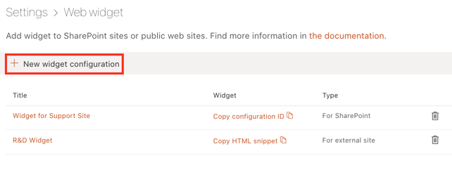
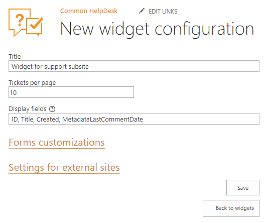
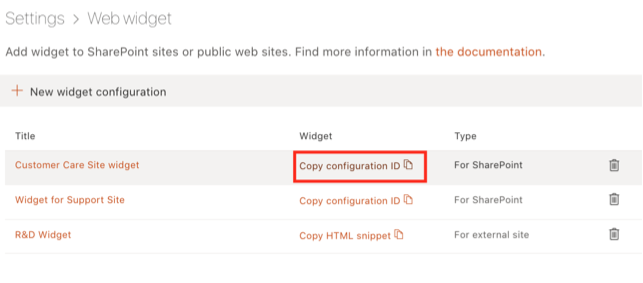
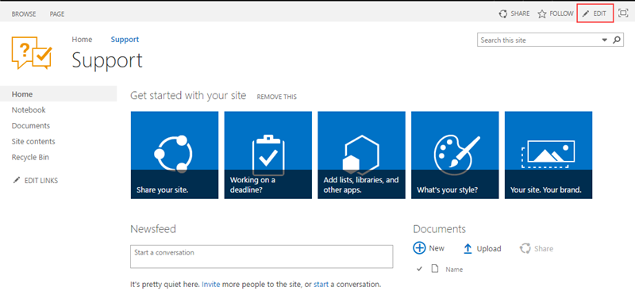
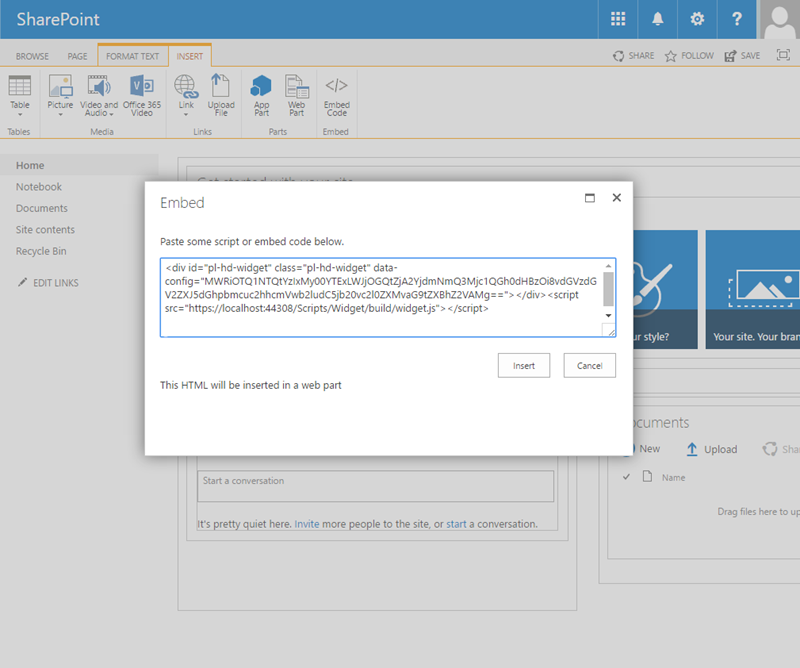
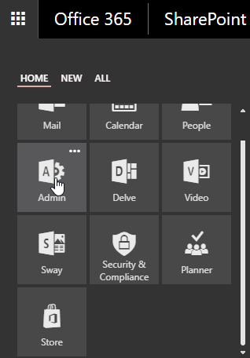
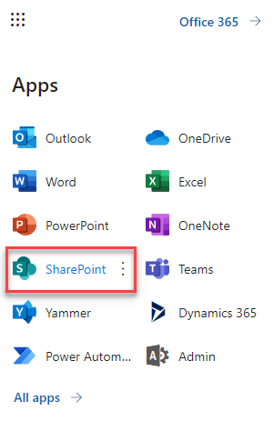
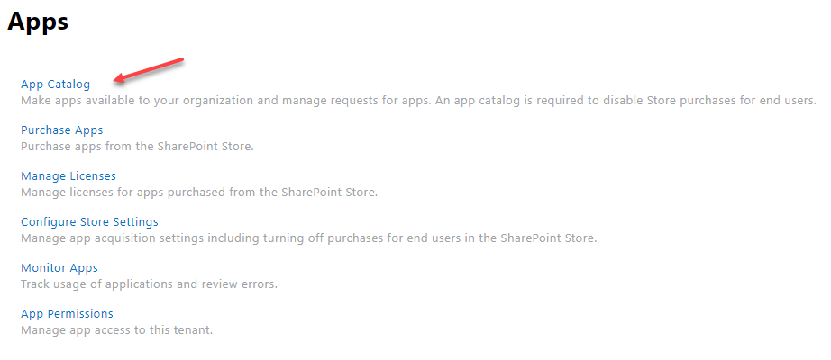
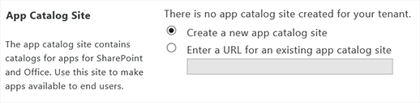
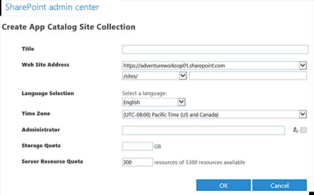
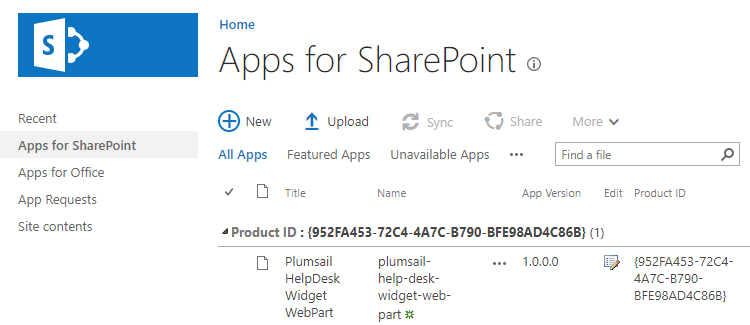
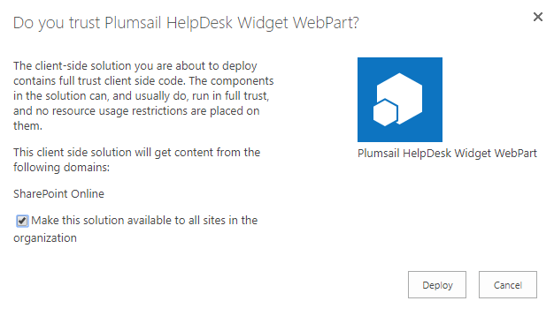
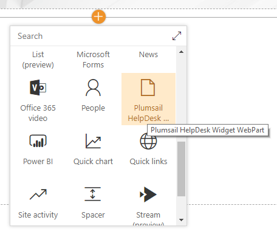
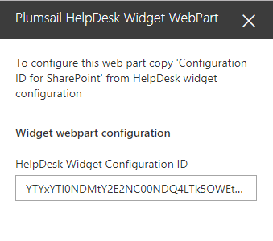
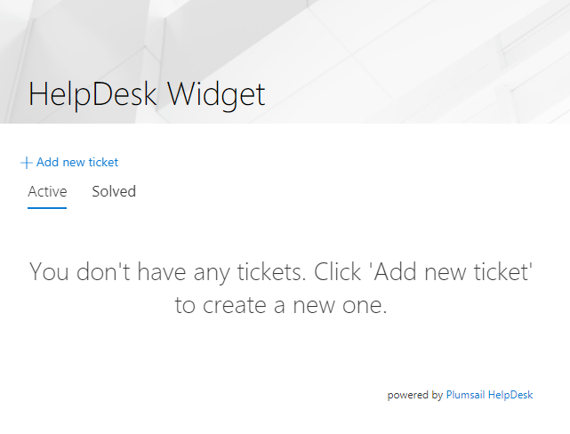
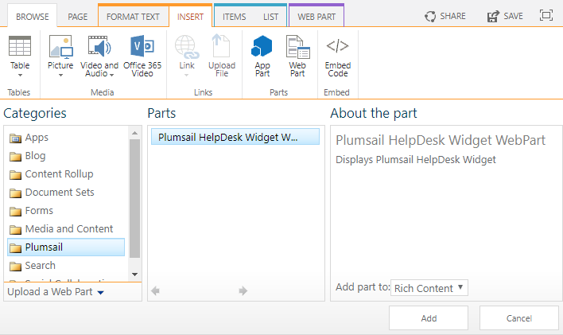
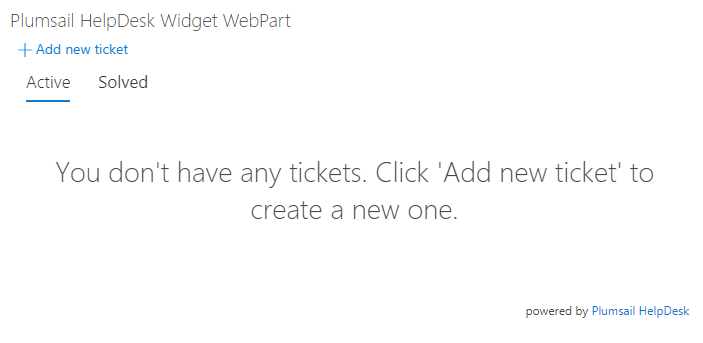
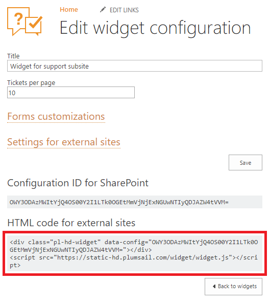

.. _this link: /Configuration%20Guide/deprecated/Widget.html
.. _internal names: ../How%20To/Find%20the%20internal%20name%20of%20SharePoint%20column.html