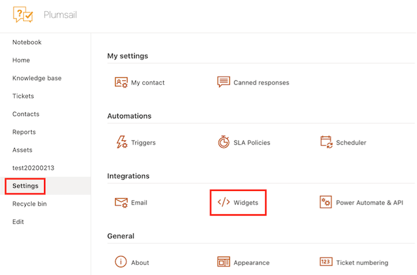
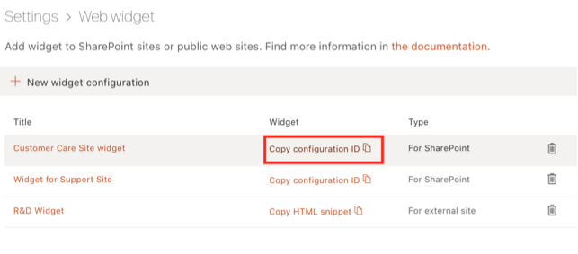
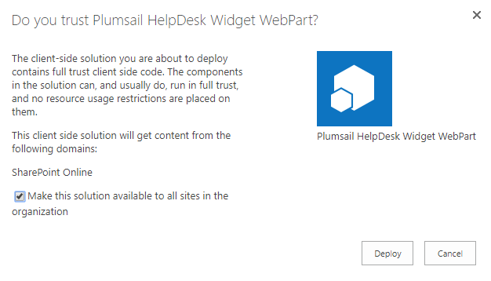
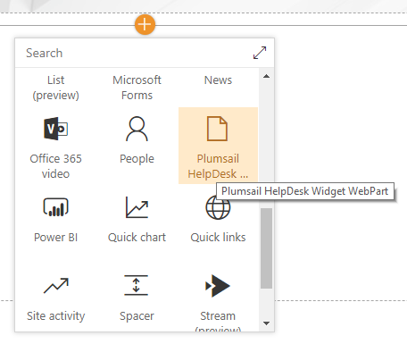
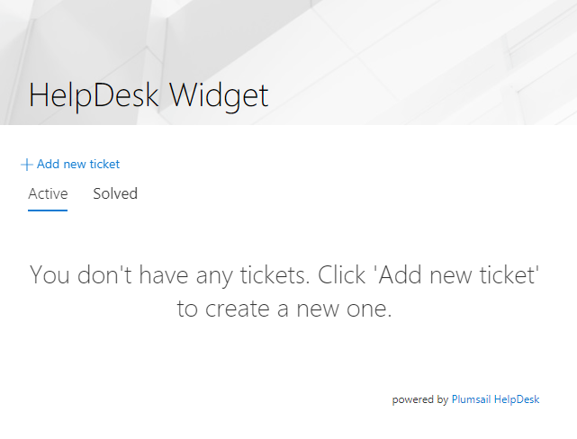
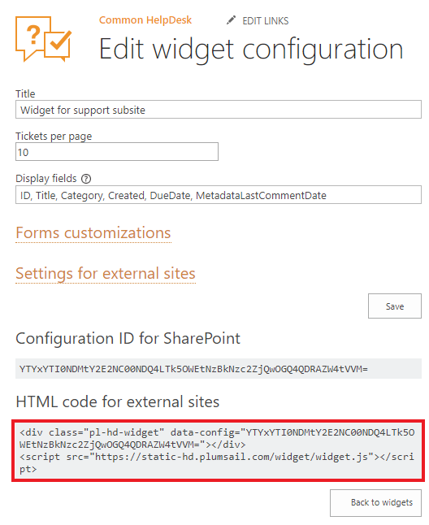

Adding widget to external site
######

The first step is to configure your future widget. To do it, open HelpDesk site and navigate to 
the **Settings** page using the left navbar.
Then click on the **Widgets** tab.

|WidgetTab|

Here you can create a new widget configuration for your page by choosing 'New item' and edit any existing configurations by clicking 'Edit'. Note that editing of widget configuration is employing to every existing widget with this configuration.

|NewWidget|

Provide a title for a widget configuration and choose how many tickets will be displayed on the page.

You can customize fields displayed in widget ticket list. To do this you will need to provide a list of comma-separated field names in Display fields section. Note, that you need to use `internal names`_ of the fields. 

If you are creating a widget for external site, you can choose widget language and whether to allow user registration. Registered users have ability to review their tickets.

.. note::
   Display fields customization is available from version 1.4.7.
.. note::
   Display fields are cached for 30 minutes for optimisation purposes. You will need to clear browser cache to apply your changes immediatly.

|WidgetMenu|

After saving, HTML code for external sites and configuration ID for SharePoint will be generated and you need to copy HTML code for external sites.

|GetGeneratedHTML|

Open editing form of your HTML page and add copied code where you'd like to place a widget.

.. |WidgetView| image:: ../_static/img/widgetview.png
   :alt: HelpDesk Widget
.. |EmailSettings| image:: ../_static/img/settingsicon.png
   :alt: E-mail settings

.. |NewWidget| image:: ../_static/img/newitem.png
   :alt: Create a new item

.. |EditPage| image:: ../_static/img/editpage.png
   :alt: Adding a widget to your site
.. |Finish| image:: ../_static/img/finish.png
   :alt: Inserting a widget
.. |Office365AdminCenter| image:: ../_static/img/widget-open-admin-center.png
.. |SharePointAdminCenter| image:: ../_static/img/widget-navigate-to-sharepoint-admin-center.png
.. |OpenAppCatalog| image:: ../_static/img/widget-open-app-catalog.png
.. |CreateAppCatalog| image:: ../_static/img/widget-create-app-catalog.png
.. |NewAppCatalog| image:: ../_static/img/widget-new-app-catalog.png
.. |UploadSPPKG| image:: ../_static/img/widget-upload-sppkg.png

.. |ConfigureModernWP| image:: ../_static/img/widget-configure-modern-wp.png

.. |PickWPOnClassicPage| image:: ../_static/img/widget-pick-wp-on-classic-page.png
.. |WidgetOnClassicPage| image:: ../_static/img/widget-on-classic-page.png

.. _this link: /Configuration%20Guide/deprecated/Widget.html
.. _internal names: ../How%20To/Find%20the%20internal%20name%20of%20SharePoint%20column.html
