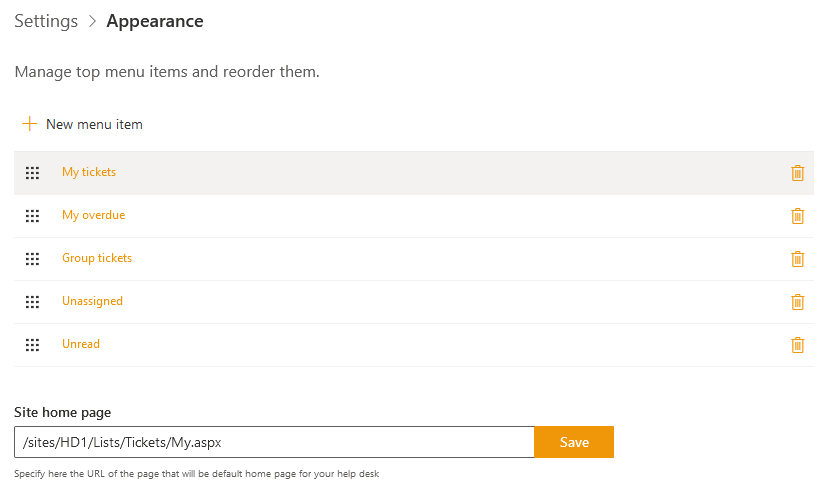

Appearance settings
###################

You can hide or display the SharePoint out of the box quick launch bar
as well as customize HelpDesk navigation.

.. note:: If you are using Plumsail HelpDesk with version older than 2.1.1, please follow  `this link <deprecated/Appearance%20(before%202.1.1).html>`_ to learn about forms customization for your version of HelpDesk.

Navigate to **Settings** tab using the left navbar:

Then click on the **Appearance** tab. Now you can see the quick launch
display setting and a list of HelpDesk navigation elements.

|navigationsets|

Top menu customization 
~~~~~~~~~~~~~~~~~~~~~~

HelpDesk top menu is a set of buttons  with different ticket views. You can customize them by adding a new button with a view or URL to external site. You can change existing buttons as well.

To add a new item to top navigation, click “New top menu item”.

|NewTopMenu|

You will see a dialog window where you need provide a title for a new item and select ticket view. If you choose a link instead of view, please provide aan URL.

|NewItem|

In Order field, provide an index number which the new item will take place in the line of existing elements. 
Don’t forget to save a new item.

If you have troubles with deleting the item, open your browser's console and type localStorage.clear() there. Then renew the page.

.. |SettingsIcon| image:: ../_static/img/settingsicon.png
   :alt: Settings Navigation Icon

.. |leftsidebar| image:: ../_static/img/navigation-1.png
   :alt: Left Side Bar
.. |navigationEdit| image:: ../_static/img/navigation_edit.png
   :alt: Navigation Edit
.. |NewTopMenu| image:: ../_static/img/new-top-menu.jpg
   :alt: New top menu item

