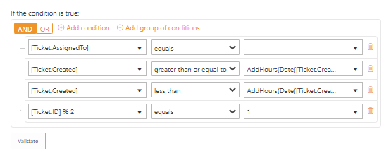
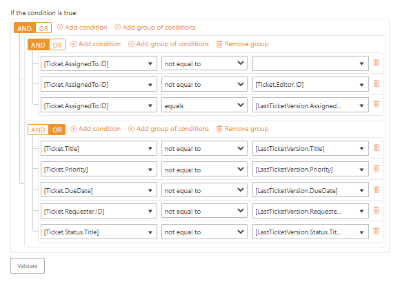

Building advanced conditions
============================

.. contents::
    :local:
    :depth: 2

How to refer to values of ticket and comment fields
---------------------------------------------------

You can use a reference in the trigger conditions.
When the one is checked, the reference will be replaced by the ticket property to which it refers.

Define the source of data
~~~~~~~~~~~~~~~~~~~~~~~~~

One of the options is retrieving properties of tickets or comments.
For the former, it is possible to get properties of the current or previous version.
One of the following keywords should be used to get a required property:

* ``[Ticket]`` (can be used on any event)
* ``[LastTicketVersion]`` (can be used on a *Ticket has been changed* event)
* ``[Comment]`` (can be used on a *Comment has been added* event)

Get simple values
~~~~~~~~~~~~~~~~~

To get a column value for a ticket or a comment it is necessary to use the column internal name from the accordant list:

.. code-block:: latex

    [Ticket.TicketID]
    [Ticket.Title]
    [Comment.Body]
    [Comment.Type]

Where *TicketID* and *Title* are internal names of columns from the *Tickets* list.
*Body* and *Type* are internal names of columns from the *Comments* list.
You can retrieve thus any simple value such as text, choice or date and time.
In the case of multiple values, they will be separated by a semicolon.

Get lookup values
~~~~~~~~~~~~~~~~~

Sometimes you may need to access data from a lookup column. Reference to it will look like this:

.. code-block:: latex

    [Ticket.Requester.Title]
    [Ticket.Requester.Organization.Title]

In the example above, tokens return a full name of the requester and a name of the requester’s organization via lookup columns.
The *Requester* is a lookup column in the *Tickets* list that refers to *Contacts* one.
The *Organization* is another lookup column but in the *Contacts* list that refers to *Organizations* one.

Get person or group values
~~~~~~~~~~~~~~~~~~~~~~~~~~

Getting data from the field which has a *Person or Group* type is almost the same as in the case with lookup fields.
The only exception, that there is a fixed list of properties that you can refer to:

* ``ID``
* ``LoginName``
* ``Title``
* ``Email``

For example, a reference to a person or group specified in the *Assigned to* field will look as follows:

.. code-block:: latex

    [Ticket.AssignedTo.ID]
    [Ticket.AssignedTo.LoginName]
    [Ticket.AssignedTo.Title]
    [Ticket.AssignedTo.Email]

How to use expression operators
-------------------------------

In the middle of each expression, there is an operator.
It performs some actions with data from both ends of expression and returns true or false.
The operator can be a basic mathematical comparison:

* equals (``==``)
* not equal to (``!=``)
* less than (``<``)
* greater than (``>``)
* less than or equal to (``<=``)
* greater than or equal to (``>=``)

As well as a function:

* ``contains`` (returns true if the left string contains the right one, it is case-sensitive)
* ``does not contain`` (returns true if the left string doesn’t contain the right one, it is case-sensitive too)
* ``matches`` (the function returns true if the left part is an occurrence of the regular expression which is in the right part of condition expression)

Options for *matches*
~~~~~~~~~~~~~~~~~~~~~

The pattern can contain inline options to modify the behaviour of the regular expression.
Such options have to be placed at the beginning of the expression inside brackets with a question mark: ``(?YOUR_OPTIONS)``.
For example options ``(?mi)`` will allow to process multi-line text with case insensitivity.
List of available options:

* allowing whitespace and comments (``x``)
* single-line mode (``s``)
* multi-line mode (``m``)
* case insensitivity (``i``)
* only allow explicit capture (``n``)

You can find additional information about inline options in this article_.

How to group condition expressions
----------------------------------

Condition expressions are grouped with the following logical operators:

* ``AND`` (the group of expressions returns ``true`` if each element does)
* ``OR`` (the group of expressions returns ``true`` if any element does)

By default, there is always one basic group of conditions even if you have just one expression.
But it is possible to add nested groups which will return a common result for all expressions it contains.

How to manipulate data inside operands
--------------------------------------

Besides operators, you can perform some additional actions on data right in the operands’ fields (the left and right parts of expressions).
There are date/time functions and arithmetical operators.
They can be applied to hardcoded data as well as to ticket and comment fields.

Date/time functions
~~~~~~~~~~~~~~~~~~~

* ``Today()`` receives no argument and returns of the current system date with 12 AM time part.
* 
* ``Now()`` receives no argument and returns the current system date and time and receives no argument.
* 
* ``Date()`` receives a date/time string as an argument and returns the same date with 12 AM time part.
* 
* ``AddMinutes() / AddHours() / AddDays() / AddMonths() / AddYears()``, each function adds the specified number of time units to a certain date/time string. It contains two arguments: the first one is a date/time string; the second one is an integer.

Arithmetical operators
~~~~~~~~~~~~~~~~~~~~~~

* Addition or concatenation (``+``)
* Subtraction (``-``)
* Multiplication (``*``)
* Division (``/``)
* Division with remainder (``%``)

How to assign tickets proportionally on the shift basis 
-------------------------------------------------------

To demonstrate how conditions should be configured, let’s consider the following example.
There are three shifts with 2 agents in each to provide 24/7 support.
New tickets are assigned to agents of a certain shift depending on the time of their creation.
All tickets should be distributed proportionally between agents of a certain shift.
We create a separate trigger for assigning tickets to each agent.
The triggers will run on the creation of a ticket.
And here is how its condition will look like for one of the agents of the day shift.

It is necessary to check whether the ticket is assigned to nobody.
A reference to assignee’s ID is used:

.. code-block:: latex

    [Ticket.AssignedTo.ID]

For checking the time of creation, a reference to the accordant ticket field is required:

.. code-block:: latex

    [Ticket.Created]

Use the ``Date()`` function to get the day.
If you pass the reference ``[Ticket.Created]`` as an argument, it will return 12 AM of the day when the ticket is created:

.. code-block:: latex

    Date([Ticket.Created])

Use the ``AddHours()`` function to define a certain time point of a day.
I used the following functions to define limits of the day shift (from 8 AM till 4 PM):

.. code-block:: latex

    AddHours(Date([Ticket.Created]), 8)
    AddHours(Date([Ticket.Created]), 16)

Also, the division with remainder will be useful in this case.
Divide the item ID by the number of agents in one shift.
In this case, it is 2. The possible remainders are 0 and 1.
It means that we assign all tickets with the former to one agent and with the latter—to another.

.. code-block:: latex

    [Ticket.ID] % 2

Thus, the condition for the described example will look as follows for one of two agents of the day shift which lasts from 8 AM till 4 PM.
All expressions are united with the logical operator ``AND`` since each should return ``true``.

|condition-1|

.. _changes:

How to detect changes made by others
------------------------------------

Out-of-the-box, HelpDesk has a trigger notifying assignees about changes performed by others.
It is fired on the *Ticket has been changed* event which allows referring to the previous ticket version.
Use ``LastTicketVersion`` instead of ``Ticket`` at the beginning of any reference to get the previous value of a field.
For instance, a reference to a previous ticket title will be such:

.. code-block:: latex

    [LastTicketVersion.Title]

Here is an overview of trigger’s conditions united into two groups:

|condition-2|
 
The first group defines whether it is a case when an assignee should be notified in general.
Each condition of the group should return true.
Here, we check whether:

* the ticket has an assignee
* the ticket is modified by someone other than the assignee
* the assignee wasn’t changed

The second group defines changing of which fields the assignee should be notified about.
In the second group, any condition should return true.
Each condition expression compares the current and previous states of the following ticket fields:

* Title
* Priority
* Due date
* Requester
* Status

If both groups of expressions return true, then the notification will be sent (check the accordant section  of the `Building advanced email templates`_ article).

.. _article: https://docs.microsoft.com/en-us/dotnet/standard/base-types/regular-expression-options?redirectedfrom=MSDN
.. _Building advanced email templates: ./Building%20advanced%20email%20templates.html