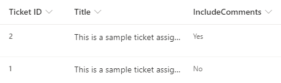
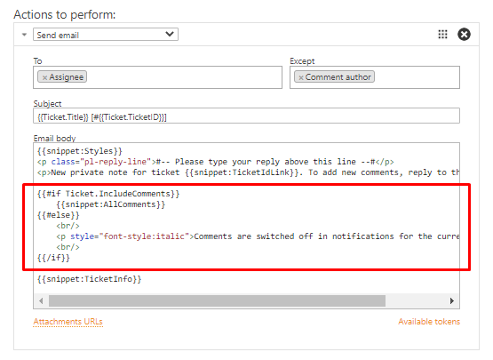
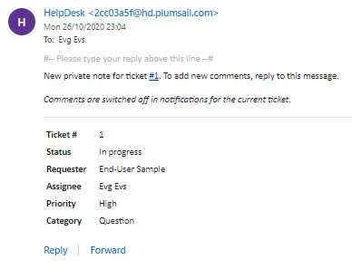
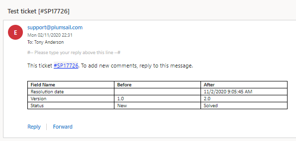
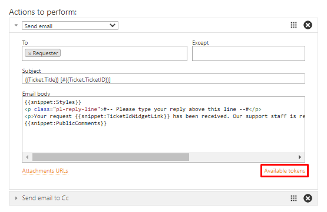

Building advanced email templates
=================================

This article describes advanced practices for customizing email notifications sent by the trigger.
We will customize the email template for the `Send email`_ trigger action.

.. contents::
    :local:
    :depth: 2

How conditionally to include values
-----------------------------------

Template engine allows you conditional including (or excluding) arbitrary content into a message.
Let’s review this feature on the following example.
The *Tickets* list has a yes/no column which defines whether to include or not all comments into agents’ notifications:

|templates-1|
 
In the template, it is necessary to add conditional tokens ``{{#if}}`` and ``{{/if}}``.
The former should contain a reference to a field.
If it resolves the value to ``true``, content between the tokens will be rendered in the resulting message.
In this case, we include the snippet conditionally:

.. code-block:: html

    {{#if Ticket.IncludeComments}}
        {{snippet:AllComments}}
    {{/if}}

The conditional tokens has complimentary ones: ``{{#elif}}`` and ``{{#else}}``.
They are optional and allow to include alternative content.
``{{#elif}}`` checks alternative condition fields, should be placed after ``{{#if}}`` and its quantity is not limited.
``{{#else}}`` should be placed just before ``{{/if}}`` and may occur just once.
The token defines what content to render if all previous conditions were ``false`` as it is in the current case.
So I add ``{{#else}}`` for notifying about switching comments off:

.. code-block:: html

    {{#if Ticket.IncludeComments}}
        {{snippet:AllComments}}
    {{#else}}
         
        
Comments are switched off in notifications for the current ticket.

         
    {{/if}}

Thus, the template with conditional including of comments will be as follows:

|templates-2|

And the agent will receive the following notification if we switched the comments off:

|templates-3|

How to iterate over a collection of values
------------------------------------------

Here is a simple example of iteration over a collection of comments:

.. code-block:: html

    {{#!Ticket.AllComments.From.Title}}
    {{#!Ticket.AllComments.Created}}
    {{#!Ticket.AllComments.Body}}

    {{#each Ticket.AllComments}}
        

            

                <strong>{{From.Title}}</strong>
            

            

                <em>{{Created}}</em>
            

            

                {{Body}}
            

        

    {{/each}}

In the beginning, it is necessary to list tokens for the repeating fields of each iteration.
In such a list, each one should start with ``#!``.
They will not be included in the result message and just let the template know about fields, that it needs to prepare for using inside the iteration.

In the example above, we used the ticket property ``AllComments``.
It refers to the *Comments* list where all of them are stored.
Thus, each comment has multiple fields which you can use in each iteration, and we selected the following:

* the title of a comment’s author (``{{#!Ticket.AllComments.From.Title}}``)
* the date of a comment’s creation (``{{#!Ticket.AllComments.Created}}``)
* the body of a comment (``{{#!Ticket.AllComments.Body}}``)

Then, there are the limits of the repeatable block specified with special tokens ``{{#each}}`` and ``{{/each}}``.
The first one should contain a reference to the field which contains the collection of values, i.e. it looks like ``{{#each Ticket.AllComments}}`` in the example.

Since we listed the full tokens for comments’ fields in the beginning, now we use only the parts within the specified collection and mark them up with HTML:

.. code-block:: html

    

        

            <strong>{{From.Title}}</strong>
        

        

            <em>{{Created}}</em>
        

        

            {{Body}}
        

    

The built-in snippet ``{{snippet:AllComments}}`` do the same in the same logic.
It has a bit more complex structure to apply HelpDesk styles and include comments’ attachments.
Here is its internal structure:

.. code-block:: html

    {{#!Ticket.AllComments.From.Title}}
    {{#!Ticket.AllComments.Created}}
    {{#!Ticket.AllComments.Body}}
    {{#!Ticket.AllComments.CommentType}}

    {{#each Ticket.AllComments}}
    

        

            <strong>{{From.Title}}</strong>
        

        
{{Created}} | {{CommentType}}

        {{#if AttachmentUrlsCollection}}
        
    
            Attachment(s): 
            {{#each AttachmentUrlsCollection}}
            <a href="{{URL}}">{{FileName}}</a>&nbsp;
            {{/each}}    
        

        {{/if}}

        

            {{Body}}
        

    

    {{/each}}

It contains conditional including of attachments and iteration over them (since each comment can have multiple attachments).
For this purpose, they use a system token with a collection of comments’ attachments: ``{{AttachmentUrlsCollection}}``.
The iteration over it doesn’t require building a dictionary.
Each object in this collection has the following self-explanatory properties, i.e. tokens to include in the iteration:

* ``FileName``
* ``URL``

How to detect changes made by others
------------------------------------

HelpDesk triggers allow notifying agents about ticket modifications made by others.
Here is a sample of the notification:

|templates-4|

You can find condition configuration for such a trigger in this article_.
The message body for the *Send email* action should contain an iteration over ``Data.FieldChanges`` which is available only on the *Ticket has been changed* event.
It is a system array of objects that contain field values before and after the last modification.
Each one has the following properties to be used as tokens within iteration:

* ``FieldName``
* ``BeforeValue``
* ``AfterValue``

The iteration over ``Data.FieldChanges`` doesn’t require building a dictionary.
The default trigger renders a table using the mentioned tokens:

.. code-block:: html

    <table class="pl-ticket-changes">
        <tbody>
            <tr>
                <th>Field Name</th>
                <th>Before</th>
                <th>After</th>
            </tr>
            {{#each Data.FieldChanges}}
            <tr>
                <td>
                    {{FieldName}}
                </td>
                <td>
                    {{BeforeValue}}
                </td>
                <td>
                    {{AfterValue}}
                </td>
            </tr>
            {{/each}}
        </tbody>
    </table>

How to use snippets
-------------------

The snippet is a small predefined part of a template in the `Send email`_ action that allows inserting blocks of information in the resulting message.
Currently, it is not allowed to customize or to create snippets.
All of them are in the hint to a template:

|templates-5|

Here is the list of available snippets:

* ``{{snippet:AllComments}}`` renders a list of all comments for a current ticket
* ``{{snippet:PublicComments}}`` renders a list of public comments for a current ticket
* ``{{snippet:Styles}}`` sets the style of an email message to the default HelpDesk style via CSS
* ``{{snippet:TicketInfo}}`` renders a summary for current ticket as a table
* ``{{snippet:TicketIdLink}}`` renders a link to a ticket in HelpDesk
* ``{{snippet:TicketIdWidgetLink}}`` renders a link to a ticket in Widget
* ``{{snippet:FeedbackLink}}`` renders a link to rate the service on the current ticket

How to use context data
-----------------------

You can use the context tokens on any event to get site related information.
There are three possible tokens:

* ``{{Context.SiteUrl}}`` (a URL of the site collection, where HelpDesk is installed)
* ``{{Context.ServerUrl}}`` (a URL of the server, where SharePoint is hosted)
* ``{{Context.WidgetUrl}}`` (a default widget URL, specified in HelpDesk settings)

.. _Send email: ./Actions%20reference.html#send-email
.. _article: ./Building%20advanced%20conditions.html#changes