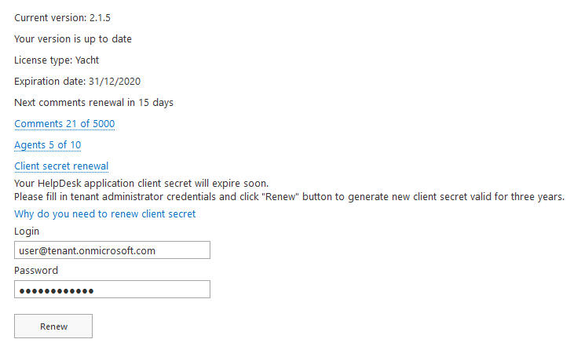

Client secret renewal
#####################

HelpDesk is a provider-hosted SharePoint Add-in. Its remote components interact with SharePoint using OAuth.
To use OAuth, the add-in must be registered with the Azure ACS cloud-based service and the SharePoint App Management Service of the tenancy or farm. 

When add-in is being registered, the following information is specified:

- A GUID for the add-in, called a client ID.
- A password for the add-in, called a client secret.

HelpDesk Add-in only has acces to the site on which it is installed and no other resources.
Add-in secrets expire, thats why we need to renew HelpDesk client secret. For details, see `ContextToken OAuth flow for SharePoint Add-ins`_ and `Replace an expiring client secret in a SharePoint Add-in`_.

Please, renew your client secret on **Settings->About page** using a **global admin** account to avoid interruption of HelpDesk services.
Your login and password are securely transferred via HTTPS, we don't store your credentials.
If you are not able to renew the client secret, check the `Known issues`_ section.

|About|

.. _known-issues:

Known issues
++++++++++++

The account used for the client secret renewal should meet the following conditions:

* it's a **global admin** account;
* login format is **user@tenant.onmicrosoft.com**;
* **multi-factor authentication** is disabled;
* **legacy authentication** is not blocked.

Find details on managing multi-factor authentication in the article `Set up multi-factor authentication`_.

To ensure that the legacy authentication is not blocked, check `conditional access policies`_ in Azure Active Directory admin center.

If the account meets all the conditions and still you can't renew the client secret, try to create a new global admin account.
After using it for renewing, you can delete the one.

.. _ContextToken OAuth flow for SharePoint Add-ins: https://msdn.microsoft.com/en-us/library/office/fp142382.aspx
.. _Replace an expiring client secret in a SharePoint Add-in: https://docs.microsoft.com/en-us/sharepoint/dev/sp-add-ins/replace-an-expiring-client-secret-in-a-sharepoint-add-in
.. _Known issues: ./Client%20secret%20renewal.html#known-issues
.. _conditional access policies: https://aad.portal.azure.com/#blade/Microsoft_AAD_IAM/ConditionalAccessBlade/Policies
.. _Set up multi-factor authentication: https://docs.microsoft.com/en-us/microsoft-365/admin/security-and-compliance/set-up-multi-factor-authentication?view=o365-worldwide

