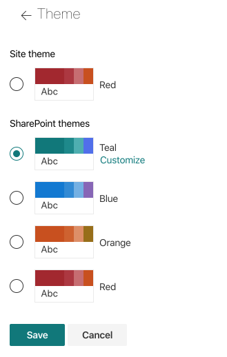
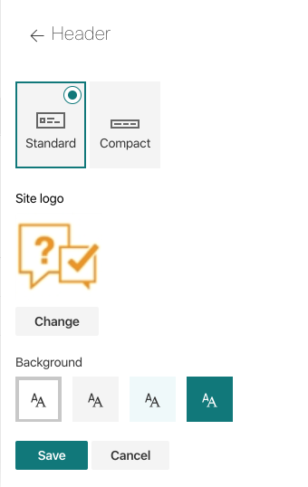

Color theme
###########

HelpDesk uses SharePoint look to change colors. 
Look is a color theme applied to your SharePoint site.

To do this please click on the **Settings** icon: 

|SettingsIcon| 

Than choose **Change the look**.
You will see a menu with two options: **Theme** and **Header**. 
Click on **Theme** to modify the existing Theme or pick a new one:

|Theme|

For each Theme, you can customize the main color, tha accent color and the background color.

Click on **Header** to modify the site's header and change the logo:

|Header|

You can read more about customising the look of a SharePoint site `here`_.

.. _here: https://support.office.com/en-us/article/change-the-look-of-your-sharepoint-site-06bbadc3-6b04-4a60-9d14-894f6a170818

.. |SettingsIcon| image:: ../_static/img/sp_sitesettingsimg-online.png
   :alt: Site Settings Icon

