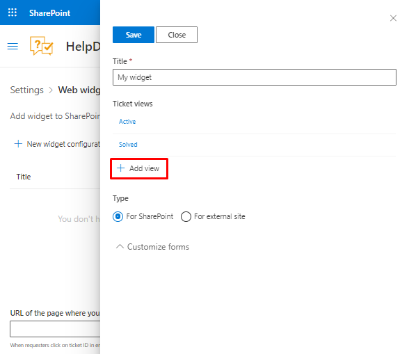
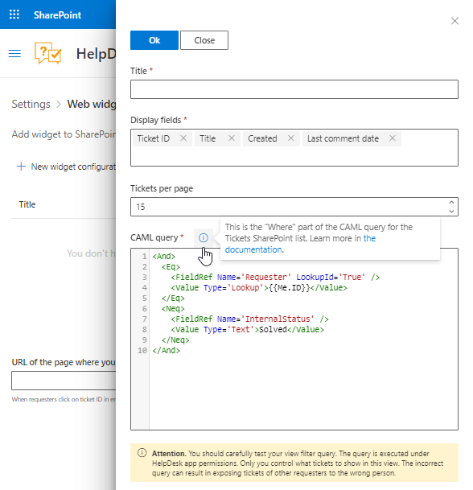
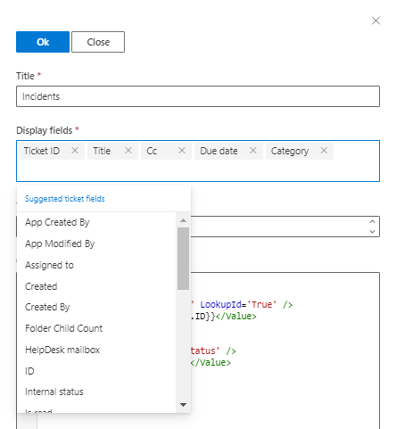
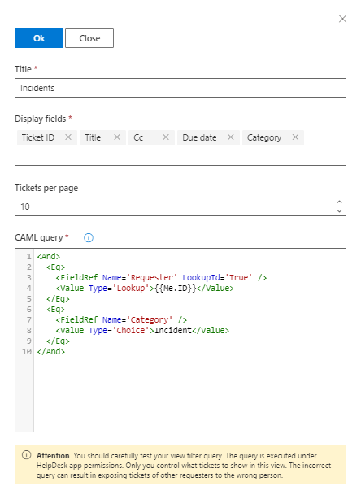
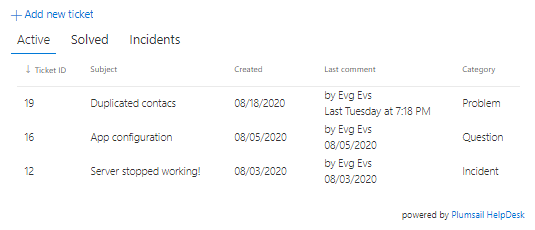
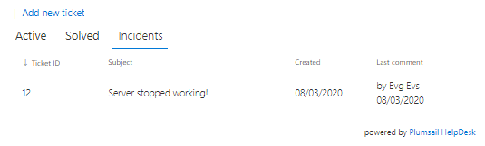

Add custom ticket views to widget
#################################

HelpDesk has “Active” and “Solved” tabs by default.
Each one is based on a widget view of the “Tickets” list.
You can add views to classify tickets and make working with them more convenient for requesters.
Let’s create a widget that will have a tab for displaying only active tickets with category “Incident.”

I create a widget and click **Add view**:

|AddView|

There is a separate form for configuration of view:

|ConfigurationForm|

I name the view in the **Title** field as “Incidents” and set the number of displayed tickets to 10.
You can display 100 **Tickets per page** maximum.
You specify what fields should be displayed in the view.
For this specific case, I assume that the requester will not need such fields as “Created” and “Last comment date” so I delete them from the **Display fields**.
On the contrary, I find it helpful to add the fields “CC,” “Due date” and “Category”:

|BasicFields|

By specifying the `CAML-query`_ you control what ticket will be displayed in the view.
Some parts of it, you shaped in a user-friendly format through filling the fields, but the content of the `Where`_ element should be marked-up as per schema requirements.
Put its child elements in the **CAML query** field on the form.
The query can contain one of these tokens:

* ``{{Me.ID}}``—ID of the contact who is currently logged into the widget. The ID corresponds to an “ID” field on the HelpDesk “Contacts” list.

* ``{{Me.Email}}``—Email address of the contact who is currently logged into the widget. The email corresponds to an “Email” field on the HelpDesk “Contacts” list.

In this case, I would like to display the tickets raised by the current user and which have the “Incident” category.
First, let’s filter the ones raised by a current user.
In the filter, I check whether the lookup field “Requester” refers to the user’s ID so I leave the first part of the default query:

.. code::

   <Eq>
      <FieldRef Name='Requester' LookupId='True' />
      <Value Type='Lookup'>{{Me.ID}}</Value>
   </Eq>

Then, I add another filter that leaves only the tickets with the “Incident” category:

.. code::

   <Eq>
      <FieldRef Name='Category' />
      <Value Type='Choice'>Incident</Value>
   </Eq>

And finally, I unite both conditions with a logical operator “And.”
That is how it looks on the form:

|QueryField|

Thus, a user can see their incident tickets separately from others:

|ActiveTickets|

|IncidentTickets|

Now, try to reproduce the described example and then implement your own views.
Your clients will appreciate convenient and clear communication

.. _CAML-query: https://docs.microsoft.com/en-us/sharepoint/dev/schema/collaborative-application-markup-language-caml-schemas
.. _Where: https://docs.microsoft.com/en-us/sharepoint/dev/schema/where-element-query