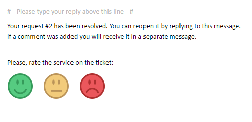
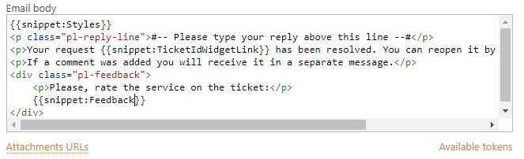
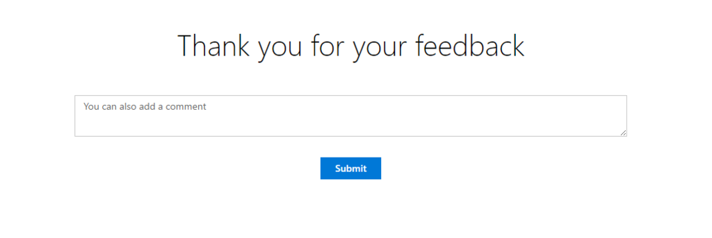
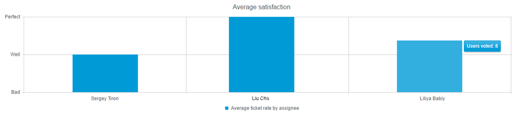
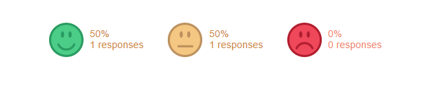
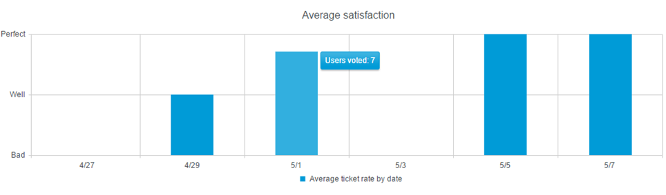

Customer service survey
#######################

Customer service survey is a feature that allows your customers to provide a feedback on work of support teams by rating solved tickets. 
By default, when ticket marked as ‘Solved’, the user receives a notification letter about solved ticket with the survey:  

|Feedback|

Providing a rate for customer service is quite user-friendly and quick. Additionally, customers can give more feedback by adding a comment.

How to add feedback snippet to your messages
~~~~~~~~~~~~~~~~~~~~~~~~~~~~~~~~~~~~~~~~~~~~

Snippet ``{{snippet:Feedback}}`` is automatically added in email notification template of a built-in trigger called “Notification: Requester – Ticket resolved”. 

|FeedbackSnippet| 

This snippet adds a block with three pictures with different ratings for the agent — perfect, well and bad. We assume that pictures are quite self-explanatory. These ratings have internal value like 1 is for bad, 2 is for well and 3 is for perfect. End-Users will never know about it, we use these value only for building `reports`_.

You can easily remove the snippet from the trigger as well as you can customize time when End-Users are asked for a satisfaction rating. Just add the snippet in email notification template of your own trigger or any other trigger. 

End-user experience
~~~~~~~~~~~~~~~~~~~~

Users don’t need to have SharePoint or Office 365 account to give a feedback. Click on the survey re-directs End-User to a new page which loads in the new tab with ‘Thank you’ text and additional form for a comment.

|CommentAfterFeedback|

This URL is unique. That means that End-User can not change his mind — assessment happens only once. If the ticket was re-open, it’s the only case when rating can be changed. 
Satisfaction rating works per ticket, so one end-users can rate every solved ticket they have submitted.

Reports
~~~~~~~

With feedback feature, you will have three new reports:

1. Overview of customer satisfaction surveys. 
On overview page, you can find overall customer satisfaction score. By clicking on one of the emoticons, you can learn which tickets were rated like that and find comment which were left.

|Overview|

2. Average ticket rate by assignee. 
This report shows average satisfaction for the agent and number of users who voted. 

|ByAssignee|

3. Average ticket rate by date 
Here you can learn how work of support team was rated day by day.

|ByDate|

.. _reports: https://plumsail.com/docs/help-desk-o365/v1.x/User%20Guide/Reports.html