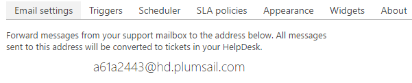

How forwarding works
####################

If you want to create new tickets automatically when new messages arrive at your support mailbox, you need to configure forwarding. `Forward
messages`_ from your support mailbox to autogenerated address as on the
picture below.

This address is a not real mailbox, it doesn't store any messages. It is
just email handler, which processes all incoming messages and creates new
tickets in your HelpDesk. It doesn't store any incoming messages. All
operations are performed over secure encrypted https connection.

|HDAutogeneratedAddress|

.. rubric:: Dedicated installation

At the moment, we don't have this feature but we are listening to you, so, send us feedback via support@plumsail.com if you'd like to get a dedicated SMTP server.

.. _Forward messages: ../Getting%20Started/Quick%20HelpDesk%20configuration.html#forwarding

