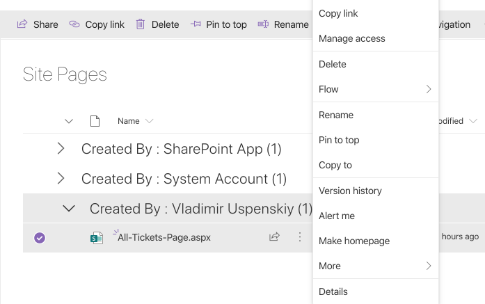
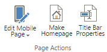

How to change home page
#######################

You can change the default HelpDesk homepage:

#. `For Modern Pages`_
#. `For Classic pages (Wiki Pages)`_

.. _from-site-pages-library:

For Modern Pages
----------------

You can add any number of Modern Pages to your HelpDesk site. 
The pages you add will appear in the **Site Pages** library.  
If you want to set on of these as a homepage, please click on the **Settings** icon: 

|SettingsIcon| 

Then navigate to the **Site Pages** library (**Site contents** -> **Site Pages**). 
In the library, choose the page you'd like to make the homepage and click on the vertical 
ellipses (...) to the right of the page name. 
Choose **Make Homepage**:

|Set Homepage|

.. _from-ribbon:

For Classic Pages (Wiki Pages)
------------------------------

Some of the pages in HelpDesk are classic pages (e.g. **Reports** and all the pages in the **Settings**)
To make one of these pages the homepage, open it in a browser. On the ribbon
tab named 'Page' you will find a button **Make homepage**:

|Set From Ribbon|

.. _For Classic pages (Wiki Pages): ./How%20to%20change%20home%20page.html#from-ribbon
.. _For Modern Pages: ./How%20to%20change%20home%20page.html#from-site-pages-library

