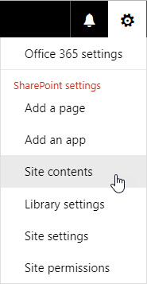
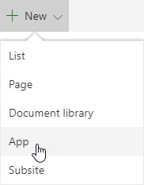
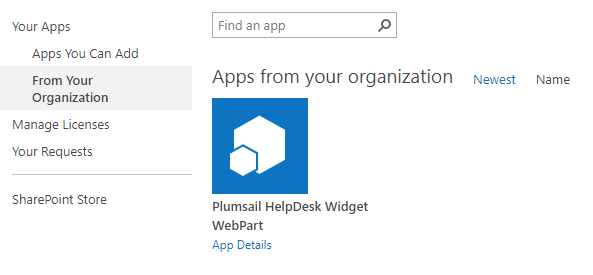

Install add-in to a site where you want to add a HelpDesk Widget
######

Navigate to the site where you want to add a HelpDesk Widget.

Go to the Site contents:

|SiteContents|

Click ‘New → App‘:

|NewAPP|

Click ‘From Your Organization’ and pick ‘Plumsail HelpDesk Widget WebPart’:

|PickAPP|

