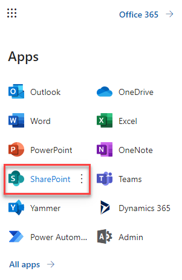
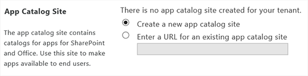

.. _upload-helpdesk-sppkg:

Installation of HelpDesk SharePoint Framework package
######

.. note::
    You have to be a SharePoint administrator to complete the installation. 
    
    If you don’t see some menus from the instruction below, most likely you are not a SharePoint administrator. 
    
    Please contact your administrator to assist with the installation.

Download add-in
-------------------------

Download the `add-in <https://static-hd.plumsail.com/ModernUI/spfx/Plumsail.HelpDesk.sppkg>`_ from our website.

Create App Catalog
-------------------------

Open Office 365 admin center:

|Office365AdminCenter|

Navigate to SharePoint Admin Center:

|SharePointAdminCenter|

Open ‘App catalog’:

|OpenAppCatalog|

If you don’t have ‘App Catalog’ yet, you will be able to create a new one:

|CreateAppCatalog|

Just fill in ‘Title’, ‘Web Site Address’, ‘Administrator’ and ‘Storage Quota’ and click ‘OK’. For example:

- Title – App Catalog Site
- Web Site address – AppCatalog
- Administrator – Fill in your account name
- Storage Quota – 10 GB

|NewAppCatalog|

Install add-in
-------------------------

Navigate to ‘Apps for SharePoint’ and upload Add-in package that you downloaded (you need to upload to the App Catalog the whole .sppkg file without unpacking it):

|UploadSPPKG|

Select “Make this solution available to all sites in the organization” in the dialog and click "Deploy". 

|TenantScopedWP|

.. |WidgetView| image:: ../_static/img/widgetview.png
   :alt: HelpDesk Widget
.. |EmailSettings| image:: ../_static/img/settingsicon.png
   :alt: E-mail settings
.. |WidgetTab| image:: ../_static/img/tab.png
   :alt: Widget Tab
.. |NewWidget| image:: ../_static/img/newitem.png
   :alt: Create a new item
.. |GenSPConfigID| image:: ../_static/img/widget-get-sp-config-id.png
   :alt: Generated HTML code
.. |EditPage| image:: ../_static/img/editpage.png
   :alt: Adding a widget to your site
.. |Finish| image:: ../_static/img/finish.png
   :alt: Inserting a widget
.. |Office365AdminCenter| image:: ../_static/img/widget-open-admin-center.png

.. |OpenAppCatalog| image:: ../_static/img/widget-open-app-catalog.png

.. |NewAppCatalog| image:: ../_static/img/widget-new-app-catalog.png

