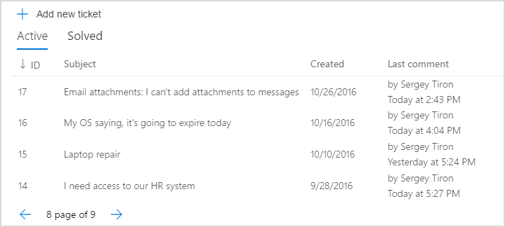
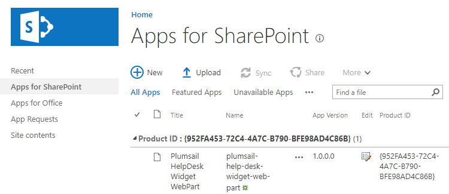

Installing Plumsail.HelpDesk package
######

Installing Widget WebPart
-------------------------

HelpDesk Widet for SharePoint sites is a a `SharePoint Framework <https://docs.microsoft.com/en-us/sharepoint/dev/spfx/sharepoint-framework-overview>`_ add-in that can be added both on classic and modern SharePoint pages. Unfortunately, SharePoint Store doesn’t support the installation of SharePoint Framework add-ins. That is why you need to install add-in manually.

You have to be a SharePoint administrator to complete the installation. If you don’t see some menus from the instruction below, most likely you are not a SharePoint administrator. Please contact your administrator to assist with the installation.

Open Office 365 admin center:

|Office365AdminCenter|

Navigate to SharePoint Admin Center:

|SharePointAdminCenter|

Open ‘App catalog’:

|OpenAppCatalog|

If you don’t have ‘App Catalog’ yet, you will be able to create a new one:

|CreateAppCatalog|

Just fill in ‘Title’, ‘Web Site Address’, ‘Administrator’ and ‘Storage Quota’ and click ‘OK’. For example:

 - Title – App Catalog Site
 - Web Site address – AppCatalog
 - Administrator – Fill in your account name
 - Storage Quota – 10 GB

|NewAppCatalog|

`Download the add-in <https://static.plumsail.com/wp-content/uploads/Files/HelpDesk365Widget/plumsail-help-desk-widget-web-part.sppkg>`_ from our website. Navigate to ‘Apps for SharePoint’ and upload Add-in package that you downloaded (you need to upload to the App Catalog the whole .sppkg file without unpacking it):

|UploadSPPKG|

You need to select “Make this solution available to all sites in the organization” in the dialog. Once you did this you can add a web part to a page.

|TenantScopedWP|

If you don’t want to make this app availalbe on all sites, you will need to `add app to each site manually <InstallWidgetAddInOnSite.html>`_.

.. |EmailSettings| image:: ../_static/img/settingsicon.png
   :alt: E-mail settings
.. |WidgetTab| image:: ../_static/img/tab.png
   :alt: Widget Tab
.. |NewWidget| image:: ../_static/img/newitem.png
   :alt: Create a new item
.. |WidgetMenu| image:: ../_static/img/newwidget.png
   :alt: Widget settings
.. |GenSPConfigID| image:: ../_static/img/widget-get-sp-config-id.png
   :alt: Generated HTML code
.. |EditPage| image:: ../_static/img/editpage.png
   :alt: Adding a widget to your site
.. |Finish| image:: ../_static/img/finish.png
   :alt: Inserting a widget
.. |Office365AdminCenter| image:: ../_static/img/widget-open-admin-center.png
.. |SharePointAdminCenter| image:: ../_static/img/widget-navigate-to-sharepoint-admin-center.png
.. |OpenAppCatalog| image:: ../_static/img/widget-open-app-catalog.png
.. |CreateAppCatalog| image:: ../_static/img/widget-create-app-catalog.png
.. |NewAppCatalog| image:: ../_static/img/widget-new-app-catalog.png

.. |TenantScopedWP| image:: ../_static/img/widget-tenant-scoped-webpart.png
