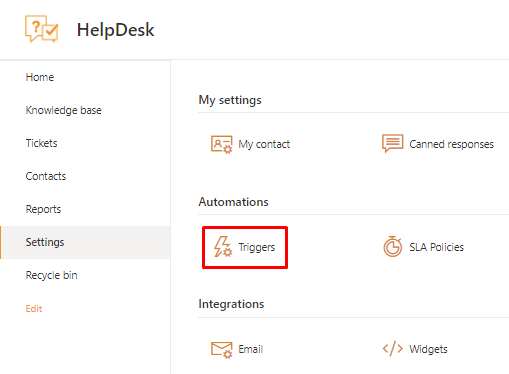

Introduction to triggers in HelpDesk for SharePoint
===================================================

.. note::
    If you are using Plumsail HelpDesk with a version older than 1.3.0, please follow this link_ to learn about triggers.

.. contents::
    :local:
    :depth: 2

In this article, you will learn what a trigger is and how to create the one following the simple guidance.

What is a trigger?
------------------

The trigger is one of HelpDesk automation tools.
There is a bunch of them available out of the box.
The default triggers send notifications to agents and requesters about significant events.
For example, there is a trigger that notifies your clients about a new reply on the ticket:

|configuration|

Whenever a new reply is added, HelpDesk runs the trigger.
Then, it checks the condition rule, i.e. whether the added comment is not initial and is a reply.
If it is true, the trigger sends notifications to a requester and CC contacts.
Trigger settings define when to run the trigger, what actions to perform, and under what conditions.
Of course, you can create triggers for other cases—more about this in further sections of the article.

How to create a new trigger?
----------------------------

Open HelpDesk settings and find triggers in the **Automations** section:

|settings|
 
Create a new item in the **Triggers** list.

|new|
 
Take a look at the trigger settings.

|empty|

**General properties** overview:

* ``Active`` (it defines whether HelpDesk will run the trigger on a specified event; use this option to temporarily disable some triggers)
* ``Log trigger runs in ticket history`` (it adds a record to the **History** tab of a ticket form if trigger actions were performed on its basis)
* ``Trigger name`` (just a name to identify the trigger on the list)
* ``Execute when`` (here you can select an event on which HelpDesk will run the trigger)
* ``Order`` (the integer that defines a trigger’s position in the queue of triggers to run)

Let’s create a trigger that will assign sales tickets to a specified agent and tag them accordingly. Set the general parameters as follows:

|general|
 
Events
------

The **Execute when** field contains possible events within your HelpDesk site on which the trigger will be started.
Their names are self-explanatory:

* ``Ticket has been created`` (a new item on the “Tickets” list is created)
* ``Ticket has been changed`` (an item on the “Tickets” list is modified)
* ``Comment has been created`` (a new comment in the existing ticket is created)

For the current case, I select the event ``Ticket has been created``.

|events|
 
Conditions
----------

The trigger will execute the specified actions only if conditions are true.
You can combine them with logical operators **AND/OR**, select ticket or comment fields on one side, and enter custom values on the other.
It is possible to build more complex conditions using functions and regular expressions.
Review the article `Building advanced conditions`_ for more information.

|references|

Let’s check whether the title of a newly created ticket contains such keywords as ``Quote`` or ``Invoice`` to define it as a sales ticket.
Select ``[Ticket.Title]`` in the left dropdown and type the keywords in the right part of each condition.
The custom strings should be enclosed in single quotes for proper processing.
Also, set the operator to ``contains``—pay attention that it is case-sensitive.
After configuring the condition, click the **Validate** button to ensure that there are no syntax errors.

|condition|
 
Actions
-------

The main point of any trigger is to perform some actions.
There can be as many actions as you need, and they can be arranged in the order you want.
To add the one, just click **Add action**.

|actions|
 
There are four types of **available actions**.
Their names are self-explanatory just as in the case with the events.

* `Set field`_ (the action assigns a value to the selected field of a ticket)
* `Send email`_ (the action sends an e-mail message based on a template that is filled with ticket data)
* `Start workflow`_ (the action starts a selected SharePoint 2013 workflow)
* `Change comment type to private`_ (if the trigger was started on comment creation, then you can change its type to private)

For more information on the actions, check the article `Actions reference`_.
In this example, we assign a ticket to a certain agent and tag it as ``Sales``.
So, I set the field “Assigned to” to the e-mail of the agent responsible for sales tickets.

|action-1|
 
Then, I add another action and set the “Tags” field to the ``Sales`` value.
After saving, the trigger is ready for use.

|action-2|
 
What is next?
-------------

Try to repeat the simple steps described in this article to understand a general order of configuring the trigger.
Then you can modify it or create others that accord your requirements.
You will find more useful information about triggers in the following articles:

* `Actions reference`_
* `Building advanced conditions`_
* `Building advanced email templates`_
* `Troubleshooting triggers`_

.. |events| image:: ../_static/img/configuration-guide-triggers-events.png
   :alt: Available events

.. _Building advanced conditions: ./Building%20advanced%20conditions.html
.. _Building advanced email templates: ./Building%20advanced%20templates.html
.. _Actions reference: ./Actions%20reference.html
.. _Troubleshooting triggers: ./Troubleshooting%20triggers.html
.. _link: ./deprecated/Triggers.html
.. _Set field: ./Actions%20reference.html#field
.. _Send email: ./Actions%20reference.html#email
.. _Start workflow: ./Actions%20reference.html#workflow
.. _Change comment type to private: ./Actions%20reference.html#type