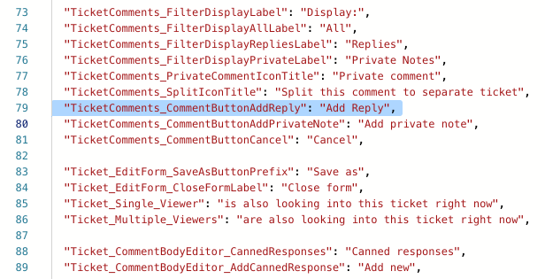

Localization
============

.. note::
   If you have the earlier version of HelpDesk than 2.1.1, please follow this link_ to learn about localization.

.. contents:: Table of contents
   :local:
   :depth: 1

Feature overview
----------------

Localization is supported in HelpDesk from version 1.3.4.
For already installed instances, upgrade 1.3.4 affects only widgets_’ localization as per the list below.
For newly created instances, you will be able to:

* select HelpDesk language during installation
* customize most of the strings in HelpDesk interface
* set display language for a widget placed outside of your SharePoint environment
* customize any string in widget interface both for internal and external widgets

Available languages:

* Czech
* Dutch
* English
* French
* German
* Italian
* Norwegian
* Polish
* Swedish

If you want to add support for a new language, please send a request to support@plumsail.com.

Localization logic
------------------

There are four different **types of strings** in HelpDesk environment:

* static content in .aspx pages
* SharePoint artefacts (list and field titles)
* dynamic content generated by JavaScript
* other content like email templates in triggers_ and `Scheduler tasks`_

**Static strings** in .aspx pages are set during HelpDesk installation and not customizable.
They also don’t depend on user language settings.

Translation of **SharePoint artefacts** to all supported languages becomes available during installation.
After enabling `Multiple Language User Interface`_ (MUI) on your HelpDesk site, SharePoint will display list titles and field names depending on user language settings.
For example, you installed HelpDesk to an English site with German as an additional interface language.
Then, the current user preferences define in which one to display the artefacts.
If HelpDesk doesn’t support the preferred language, the user will see SharePoint artefacts in the default language selected during installation.

Most of the strings in the HelpDesk user interface are generated **dynamically** by JavaScript and can be **customized**.
Each supported language has its own localization file both in an `interface`_ folder and in a `widget`_ one.
These strings also support MUI and follow the same logic as the SharePoint artefacts.

**Email templates** are configured during the installation process and can be customized.
MUI is not available for them.

Selecting HelpDesk language
---------------------------

When you are installing HelpDesk to a new team site, you can select the main language from a dropdown containing all supported languages.
HelpDesk language can’t be changed after installation.

|HelpDeskOnlineSelectLanguage|

.. _interface-loc:

How to change a string in the interface
---------------------------------------

To change a string in HelpDesk interface, you need to open a **folder** located by URL ``<HelpDeskUrl>/HD/modern_localization/modern_ui``.
There are files with localization strings for each supported language.

For example, let us change a button title for English locale.
To do this, you will need to modify a **file** ``en-US.js``.
We advise you to create a backup copy of this file before any changes.

|LocalizationFile|

**Open** the file and click ``Open in Text Editor``.

|OpenLocalizationFile|

You will see a **JSON**, containing all strings that can be customized.
They are stored in format ``"SectionName_StringName": "String value"``.
We will **edit** the value of a string ``TicketComents_CommentButtonAddReply`` and change it to a simple ``Reply``.

|ModifyLocalizationFile|

**Save** the file after editing and check if everything is fine.
You may need to reload page twice to see your changes.

|ReplyLocalization|

.. note::
	Not all strings in the HelpDesk interface are customizable. You can send us a support request if you want to change something that does not exist in localization files.

.. _widget-loc:

Widget localization
-------------------

The widgets located inside the SharePoint environment follow usual localization logic.
For each external one, it is necessary to set a language.
So now, you can put English and German widgets to respective versions of your site.
Also, HelpDesk allows translating to any custom language.

To set a language for the external widget, you need to open its `configuration form`_  and select a locale in the accordant dropdown.
Each one is available in a folder located by URL ``<HelpDeskUrl>/HD/modern_localization/widget`` so you can customize them in the same way as the HelpDesk interface_.

|WidgetLanguage| 

To set a custom language, create a copy of the file ``en-US.js`` in the mentioned folder and rename it to `another locale`_, for example, ``bg-BG.js``.
Then, translate all strings in it and save the file.

|WidgetCustomLanguagePath|

|WidgetCustomLanguage|

.. note::
	For optimization purposes, there are caching of widget localization strings for 30 minutes. You will need to clear browser cache to apply your changes immediately.

.. _Multiple Language User Interface: https://support.office.com/en-us/article/Choose-the-languages-you-want-to-make-available-for-a-site-s-user-interface-16d3a83c-05ab-4b50-8fbb-ff576a3351e8
.. _another locale: https://docs.microsoft.com/en-us/previous-versions/commerce-server/ee825488(v=cs.20)
.. _link: ./deprecated/Localization.html
.. _widgets: ./Widget.html
.. _triggers: ./Triggers.html
.. _Scheduler tasks: ./Scheduling.html
.. _interface: #interface-loc
.. _widget: #widget-loc
.. _configuration form: ./Add%20widget%20to%20external%20site.html

.. |HelpDeskOnlineSelectLanguage| image:: ../_static/img/wizard-1.png
   :alt: Select Language

.. |ReplyLocalization| image:: ../_static/img/reply-localization.png
   :alt: Reply Localization
.. |WidgetLanguage| image:: ../_static/img/widget-lang.png
   :alt: Widget Language

.. |WidgetCustomLanguage| image:: ../_static/img/widget-lang-custom.png
   :alt: Widget Custom Language