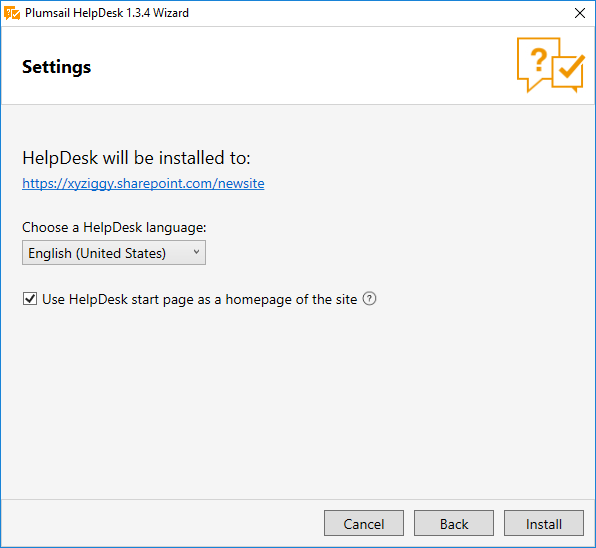
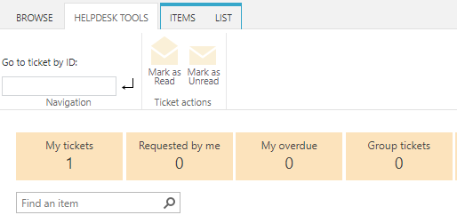

Localization
############

.. contents:: Table of contents
   :local:
   :depth: 1

Feature overview
----------------
Localization is supported in HelpDesk from version 1.3.4.

For already installed instances, upgrade 1.3.4 brings the ability to localize HelpDesk Widget. This means that you will be able to set display language for a widget placed outside of your SharePoint environment. You will also be able to customize any string in widget interface both for internal and external widgets.

For a newly created instances you will be able:

- Select HelpDesk language during installation
- Customize most of the strings in HelpDesk interface
- Set display language for a widget placed outside of your SharePoint environment
- Customize any string in widget interface both for internal and external widgets

Available languages:

- Czech
- Dutch
- English
- French
- German
- Italian
- Norwegian
- Swedish

If you want to add support of new language, please send request to support@plumsail.com.

Localization logic
------------------
There are four different types of strings in HelpDesk environment:

- Static content in aspx pages
- Sharepoint artefacts (list and field titles)
- Dynamic content, generated by javascript
- Other content like email templates in triggers and Scheduler

Static strings in aspx pages are being set during HelpDesk installation and can't be customized by clients. They also don't depend on user language settings.

Sharepoint artefacts are translated to all supported languages during installation. So if `Multiple Language User Interface (MUI)`_\  is enabled on your site, HelpDesk list titles and field names will be displayed depending on user language settings. For example, if you installed HelpDesk on English site with German as additional interface language, sharepoint artefacts will be displayed in English or German depending on current user preferences. If user's preferred language is not supported by HelpDesk, he will see sharepoint artefacts in default HelpDesk language selected during installation.

Most of the strings in HelpDesk user interface are generated dynamically by javascript and can be customized. All strings are stored in separate files for each supported language in *<Site with HelpDesk>/HD/localization* folder.
These strings also support MUI. The same logic is applied for translation of these strings as for SharePoint artefacts.

Email templates are configured during installation process and can be customized. MUI is not supported for them.

Selecting HelpDesk language
---------------------------
If you are installing HelpDesk to an existing web site, this site language will be used in HelpDesk, because there is no supported way to change the default language of a site, once it has been created. Is default site language is not supported, HelpDesk will be installed in English.

If you are installing HelpDesk to a new web site, you can select HelpDesk language from a dropdown containing all supported languages.

|HelpDeskOnlineSelectLanguage|

.. note::
	HelpDesk language can't be changed after installation

How to change a string in the interface
---------------------------------------

To change a string in HelpDesk interface you need to open *<Site with HelpDesk>/HD/localization* folder.
There are files with localization strings for each supported language.

For example, let us change HelpDesk ribbon tab title for English locale. To do this you will need to modify en-US.js file. We advise you to create backup copy of this file before any changes.

Open en-US.js file and click Open button.

|ModifyLocalizationFile|

You will see a JSON, containing all strings that can be customized. They are stored in format "SectionName_StringName": "String value". In our case we will edit Ribbon_TabTitle string value. Let's change it to "HelpDesk tools". Save the file after editing and check if everything is fine. You may need to reload page twice to see your changes.

|RibbonLocalization|

.. note::
	Not all srings in HelpDesk interface can be customized, you can send us a support request if you want to change something that does not exist in localization files.

Widget localization
-------------------
HelpDesk users are now able to select language for widgets located on external sites.
For widgets located inside SharePoint environment usual localization logic is applied.

For example, you can put English widget to an English version of your site and German widget to a German version. You can also translate your widget to any custom language by yourself.

To set language for your widget you need to open widget configuration form and select a language from Site language dropdown. You can also select custom language option and enter you own locale name. You can find list of culture names here: `Table of Language Culture Names`_\.

|WidgetLanguage| |WidgetCustomLanguage|

If you selected custom language for your widget you will need to translate it by yourself. To do this, navigate to *<Site with HelpDesk>/HD/localization* folder, create a copy of en-US.js file and rename it to LocaleName.js, for example it-IT.js. Then you will have to translate all strings starting with "Widget" prefix and save the file.

Also you can customize any string in Widget interface just the same way as any other string in HelpDesk interface.

.. note::
	Widget localization strings are cached for 30 minutes for optimisation purposes. You will need to clear browser cache to apply your changes immediatly.

.. _Multiple Language User Interface (MUI): https://support.office.com/en-us/article/Choose-the-languages-you-want-to-make-available-for-a-site-s-user-interface-16d3a83c-05ab-4b50-8fbb-ff576a3351e8
.. _Table of Language Culture Names: https://msdn.microsoft.com/ru-ru/library/ee825488(v=cs.20).aspx

.. |ModifyLocalizationFile| image:: ../_static/img/en-US.png
   :alt: Modify Localization File

.. |WidgetCustomLanguage| image:: ../_static/img/widget-lang-custom.png
   :alt: Widget Custom Language

   

   
