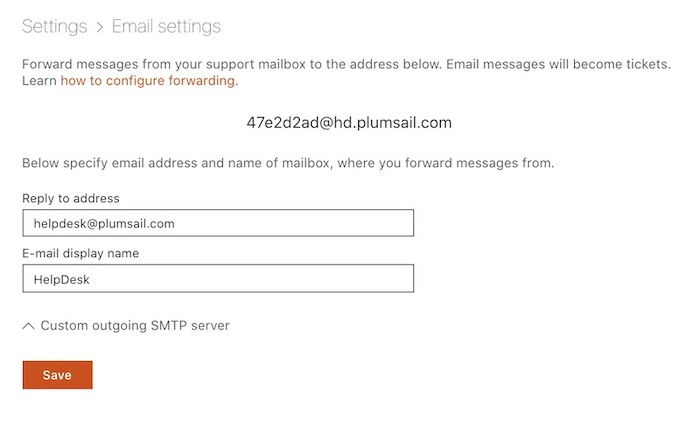
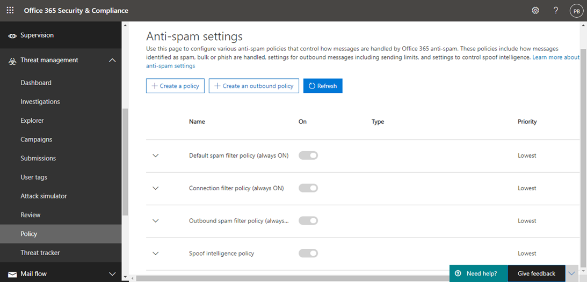
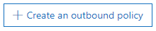
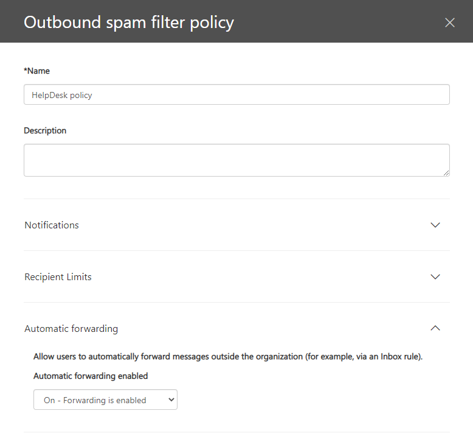
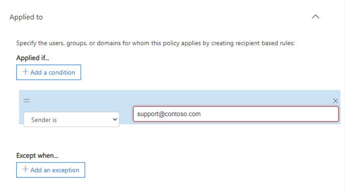

How to forward incoming email messages to HelpDesk address in Office365 Outlook
######################################################################## 

.. contents:: Table of contents
    :local:
    :depth: 1

Enable automatic external forwarding
------------------------------------

Firstly, You need to do some steps to enable automatic external forwarding for individual mailboxes

1. Open the Anti-spam settings page here: https://protection.office.com/antispam.

|step1|

2. Click **+ Create an outbound policy**.

|step2|

3. Enter the **Name** and **Description**. Click the down arrow next to **Automatic forwarding** to expand that section. Choose **On - Forwarding is enabled** from the dropdown.

|step3|

4. Click the down arrow next to **Applied to**, then **+Add a condition**. Choose **Sender is** from the dropdown list, then click in **Add a tag** to find the email account(s) you'd like to allow to automatically forward and select them. Click Save.

|step4|

.. note:: You may have other transport rules or spam policies in place at Microsoft 365 that block external forwarding in addition to the outbound spam filtering we've covered here. If automatic external forwarding is still blocked after adjusting these policies, you will want to reach out to your Microsoft 365 support for assistance in finding any further blocking that has been set up in your Microsoft 365 account. 

Configure forwarding
--------------------

Then, you can `use rules in Outlook Web App to automatically forward messages to another account`_ .
In case of Helpdesk the account is the Helpdesk auto-generated email address.

|AutoGeneratedEmail|

.. _use rules in Outlook Web App to automatically forward messages to another account: https://support.microsoft.com/en-us/office/use-rules-in-outlook-web-app-to-automatically-forward-messages-to-another-account-1433e3a0-7fb0-4999-b536-50e05cb67fed?ui=en-us&rs=en-us&ad=us#__toc377639463

