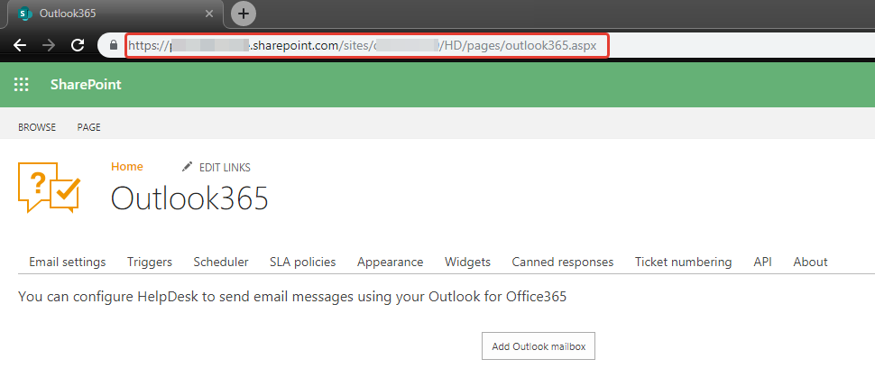
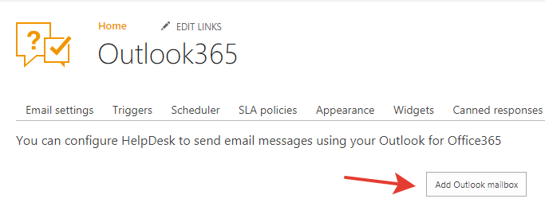
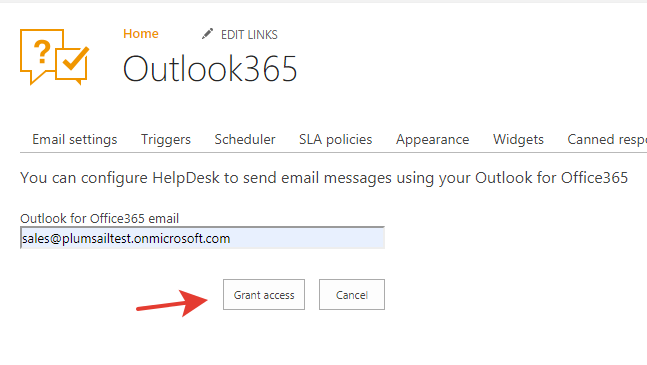
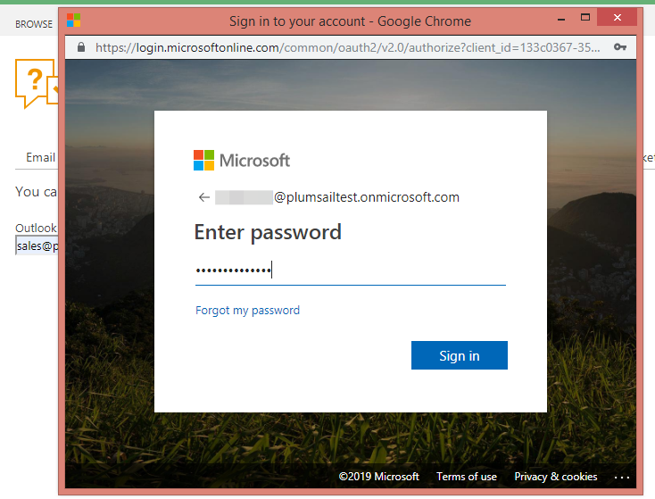
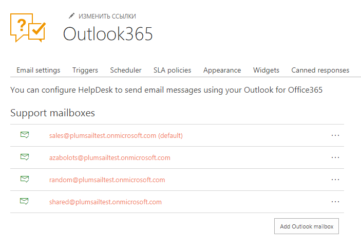
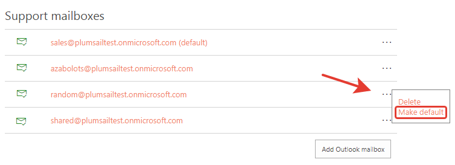
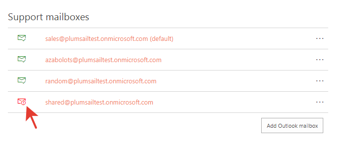
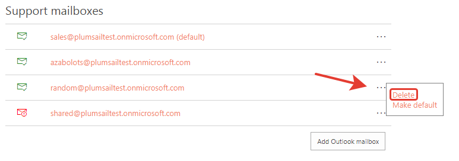

Sending messages using Outlook
###########################

When it can be useful
~~~~~~~~~~~~~~~~~~~~~~~~~~~~~~~~~~~~~~~~~~~~~~~~~~~~~~~

Each HelpDesk has it's own email address, for example 1234@hd.plumsail.com.
If you send a message to this address, it will appear in HelpDesk as a
new ticket. If you reply to this message directly or via HelpDesk, the
reply will appear as a comment in a ticket discussion. This mailbox is
used to create tickets and comments in real time and does not store your
messages. You can find more information in \ `this article`_.

Most likely you already have your own support e-mail address (for example, support@domain.com) 
and you already configured e-mail forwarding from your address to HelpDesk.

By default, HelpDesk will use the auto-generated email address for sending
notifications. Sometimes it can confuse users. For example, John Smith sent a question 
to support@domain.com but got notification about an answer from 1234@hd.plumsail.com.
To avoid such scenario you can configure HelpDesk to send email notifications from your outlook mailboxes.
Just grant access to support@domain.com and John Smith will receive notifications from the 
the same address which was used to ask his question.

Granting access to your Outlook mailbox
~~~~~~~~~~~~~~~~~~~~~~~~~~~~~~~~~~~~~~~~~~~~~~~~~~~~~~~

Navigate to https://{your helpdesk}/HD/pages/outlook365.aspx using browser's addressbar.

You will see “Outlook365” page.

|Outlook365Settings|

Do the following steps to allow HelpDesk to send email notifications from your mailbox:

1. Click "Add Outlook mailbox" button.

|Step1|

2. Enter outlook mailbox address and click "Grant access"

|Step2|

4. Sign in and grant access 

|Step3|

You can add as many mailboxes as you want.

|Step4|

.. Warning::
    If at least one Outlook mailbox is configured, HelpDesk will use Outlook365 
    to send all emails. This means that email notifications can stop working if 
    you revoke access in the future. If HelpDesk lost access to some mailbox, 
    the red indicator is displayed

    |LostAccess|

Default mailbox
~~~~~~~~~~~~~~~~~~~~~~~~~~~~~~~~~~~~~~~~~~~~~~~~~~~~~~~

Default mailbox is used by HelpDesk for email notifications when it is impossible to understand what mailbox to use:

- When a ticket is created from SharePoint UI
- When a ticket is created from a widget
- When a ticket is created from MS Flow or REST API

To make mailbox default do the following:

1. Open mailbox menu (click three dots)
2. Click "Make default"

|MakeDefault|

Delete mailbox
~~~~~~~~~~~~~~~~~~~~~~~~~~~~~~~~~~~~~~~~~~~~~~~~~~~~~~~

You can delete outlook mailbox. 
Just do the following:

1. Open mailbox menu (click three dots)
2. Click "Delete"

|Delete|

.. _this article: How%20forwarding%20works.html

